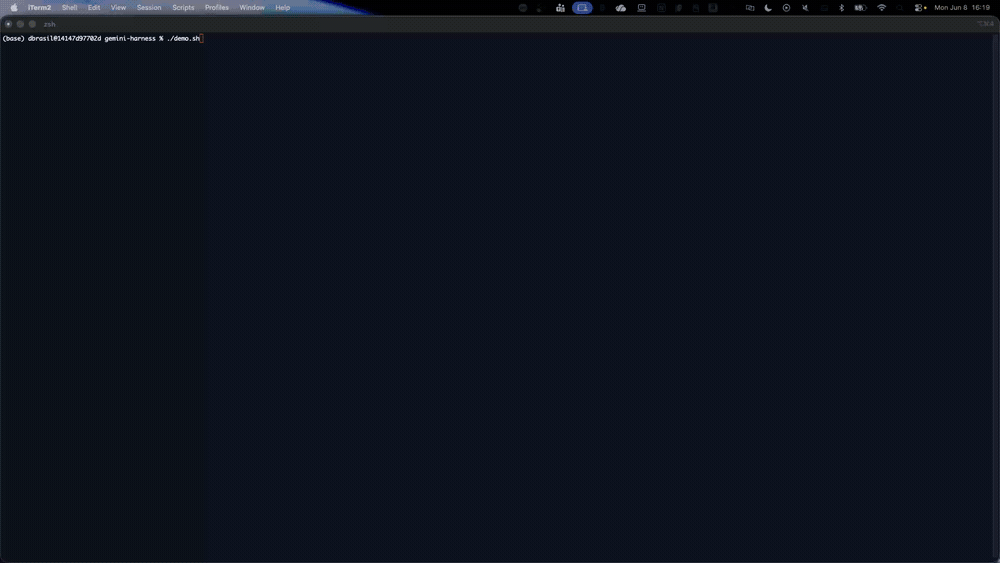

# Gemini Harness (AgentCore CLI)

Run an [AgentCore Harness](https://docs.aws.amazon.com/bedrock-agentcore/latest/devguide/harness.html)
on a **Google Gemini** model, built entirely with the AgentCore CLI.



| Item              | Detail                                                       |
|:------------------|:-------------------------------------------------------------|
| Type              | Feature sample                                               |
| Agent             | General-purpose assistant (Harness — no orchestration code)  |
| Model provider    | Google Gemini (`gemini-2.5-flash`)                           |
| CLI               | `@aws/agentcore@preview` (tested on `1.0.0-preview.12`)      |
| Complexity        | Beginner                                                     |

A harness is a config-based managed agent loop: you declare the model and the
service runs it in an isolated microVM. Gemini is a non-Bedrock provider, so its
API key lives in **AgentCore Identity** (token vault) and the harness references
it by ARN — the key never sits in the harness config.

## Prerequisites

- **Node.js 20+** and the preview CLI:
  ```bash
  npm install -g @aws/agentcore@preview
  agentcore --version          # 1.0.0-preview.12 or later
  ```
- **AWS credentials** for a harness preview region: `us-east-1`, `us-west-2`,
  `ap-southeast-2`, or `eu-central-1`.
  ```bash
  export AWS_DEFAULT_REGION=us-west-2
  ```
- A **Google Gemini API key** (Google AI Studio):
  ```bash
  export GEMINI_API_KEY="<your-key>"
  ```

## Steps

### 1. Create an empty project

```bash
agentcore create --project-name geminiharness --no-agent
cd geminiharness
```

`--no-agent` gives you a project with no code-based agent — just the structure a
harness needs. (Don't pass `--skip-install`: the CDK toolchain must be installed
or `deploy` fails its TypeScript build.)

### 2. Store the Gemini key

```bash
agentcore add credential --type api-key --name my-gemini-key --api-key "$GEMINI_API_KEY"
```

This registers the key in the token vault. Its ARN is:

```
arn:aws:bedrock-agentcore:<region>:<account-id>:token-vault/default/apikeycredentialprovider/my-gemini-key
```

### 3. Add the harness

Pass the **full ARN** (not the credential name) to `--api-key-arn`:

```bash
agentcore add harness \
  --name gemini_harness \
  --model-provider gemini \
  --model-id gemini-2.5-flash \
  --api-key-arn "arn:aws:bedrock-agentcore:us-west-2:<account-id>:token-vault/default/apikeycredentialprovider/my-gemini-key" \
  --no-memory
```

### 4. Set the deployment target

If `agentcore/aws-targets.json` is empty (`[]`), add a `default` target:

```json
[
  { "name": "default", "account": "<account-id>", "region": "us-west-2" }
]
```

### 5. Deploy and invoke

```bash
agentcore deploy --yes

agentcore invoke \
  --harness gemini_harness \
  --session-id "$(uuidgen)" \
  "What model are you and who trained you?"
```

Expected reply: *"I am a large language model, trained by Google."* — confirming
the harness routes to Gemini. Reuse the same `--session-id` to continue a
conversation in the same microVM.

Check resources any time:

```bash
agentcore status
```

## Clean up

```bash
agentcore remove harness --name gemini_harness --yes
agentcore remove credential --name my-gemini-key --yes
agentcore deploy --yes
```

> Deleting a harness reserves its name for a while (minutes–hours). To redeploy
> sooner, use a new harness name.

## Demo

The GIF above (`images/gemini-harness.gif`) shows `demo.sh` running the full flow
end to end. To run it yourself:

```bash
./demo.sh                 # prompts for the Gemini key if not already set
STEP_PAUSE=2 ./demo.sh    # slower, for recording
```

## Notes

- Verified end-to-end on `1.0.0-preview.12` (deploy + live Gemini invoke).
- Step 4 (writing the `default` target) is a manual step because no
  non-interactive flag sets it; interactive `agentcore create` prompts for it.
  May change in a later CLI release.
- The CLI's harness supports `bedrock`, `open_ai`, and `gemini` as model
  providers. For the OpenAI-compatible Mantle endpoint and LiteLLM routing on a
  newer CLI, see [11-mantle](../11-mantle) and [12-litellm-mantle](../12-litellm-mantle).

## References

- [Harness — dev guide](https://docs.aws.amazon.com/bedrock-agentcore/latest/devguide/harness.html)
- [Configure agents and models](https://docs.aws.amazon.com/bedrock-agentcore/latest/devguide/harness-config-and-models.html)
- [AgentCore CLI](https://github.com/aws/agentcore-cli)
