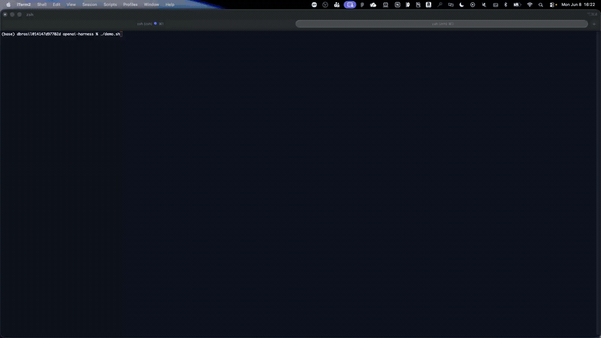

# OpenAI Harness (AgentCore CLI)

Run an [AgentCore Harness](https://docs.aws.amazon.com/bedrock-agentcore/latest/devguide/harness.html)
on an **OpenAI model hosted in Amazon Bedrock** (GPT-OSS), built entirely with
the AgentCore CLI.



| Item              | Detail                                                       |
|:------------------|:-------------------------------------------------------------|
| Type              | Feature sample                                               |
| Agent             | General-purpose assistant (Harness — no orchestration code)  |
| Model provider    | `bedrock` (OpenAI GPT-OSS — `openai.gpt-oss-20b-1:0`)        |
| CLI               | `@aws/agentcore@preview` (tested on `1.0.0-preview.12`)      |
| Complexity        | Beginner                                                     |

OpenAI's GPT-OSS models are served **through Amazon Bedrock**, so the harness
uses `--model-provider bedrock` — auth is handled by the harness execution role
(IAM). No OpenAI API key and no credential resource are needed.

> This is the Bedrock-hosted path. The CLI also has a native `open_ai` provider
> (OpenAI's own API, key-based), but for the NY Summit samples all non-Gemini
> models run through Bedrock.

## Prerequisites

- **Node.js 20+** and the preview CLI:
  ```bash
  npm install -g @aws/agentcore@preview
  agentcore --version          # 1.0.0-preview.12 or later
  ```
- **AWS credentials** for a harness preview region: `us-east-1`, `us-west-2`,
  `ap-southeast-2`, or `eu-central-1`.
  ```bash
  export AWS_DEFAULT_REGION=us-west-2
  ```
- **Bedrock model access** enabled for the OpenAI GPT-OSS models in your account.
  Check what's available:
  ```bash
  aws bedrock list-foundation-models --by-provider openai --region us-west-2
  # e.g. openai.gpt-oss-20b-1:0, openai.gpt-oss-120b-1:0
  ```

## Steps

### 1. Create an empty project

```bash
agentcore create --project-name openaiharness --no-agent
cd openaiharness
```

`--no-agent` gives you a project with no code-based agent — just the structure a
harness needs. (Don't pass `--skip-install`: the CDK toolchain must be installed
or `deploy` fails its TypeScript build.)

### 2. Add the harness

No credential step — the bedrock provider uses your execution role:

```bash
agentcore add harness \
  --name openai_gptoss \
  --model-provider bedrock \
  --model-id openai.gpt-oss-20b-1:0 \
  --no-memory
```

### 3. Set the deployment target

If `agentcore/aws-targets.json` is empty (`[]`), add a `default` target:

```json
[
  { "name": "default", "account": "<account-id>", "region": "us-west-2" }
]
```

### 4. Deploy and invoke

```bash
agentcore deploy --yes

agentcore invoke \
  --harness openai_gptoss \
  --session-id "$(uuidgen)" \
  "What model are you?"
```

Verified reply: *"I'm ChatGPT, a large language model … OpenAI's GPT-4
architecture."* — confirming the harness routes to the OpenAI model. Reuse the
same `--session-id` to continue in the same microVM.

Check resources any time:

```bash
agentcore status
```

## Clean up

```bash
agentcore remove harness --name openai_gptoss --yes
agentcore deploy --yes
```

> Deleting a harness reserves its name for a while (minutes–hours). To redeploy
> sooner, use a new harness name.

## Demo

The GIF above (`images/openai-harness.gif`) shows `demo.sh` running the full flow
end to end. To run it yourself:

```bash
./demo.sh                                     # no API key needed (bedrock provider)
MODEL_ID=openai.gpt-oss-120b-1:0 ./demo.sh    # larger model
```

## Notes

- Verified end-to-end on `1.0.0-preview.12` (deploy + live invoke,
  `openai.gpt-oss-20b-1:0`, us-west-2).
- Bedrock-hosted models need no API key — the execution role's
  `bedrock:InvokeModel*` permission covers it.
- Step 3 (writing the `default` target) is manual because no non-interactive
  flag sets it; interactive `agentcore create` prompts for it.
- Swap `--model-id` to `openai.gpt-oss-120b-1:0` for the larger model.

## References

- [Harness — dev guide](https://docs.aws.amazon.com/bedrock-agentcore/latest/devguide/harness.html)
- [Configure agents and models](https://docs.aws.amazon.com/bedrock-agentcore/latest/devguide/harness-config-and-models.html)
- [AgentCore CLI](https://github.com/aws/agentcore-cli)
