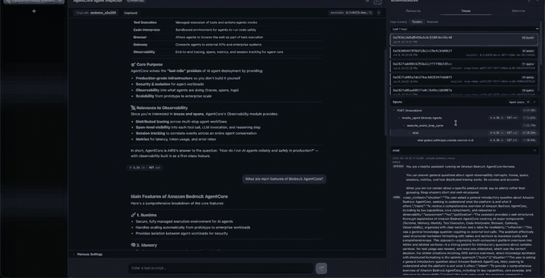
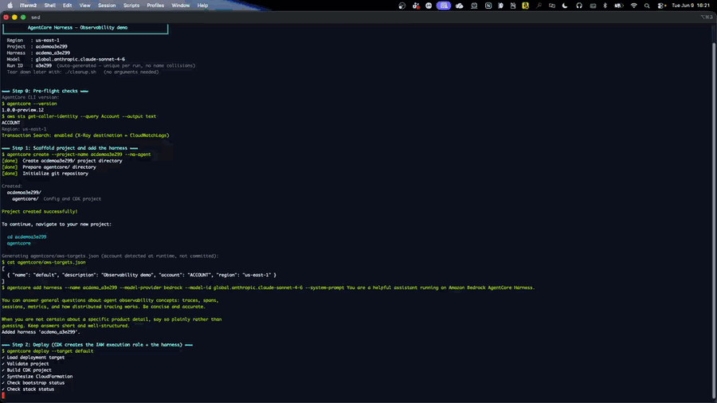

# Getting started with the Agent Inspector



| Information         | Details                                                          |
|:--------------------|:-----------------------------------------------------------------|
| Tutorial type       | Advanced example                                                 |
| Agent type          | General-purpose assistant                                        |
| Agentic framework   | None (AgentCore CLI)                                             |
| LLM model           | Anthropic Claude Sonnet 4.6                                      |
| Tutorial components | AgentCore harness, Agent Inspector (`agentcore dev`), AgentCore Observability, CloudWatch |
| Example complexity  | Beginner                                                         |
| Tooling             | `agentcore` CLI + `aws` CLI (no application code)                |

Deploy a harness from scratch with the AgentCore CLI, then open the **Agent Inspector** —
the local web UI launched by `agentcore dev` — to chat with the agent and watch its
**sessions, traces, and spans** appear live, with no instrumentation code.

## What you learn

- Scaffold and deploy a harness with the AgentCore CLI (`create --no-agent` → `add harness` → `deploy`)
- Why harness telemetry is **automatic** — no ADOT, no `OTEL_*` variables, no code
- Enable **CloudWatch Transaction Search** (the one account-level prerequisite for traces)
- Confirm OpenTelemetry spans landed in the `aws/spans` log group
- Open the **Agent Inspector** to view the session, the trace, and the span tree
- Read the same data two ways: the Agent Inspector and the CloudWatch GenAI Observability console

## Deploy first, then inspect

The order matters, and it is the whole point of this sample. The Agent Inspector reads the
harness's telemetry **from CloudWatch**, so there is nothing to inspect until the harness is
deployed and has handled at least one invocation. If you open the Inspector against a harness
that was never invoked, the Traces pane is empty — not broken, just empty.

So `demo.sh` deploys, invokes the agent a few times, confirms the spans landed in `aws/spans`,
and **only then** launches the Inspector — so the data is already there when the UI opens.

## How harness observability works

A harness runs on AgentCore Runtime in an isolated microVM. The managed agent loop is
instrumented **service-side** with the AWS Distro for OpenTelemetry (ADOT). That is the key
difference from a code-based agent:

| | Code-based agent (you write the loop) | Harness (managed loop) |
|---|---|---|
| Instrumentation | You add ADOT + set `OTEL_*` env vars | Automatic, service-side |
| First trace | After you wire it up | From the first invocation |
| Account prerequisite | CloudWatch Transaction Search | CloudWatch Transaction Search |

The telemetry forms a three-level hierarchy:

| Level | What it is | Keyed by |
|---|---|---|
| **Session** | a full conversation | `runtimeSessionId` |
| **Trace** | one invocation (request/response cycle) | `traceId` |
| **Span** | one unit of work in a trace (model call, tool call, memory op) | `spanId` |

Spans carry GenAI semantic-convention attributes such as `gen_ai.request.model`,
`gen_ai.usage.input_tokens`, and `gen_ai.usage.output_tokens`.

## Architecture

```
agentcore CLI
    │  create --no-agent → add harness → deploy
    ▼
[Control Plane]  the harness + IAM execution role are created
    │
    ▼
[Harness] READY ──invoke──▶ [Firecracker microVM]
                               ├── agent loop (Claude Sonnet 4.6 + tools + memory)
                               └── service-side ADOT instrumentation
                                          │  OpenTelemetry spans
                                          ▼
                          CloudWatch  ──  aws/spans  (Transaction Search)
                                          │
              ┌───────────────────────────┴───────────────────────────┐
              ▼                                                         ▼
   Agent Inspector (agentcore dev)                    GenAI Observability console
   local web UI: chat + Traces pane                   Sessions / Traces / Spans
```

Both views read the same CloudWatch spans. The Agent Inspector is the local one this sample
opens; the GenAI Observability console is the same data in the AWS console.

## Prerequisites

- **AgentCore CLI (preview):** `npm install -g @aws/agentcore@preview`
- **AWS CLI v2** with credentials for a harness preview region
  (`us-east-1`, `us-west-2`, `ap-southeast-2`, `eu-central-1`).
- Amazon Bedrock model access to Claude Sonnet 4.6 in that region.
- **CloudWatch Transaction Search enabled once per account.** `demo.sh` checks this and prints
  the enable commands if it is missing. See
  [AgentCore Observability — getting started](https://docs.aws.amazon.com/bedrock-agentcore/latest/devguide/observability-get-started.html).

## Run

```bash
# default region us-east-1; override with AWS_REGION
./demo.sh

# offline self-test (no AWS calls) — validates account masking + files
./demo.sh --self-test
```

`demo.sh` runs these steps and prints each command before it runs:

1. Pre-flight checks (CLI, credentials, Transaction Search).
2. Scaffold an empty project and add a harness (Claude Sonnet 4.6, long-term memory on).
3. Deploy — CDK creates the IAM execution role and the harness is created.
4. Invoke the harness across one session (multiple turns).
5. Query `aws/spans` to confirm OpenTelemetry spans were emitted.
6. Launch the **Agent Inspector** (`agentcore dev --skip-deploy`) — the local web UI, wired to
   the deployed harness. It runs until you stop it with `Ctrl-C`.

Steps 1-5, the scripted deploy (account ID masked as `<ACCOUNT>`):



> Step 6 is interactive: it opens the Agent Inspector and stays running. That is expected — it
> is the UI you explore. `--skip-deploy` is used because step 3 already deployed (otherwise
> `agentcore dev` would deploy again).

> **Account safety:** your AWS account ID is detected at runtime and used only to generate a
> git-ignored `aws-targets.json`. All printed output is masked — the account ID becomes
> `<ACCOUNT>` and your username/home path becomes `<USER>` — so a terminal recording of
> `demo.sh` is safe to share.

## View the results

### In the Agent Inspector (what this sample opens)

When `agentcore dev` launches, the Agent Inspector opens in your browser with:

- a **chat panel** to invoke the agent,
- a **Traces** pane that reads the harness's CloudWatch spans (the same data from step 5),
- a **Memory / Resources** view.

Open a trace to see the span tree, each row showing token usage and latency:

```
POST /invocations
  └─ invoke_agent Strands Agents          4.3k in / 617 out   12.08s
       └─ execute_event_loop_cycle        4.3k in / 617 out   11.28s
            └─ chat                        4.3k in / 617 out   10.39s
                 └─ chat global.anthropic.claude-sonnet-4-6
```

### In the GenAI Observability console (the same data, in AWS)

```
https://us-east-1.console.aws.amazon.com/cloudwatch/home?region=us-east-1#gen-ai-observability
```

Under the **Bedrock AgentCore** tab: **Sessions** (keyed by `runtimeSessionId`), **Traces**
(per invocation), and **Spans** (token usage, latency, GenAI attributes).

You can also query the raw spans directly:

```bash
aws logs filter-log-events --log-group-name aws/spans \
  --filter-pattern "<your-session-id>" --region us-east-1
```

## Best practices

- **Deploy and invoke before you inspect.** The Inspector shows what is in CloudWatch; an
  uninvoked harness has nothing to show.
- **Enable Transaction Search once per account, early.** Spans take a few minutes to appear
  after it is first enabled — turn it on before you need to debug, not during an incident.
- **Reuse the same `runtimeSessionId`** across turns you want grouped into one session. A new
  id starts a new session in the Inspector and the console.
- **Do not add ADOT to a harness.** It is already instrumented service-side; `OTEL_*` variables
  are the path for *code-based* agents only.
- **Scope the execution role tightly in production.** The CLI generates a working role; for real
  workloads, narrow the Bedrock model and resource ARNs to what the harness actually uses.
- **Clean up.** A running harness keeps its session VM warm. Run `./cleanup.sh` when you are done.

## Manual CLI walkthrough

The same flow without `demo.sh`, one command at a time. Replace `<ACCOUNT>` and pick a region.

```bash
export AWS_REGION=us-east-1

# 1. Empty project (no code-based agent), then add a harness
agentcore create --project-name acdemo --no-agent
cd acdemo

# 2. Tell the CLI where to deploy (account detected from your credentials)
cat > agentcore/aws-targets.json <<JSON
[ { "name": "default", "account": "<ACCOUNT>", "region": "us-east-1" } ]
JSON

# 3. Add the harness (Claude Sonnet 4.6, long-term memory auto-created)
agentcore add harness --name acdemo_assistant \
  --model-provider bedrock --model-id global.anthropic.claude-sonnet-4-6 \
  --system-prompt "You are a helpful assistant running on Amazon Bedrock AgentCore Harness."

# 4. Deploy (CDK creates the IAM execution role; the harness is created)
agentcore deploy --target default

# 5. Invoke — this is what generates the telemetry
SID="acdemo-$(uuidgen)"
agentcore invoke --harness acdemo_assistant --session-id "$SID" \
  "List three signals AgentCore Observability captures for an agent invocation."

# 6. Confirm the spans landed (give it 1-3 minutes)
aws logs filter-log-events --log-group-name aws/spans \
  --filter-pattern "$SID" --region "$AWS_REGION" --query 'length(events)'

# 7. Open the Agent Inspector against the deployed harness
agentcore dev --skip-deploy
```

## Clean up

```bash
./cleanup.sh
```

This removes the harness and memory, deletes the CDK stack (IAM role + memory), and removes the
local workspace, so no billable resources are left behind.

> The harness name is soft-deleted and reserved for a short time after deletion. The next
> `./demo.sh` run auto-generates a fresh unique name, so you can run it again right away.

## Where to next

- **[01-custom-containers](../01-custom-containers)** — bring your own container image for the harness.
- **[03-execution-limits](../03-execution-limits)** — cap iterations, tokens, and timeouts.
- **[AgentCore Observability dev guide](https://docs.aws.amazon.com/bedrock-agentcore/latest/devguide/observability.html)** — metrics, log groups, and trace details.
- **[AgentCore harness dev guide](https://docs.aws.amazon.com/bedrock-agentcore/latest/devguide/harness.html)** — the full harness reference.
