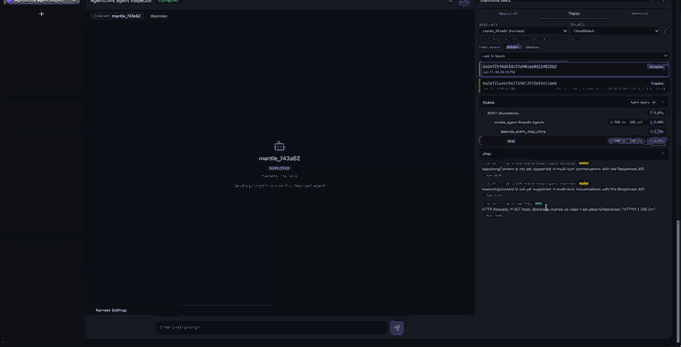
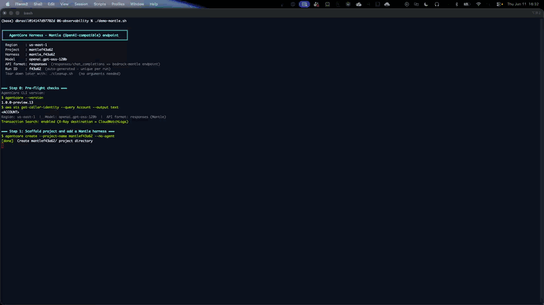

# Run a harness model through the Mantle (OpenAI-compatible) endpoint



| Information         | Details                                                          |
|:--------------------|:-----------------------------------------------------------------|
| Tutorial type       | Advanced example                                                 |
| Agent type          | General-purpose assistant                                        |
| Agentic framework   | None (AgentCore CLI)                                             |
| LLM model           | OpenAI `gpt-oss-120b` (open-weight), served through Amazon Bedrock |
| Tutorial components | AgentCore harness, Bedrock Mantle endpoint, Observability, CloudWatch |
| Example complexity  | Beginner                                                         |
| Tooling             | `agentcore` CLI (no application code)                            |

A Bedrock harness can call its model two ways, chosen by one config field, `apiFormat`. This
example uses the OpenAI-compatible **Mantle** path to run OpenAI's open-weight `gpt-oss-120b`
through Amazon Bedrock — no API key, the harness execution role's Bedrock permissions are used.

## What you learn

- The difference between the `bedrock-runtime` (Converse) and `bedrock-mantle` (OpenAI-compatible) endpoints
- How to select the endpoint with `agentcore add harness --api-format`
- Run an OpenAI open-weight model (`gpt-oss-120b`) on a harness with no API key
- Confirm the Mantle harness is observable — the GenAI span tree lands in `aws/spans`
- The model-id gotcha that trips up the Mantle endpoint

## Two endpoints, one flag

A `bedrock` harness routes inference based on `--api-format`:

| `--api-format` | Endpoint | API | Use when |
|---|---|---|---|
| `converse_stream` (default) | `bedrock-runtime` | Bedrock Converse | Bedrock-native models and tools |
| `responses` | `bedrock-mantle` | OpenAI Responses | OpenAI-compatible, stateful, server-side tools |
| `chat_completions` | `bedrock-mantle` | OpenAI Chat Completions | Bringing OpenAI SDK-style code to Bedrock |

`responses` and `chat_completions` are the OpenAI-compatible "Mantle" APIs. With them, a `bedrock`
provider harness sends inference to the `bedrock-mantle.{region}.api.aws` endpoint. The choice is
saved to `harness.json` as `model.apiFormat`; it is not a different provider (the provider stays
`bedrock`).

## ⚠️ The Mantle model id drops the version suffix

This is the one thing that will trip you up. The same model has **two ids**:

| Endpoint | Model id |
|---|---|
| `bedrock-runtime` / `list-foundation-models` | `openai.gpt-oss-120b-1:0` |
| **`bedrock-mantle`** | **`openai.gpt-oss-120b`** (no `-1:0`) |

Passing the `-1:0` form to a Mantle harness returns `404 "The model '...' does not exist"`. Use the
suffix-less id for `--api-format responses`/`chat_completions`.

## Architecture

```
agentcore CLI  → create --no-agent → add harness --api-format responses → deploy
                                                   │
                                                   ▼
[Harness] READY ──invoke──▶ [Firecracker microVM]
                               ├── agent loop (gpt-oss-120b)
                               └── service-side ADOT instrumentation
                                          │  OpenTelemetry spans
                                          ▼   (model inference → bedrock-mantle endpoint)
                          CloudWatch  ──  aws/spans  (Transaction Search)
```

The harness is auto-instrumented exactly like a Converse harness — no ADOT, no `OTEL_*` variables.

## Prerequisites

- **AgentCore CLI (preview):** `npm install -g @aws/agentcore@preview` (preview.13+ — that is when
  `--api-format` shipped in the CLI).
- **AWS CLI v2** with credentials for a harness preview region
  (`us-east-1`, `us-west-2`, `ap-southeast-2`, `eu-central-1`).
- Amazon Bedrock access to `openai.gpt-oss-120b` in that region.
- **CloudWatch Transaction Search enabled once per account** (the script checks and prints the
  enable commands if missing). See
  [AgentCore Observability — getting started](https://docs.aws.amazon.com/bedrock-agentcore/latest/devguide/observability-get-started.html).

## Run

```bash
# default region us-east-1; override with AWS_REGION
./demo.sh

# offline self-test (no AWS calls)
./demo.sh --self-test
```

`demo.sh` runs these steps, printing each command:

1. Pre-flight checks (CLI, credentials, Transaction Search).
2. Scaffold an empty project and add a harness with `--api-format responses` (gpt-oss-120b, memory on).
3. Deploy — CDK creates the IAM execution role and the harness is created.
4. Invoke the harness through Mantle across one session.
5. Query `aws/spans` to confirm OpenTelemetry spans were emitted.
6. Launch the **Agent Inspector** (`agentcore dev --skip-deploy`) to watch the telemetry live.

The scaffold step, showing `--api-format responses` and the `apiFormat` written into `harness.json`:



> **Account safety:** the account ID is detected at runtime (used only for a git-ignored
> `aws-targets.json`) and masked as `<ACCOUNT>`; your username/home path is masked as `<USER>`. A
> terminal recording of `demo.sh` is safe to share.

## The single config difference

Everything is the same as a default harness except the model block. After `add harness`,
`harness.json` reads:

```json
"model": {
  "provider": "bedrock",
  "modelId": "openai.gpt-oss-120b",
  "apiFormat": "responses"
}
```

The equivalent CLI call:

```bash
agentcore add harness --name my-mantle-agent \
  --model-provider bedrock \
  --model-id openai.gpt-oss-120b \
  --api-format responses \
  --system-prompt "You are a helpful assistant."
```

## View the results

In the Agent Inspector (or the CloudWatch GenAI Observability console), open a trace to see the
span tree — same shape as any harness, and the span carries the Mantle model id and token usage:

```
POST /invocations
  └─ invoke_agent Strands Agents          ... in / ... out
       └─ execute_event_loop_cycle
            └─ chat                         gen_ai.request.model = openai.gpt-oss-120b
```

```
https://us-east-1.console.aws.amazon.com/cloudwatch/home?region=us-east-1#gen-ai-observability
```

> Spans take **3-10 minutes** to appear (the infrastructure spans land first; the `chat` /
> `invoke_agent` spans follow). Don't conclude "no telemetry" early — leave the Inspector open.

## Best practices

- **Use the suffix-less model id** for Mantle (`openai.gpt-oss-120b`). The `-1:0` form 404s.
- **`--api-format` is set at add-harness time.** `agentcore invoke` overrides `--model-id` and
  `--model-provider` but not the API format. To switch Converse↔Mantle per call, use the boto3
  `invoke_harness` `model` object.
- **No API key needed** for a `bedrock` Mantle harness — it uses the execution role's Bedrock
  permissions, just like a Converse harness.
- **Enable Transaction Search once per account, early**, so spans are visible when you need them.
- **Clean up.** Run `./cleanup.sh` when you are done so no billable resources are left.

## Clean up

```bash
./cleanup.sh
```

Removes the harness and memory, deletes the CDK stack, and removes the local workspace.

## Where to next

- **[10-getting-started-with-agent-inspector](../../10-getting-started-with-agent-inspector)** — the default (Converse) harness + Agent Inspector walkthrough this builds on.
- **[Endpoints supported by Amazon Bedrock](https://docs.aws.amazon.com/bedrock/latest/userguide/endpoints.html)** — `bedrock-runtime` vs `bedrock-mantle`.
- **[AgentCore harness dev guide](https://docs.aws.amazon.com/bedrock-agentcore/latest/devguide/harness.html)** — the full harness reference.
