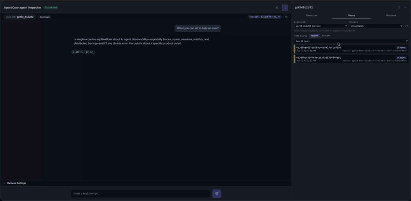
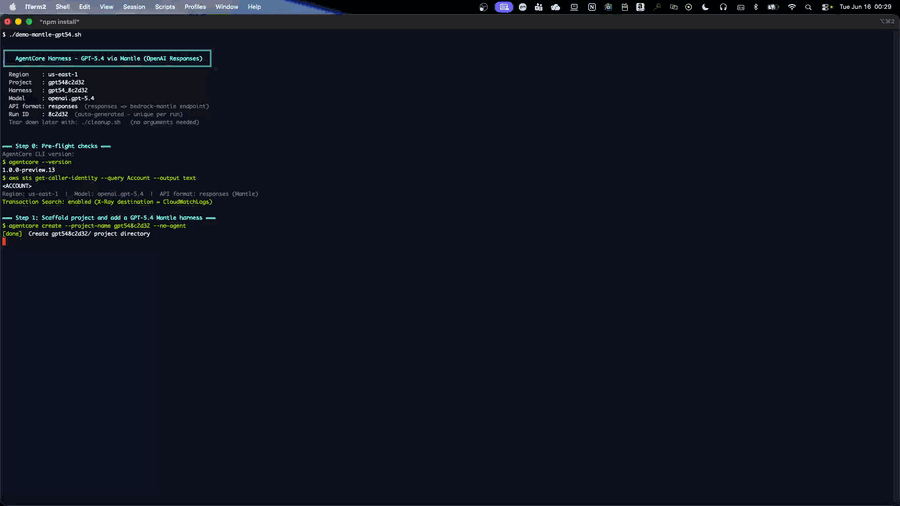

# Run GPT-5.4 on a harness via the Mantle (OpenAI Responses) endpoint



| Information         | Details                                                          |
|:--------------------|:-----------------------------------------------------------------|
| Tutorial type       | Advanced example                                                 |
| Agent type          | General-purpose assistant                                        |
| Agentic framework   | None (AgentCore CLI)                                             |
| LLM model           | OpenAI **GPT-5.4**, served through Amazon Bedrock                |
| Tutorial components | AgentCore harness, Bedrock Mantle endpoint, Observability, CloudWatch |
| Example complexity  | Beginner                                                         |
| Tooling             | `agentcore` CLI (no application code)                            |

This example runs OpenAI's **GPT-5.4** on an AgentCore harness by routing inference through the
OpenAI-compatible **Mantle** endpoint. It builds on
[the endpoint example](../endpoint) (which uses the open-weight `gpt-oss-120b`); the
difference here is the model and one important constraint that comes with it.

## What you learn

- Run a hosted **GPT-5.4** model on a harness with a single CLI command
- Why GPT-5.4 requires `--api-format responses` specifically (it does not support Converse or Chat Completions)
- Confirm the harness is observable in CloudWatch (the GenAI span tree, with token usage)
- Read the telemetry in the Agent Inspector and the GenAI Observability console

## GPT-5.4 is a Responses-API model

A Bedrock harness chooses how it calls its model with `--api-format`:

| `--api-format` | Endpoint | API |
|---|---|---|
| `converse_stream` (default) | `bedrock-runtime` | Bedrock Converse |
| `responses` | `bedrock-mantle` | OpenAI Responses |
| `chat_completions` | `bedrock-mantle` | OpenAI Chat Completions |

Per the Amazon Bedrock
[model/API compatibility table](https://docs.aws.amazon.com/bedrock/latest/userguide/models-api-compatibility.html),
**GPT-5.4 supports the Responses API only** — not Converse, not Chat Completions. So this example
**must** use `--api-format responses`. With any other format the model is rejected at invoke time.

That is the one rule to remember: **GPT-5.4 on a harness = `--api-format responses`.**

## Architecture

```
agentcore CLI  → create --no-agent → add harness --api-format responses → deploy
                                                   │
                                                   ▼
[Harness] READY ──invoke──▶ [Firecracker microVM]
                               ├── agent loop (GPT-5.4)
                               └── service-side ADOT instrumentation
                                          │  OpenTelemetry spans
                                          ▼   (inference → bedrock-mantle Responses API)
                          CloudWatch  ──  aws/spans  (Transaction Search)
```

The harness is auto-instrumented exactly like any other — no ADOT setup, no `OTEL_*` variables.

## Prerequisites

- **AgentCore CLI (preview):** `npm install -g @aws/agentcore@preview`
- **AWS CLI v2** with credentials for a harness preview region
  (`us-east-1`, `us-west-2`, `ap-southeast-2`, `eu-central-1`).
- Amazon Bedrock access to `openai.gpt-5.4` in that region (enable it under Bedrock model access).
- **CloudWatch Transaction Search enabled once per account** (the script checks and prints the
  enable commands if missing). See
  [AgentCore Observability — getting started](https://docs.aws.amazon.com/bedrock-agentcore/latest/devguide/observability-get-started.html).

## Run

```bash
# default region us-east-1; override with AWS_REGION
./demo.sh

# offline self-test (no AWS calls)
./demo.sh --self-test
```

`demo.sh` runs these steps, printing each command:

1. Pre-flight checks (CLI, credentials, Transaction Search).
2. Scaffold an empty project and add a harness with `openai.gpt-5.4` + `--api-format responses`.
3. Deploy — CDK creates the IAM execution role and the harness is created.
4. Invoke GPT-5.4 across one session.
5. Query `aws/spans` to confirm OpenTelemetry spans were emitted.
6. Launch the **Agent Inspector** (`agentcore dev --skip-deploy`) to watch the telemetry live.

The scaffold + deploy steps, showing `--api-format responses` and the `harness.json` it writes:



> **Account safety:** the account ID is detected at runtime (used only for a git-ignored
> `aws-targets.json`) and masked as `<ACCOUNT>`; your username/home path is masked as `<USER>`. A
> terminal recording of `demo.sh` is safe to share.

## The single config difference

After `add harness`, the model block in `harness.json` reads:

```json
"model": {
  "provider": "bedrock",
  "modelId": "openai.gpt-5.4",
  "apiFormat": "responses"
}
```

The equivalent CLI call:

```bash
agentcore add harness --name my-gpt5-agent \
  --model-provider bedrock \
  --model-id openai.gpt-5.4 \
  --api-format responses \
  --system-prompt "You are a helpful assistant."
```

## View the results

In the Agent Inspector (or the CloudWatch GenAI Observability console), open a trace to see the span
tree — the model call appears with its token usage:

```
POST /invocations
  └─ invoke_agent Strands Agents          ... in / ... out
       └─ execute_event_loop_cycle
            └─ chat                         gen_ai.request.model = openai.gpt-5.4
```

```
https://us-east-1.console.aws.amazon.com/cloudwatch/home?region=us-east-1#gen-ai-observability
```

> Spans take **3-10 minutes** to appear (infrastructure spans land first; the `chat` /
> `invoke_agent` spans follow). Don't conclude "no telemetry" early — leave the Inspector open.

## Best practices

- **Use `--api-format responses` for GPT-5.4.** It is the only API the model supports; `converse_stream`
  and `chat_completions` will be rejected.
- **No API key needed** for a `bedrock`-provider Mantle harness — it uses the execution role's Bedrock
  permissions.
- **Enable Transaction Search once per account, early**, so spans are visible when you need them.
- **Clean up.** Run `./cleanup.sh` when you are done so no billable resources are left.

## Clean up

```bash
./cleanup.sh
```

Removes the harness and memory, deletes the CDK stack, and removes the local workspace.

## Where to next

- **[endpoint](../endpoint)** — the same Mantle path with the open-weight `gpt-oss-120b`.
- **[10-getting-started-with-agent-inspector](../../10-getting-started-with-agent-inspector)** — the default (Converse) harness + Agent Inspector walkthrough.
- **[Endpoints supported by Amazon Bedrock](https://docs.aws.amazon.com/bedrock/latest/userguide/endpoints.html)** — `bedrock-runtime` vs `bedrock-mantle`.
