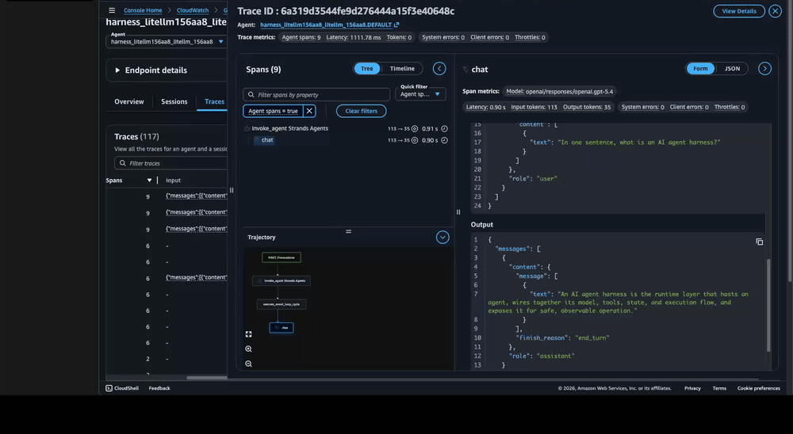
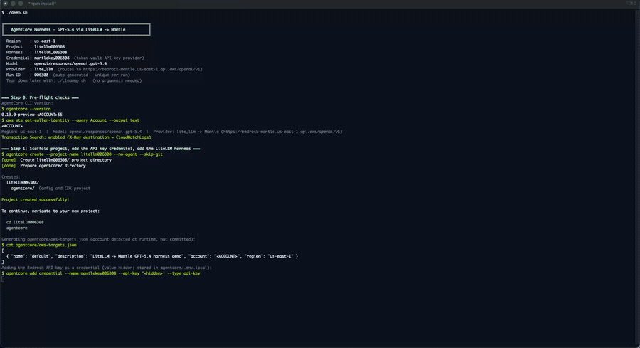

# Run GPT-5.4 on a harness with a LiteLLM model configuration (routing to Mantle)



| Information         | Details                                                          |
|:--------------------|:-----------------------------------------------------------------|
| Tutorial type       | Advanced example                                                 |
| Agent type          | General-purpose assistant                                        |
| Agentic framework   | None (AgentCore CLI)                                             |
| LLM model           | OpenAI **GPT-5.4**, served through Amazon Bedrock                |
| Tutorial components | AgentCore harness, LiteLLM model config, credential provider, Bedrock Mantle endpoint, Observability |
| Example complexity  | Intermediate                                                     |
| Tooling             | `agentcore` CLI (no application code)                            |

This example runs OpenAI's **GPT-5.4** on an AgentCore harness using a **LiteLLM** model
configuration, with LiteLLM routing inference to the OpenAI-compatible **Mantle** endpoint on
Amazon Bedrock.

It is the LiteLLM counterpart to [11-mantle/gpt5](../11-mantle/gpt5). Same model, same endpoint.
The difference is how the harness reaches the model, and that difference is the point of this
sample.

## LiteLLM is a routing layer, not a "model provider"

A harness picks how it calls its model with `--model-provider`:

| `--model-provider` | What it means |
|---|---|
| `bedrock` | The harness calls Amazon Bedrock directly with the execution role's permissions. |
| `lite_llm` | The harness calls the model through [LiteLLM](https://www.litellm.ai/), a routing layer that speaks many model APIs behind one interface. You give it a base URL and a credential. |

So `lite_llm` is not a hosted model. It is plumbing. You point it at an endpoint (`--api-base`) and
hand it a key (`--api-key-arn`), and it routes the request there. In this sample the endpoint is the
Bedrock Mantle (OpenAI Responses) endpoint, so LiteLLM ends up calling the same place
[11-mantle/gpt5](../11-mantle/gpt5) calls directly, just through one extra layer.

Two pieces of the model id and base URL matter:

- **`--model-id openai/responses/openai.gpt-5.4`** — the `responses/` segment forces LiteLLM onto the
  OpenAI **Responses** route. GPT-5.4 supports Responses only (not Chat Completions, not Converse),
  so this segment is required.
- **`--api-base https://bedrock-mantle.<region>.api.aws/openai/v1`** — the OpenAI-compatible base path
  on the Mantle endpoint.

## The credential flow

Unlike a `bedrock`-provider harness (which uses the execution role and needs no key), a `lite_llm`
harness needs an API key to authenticate to the endpoint. The CLI handles this without any code:

1. `agentcore add credential --name <name> --api-key <key> --type api-key` stores the key in
   `agentcore/.env.local` (git-ignored) and records the credential in the project.
2. `agentcore deploy` creates a **token-vault API-key credential provider** from it and wires the
   harness to it by ARN.
3. Deploy also grants the execution role `bedrock-agentcore:GetResourceApiKey` on that provider, so
   the running harness can fetch the key. No manual IAM.

The key value is read from the `BEDROCK_API_KEY` environment variable (or a `demo.env` file next to
the script). It is never printed and never committed.

## Architecture

```
agentcore CLI  → create → add credential → add harness (lite_llm) → deploy
                                                   │
                                                   ▼
[Harness] READY ──invoke──▶ [Firecracker microVM]
                               ├── agent loop (GPT-5.4)
                               ├── LiteLLM routing layer
                               └── service-side ADOT instrumentation
                                          │  OpenTelemetry spans
                                          ▼   (inference → bedrock-mantle Responses API)
                          CloudWatch  ──  aws/spans  (Transaction Search)
```

The harness is auto-instrumented like any other — no ADOT setup, no `OTEL_*` variables.

## Prerequisites

- **AgentCore CLI (preview):** `npm install -g @aws/agentcore@preview`
- **AWS CLI v2** with credentials for a harness preview region
  (`us-east-1`, `us-west-2`, `ap-southeast-2`, `eu-central-1`).
- **A Bedrock API key** for the Mantle endpoint (Bedrock console → API keys). Export it as
  `BEDROCK_API_KEY` or put `BEDROCK_API_KEY=...` in a `demo.env` next to `demo.sh`.
- Amazon Bedrock access to `openai.gpt-5.4` in that region.
- **CloudWatch Transaction Search enabled once per account** (the script checks and prints the
  enable commands if missing). See
  [AgentCore Observability — getting started](https://docs.aws.amazon.com/bedrock-agentcore/latest/devguide/observability-get-started.html).

## Run

```bash
# default region us-east-1; override with AWS_REGION
export BEDROCK_API_KEY=...      # or put it in demo.env
./demo.sh

# offline self-test (no AWS calls)
./demo.sh --self-test
```

`demo.sh` runs these steps, printing each command:

1. Pre-flight checks (CLI, credentials, Transaction Search).
2. Scaffold an empty project, add the Bedrock API key as a credential, add a `lite_llm` harness
   pointed at `openai.gpt-5.4` over Mantle.
3. Deploy — CDK creates the IAM role, the credential provider, and the harness.
4. Invoke GPT-5.4 across one session (multiple turns).
5. Query `aws/spans` to confirm OpenTelemetry spans were emitted, then point you to the GenAI
   Observability console to view the trace and span tree.



> **Account safety:** the account ID is detected at runtime (used only for a git-ignored
> `aws-targets.json`) and masked as `<ACCOUNT>`; your username/home path is masked as `<USER>`. The
> script sets a wide `COLUMNS` so long ARNs do not wrap and slip past the mask. A terminal recording
> of `demo.sh` is safe to share. The API key is never printed.

## One current caveat: tools on the LiteLLM Responses path

On the `lite_llm` → Mantle Responses path, the runtime currently forwards a tool definition whose
schema is missing its `name`, and Mantle rejects the request:

```
Invalid 'tools': missing field `name`
```

This happens even though the harness has no tools configured. The demo works around it by passing a
non-empty allow-list that matches no real tool — read it as "allow no tools":

```bash
agentcore invoke --harness <name> --allowed-tools "none" --prompt "..."
```

That makes the runtime forward zero tools, so the request is accepted. This is a temporary
workaround, specific to the LiteLLM Responses path; the `bedrock`-provider Responses path in
[11-mantle/gpt5](../11-mantle/gpt5) does not need it. If you do not need tools, it is harmless. The
`demo.sh` here applies it for you and explains it inline. Remove it once the runtime is fixed.

> **Agent Inspector note:** the Inspector (`agentcore dev`) chat panel cannot pass
> `--allowed-tools`, so on this LiteLLM Responses path its chat hits the same tool error. Until the
> runtime fix lands, view this harness's telemetry in the **GenAI Observability console** (link
> below) rather than the Inspector chat. The CLI invokes above work fine.

## View the results

Open the CloudWatch **GenAI Observability** console, pick this harness, and open a trace to see the
span tree — the model call appears with its token usage and the LiteLLM-routed model id:

```
POST /invocations
  └─ invoke_agent Strands Agents          ... in / ... out
       └─ execute_event_loop_cycle
            └─ chat                         gen_ai.request.model = openai/responses/openai.gpt-5.4
```

```
https://us-east-1.console.aws.amazon.com/cloudwatch/home?region=us-east-1#gen-ai-observability
```

> Spans take **3-10 minutes** to appear (infrastructure spans land first; the `chat` /
> `invoke_agent` spans follow). Don't conclude "no telemetry" early — give it a few minutes and
> refresh.

## Best practices

- **Use the `responses/` route id for GPT-5.4** (`openai/responses/openai.gpt-5.4`). It is the only
  API the model supports.
- **Keep the API key out of the shell history and git.** Use `BEDROCK_API_KEY` / `demo.env`; both are
  git-ignored here.
- **Enable Transaction Search once per account, early**, so spans are visible when you need them.
- **Clean up.** Run `./cleanup.sh` when you are done — it deletes the harness, the CDK stack, and the
  credential provider, so nothing billable is left.

## Clean up

```bash
./cleanup.sh
```

Removes the harness, deletes the CDK stack (IAM role), deletes the token-vault credential provider,
and removes the local workspace.

## Where to next

- **[11-mantle/gpt5](../11-mantle/gpt5)** — the same GPT-5.4 model on Mantle via
  `--model-provider bedrock --api-format responses` (no LiteLLM, no API key).
- **[11-mantle/endpoint](../11-mantle/endpoint)** — the open-weight `gpt-oss-120b` on Mantle.
- **[10-getting-started-with-agent-inspector](../10-getting-started-with-agent-inspector)** — the default (Converse) harness + Agent Inspector walkthrough.
- **[LiteLLM](https://www.litellm.ai/)** — the routing layer this sample uses.
