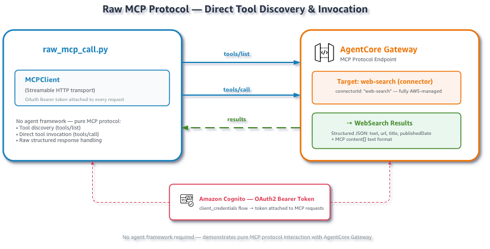

# Raw MCP Tool Discovery and Invocation

## Overview

This example calls the AgentCore gateway directly over the MCP protocol — no agent framework involved. It's the simplest way to verify your Gateway and Web Search Tool target are working correctly.

> 🔒 **Search Privacy**: The Web Search Tool queries an AWS-maintained search index. Queries do not route to any third-party search engines or external providers.



## Prerequisites

- Python 3.10+
- AWS account with Amazon Bedrock enabled in **us-east-1**
- AWS credentials with IAM, Cognito, and AgentCore gateway permissions

## How It Works

The script performs three operations against the Gateway:

### Step 1: Authenticate

An OAuth token is obtained from Cognito using the `client_credentials` flow. The token is attached as a `Bearer` header on the MCP Streamable HTTP transport. This is handled internally by `create_streamable_http_transport()`.

```python
from utils.gateway_auth import create_streamable_http_transport

transport = create_streamable_http_transport()
```

### Step 2: Discover Tools (`tools/list`)

The MCP `tools/list` call returns all tools available on the Gateway. For a Gateway with the Web Search connector target, you'll see:

```json
{
  "name": "WebSearch",
  "description": "Search the web for current information",
  "inputSchema": {
    "type": "object",
    "properties": {
      "query": {
        "type": "string",
        "description": "Search query (max 200 characters)"
      }
    },
    "required": ["query"]
  }
}
```

### Step 3: Invoke the Tool (`tools/call`)

Calling the tool with a query returns structured results:

```json
{
  "results": [
    {
      "text": "Snippet from the web page...",
      "url": "https://example.com/article",
      "title": "Article Title",
      "publishedDate": "2026-05-28"
    }
  ]
}
```

## Files

| File | Description |
|:-----|:------------|
| `raw_mcp_call.py` | Main example script — tool discovery and invocation |

## Quick Start

```bash
# Install dependencies
pip install -r ../requirements.txt
#python3 -m pip install --upgrade --force-reinstall boto3

# Set up the Gateway (creates IAM role, Cognito, Gateway, Web Search target)
python setup_gateway.py
#python setup_gateway.py --gateway-name my-web-search-gw

# Load credentials into your shell
source .env.web-search

# Run the example — discovers WebSearch tool and invokes it
python raw_mcp_call.py

# Try a custom query
python raw_mcp_call.py --query "Latest Python release"
python raw_mcp_call.py --query "AWS re:Invent 2026 announcements"
```

| Parameter | Required | Description |
|:----------|:---------|:------------|
| `--query` | No | Search query (default: built-in example query) |

## Cleanup (Optional)

When you're done remove all provisioned AWS resources:

**1. Retrieve resource IDs** from the setup output (printed when you ran `setup_gateway.py`):

```
Gateway ID:   <printed during setup>
IAM Role:     agentcore-web-search-gateway-role
Cognito Pool: <printed during setup>
```

> **Tip:** If you no longer have the terminal output, the gateway ID is the subdomain prefix in your `AGENTCORE_GATEWAY_URL` (e.g., `gw-abc123` from `https://gw-abc123.gateway.bedrock-agentcore...`). The IAM role follows the pattern `agentcore-<gateway-name>-role`.

**2. Run cleanup:**

```bash
python cleanup.py --gateway-id <id> --user-pool-id <id> --role-name <name>
```

| Parameter | Required | Description |
|:----------|:---------|:------------|
| `--gateway-id` | Yes | Gateway ID |
| `--user-pool-id` | Yes | Cognito User Pool ID |
| `--role-name` | Yes | IAM role name |
