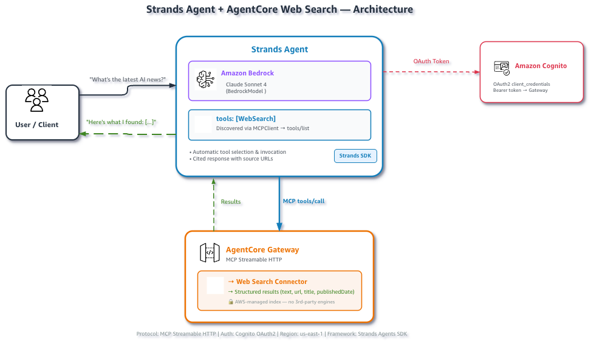

# Web Search with a Strands AI Agent

## Overview

This example shows the complete agent integration: a Strands agent automatically discovers and invokes the Web Search Tool to answer real-time questions with cited sources.



## Prerequisites

- Python 3.10+
- AWS account with Amazon Bedrock enabled in **us-east-1**
- AWS credentials with IAM, Cognito, and AgentCore gateway permissions
- Claude Sonnet 4 model access enabled in Bedrock

```bash
pip install -r ../requirements.txt
```

## Quick Start

```bash
# 1. Set up the Gateway (creates IAM role, Cognito, Gateway, Web Search target)
#python setup_gateway.py
python setup_gateway.py --gateway-name strands-web-search-gw

# 2. Load credentials into your shell
source .env.web-search

# 3. (Optional) Override the default model
export BEDROCK_MODEL_ID="us.anthropic.claude-sonnet-4-20250514-v1:0"

# 4. Run the agent
python web_search_strands.py

# Try a custom query
python web_search_strands.py --query "What are the latest AI announcements?"
python web_search_strands.py --query "Current price of Bitcoin"
```

| Parameter | Required | Description |
|:----------|:---------|:------------|
| `--query` | No | Research question (default: built-in demo queries) |

## How It Works

The script creates an agent that connects to the Gateway, and runs a research query to the agent.

### Step 1: Connect to the Gateway

The agent connects via MCP Streamable HTTP. Authentication is handled internally — an OAuth token is obtained from Cognito and attached to the transport. The Gateway returns the `WebSearch` tool with its input schema, and Strands registers it as an available tool for the LLM.

```python
from utils.web_search_agent import create_agent, create_mcp_client

mcp_client = create_mcp_client()
```

### Step 2: Create the Agent

The `create_agent()` function discovers tools via `tools/list` and configures a Strands agent with a system prompt that instructs it to search and cite sources:

```python
with mcp_client:
    agent = create_agent(mcp_client)
```

### Step 3: Run the Agent Loop

When you ask a question, the agent loop executes:

1. Strands sends the query + tool schema to Claude Sonnet 4
2. Claude decides to call `WebSearch` with a concise search query
3. Strands invokes the tool via MCP `tools/call` on the Gateway
4. The Gateway routes to the Web Search connector and returns results
5. Results are fed back to Claude as a tool result
6. Claude synthesizes a final answer with cited sources

```python
result = agent("What is the latest version of Python?")
print(result.message)
```

## Files

| File | Description |
|:-----|:------------|
| `setup_gateway.py` | Creates Gateway + Web Search target infrastructure |
| `web_search_strands.py` | Main demo script — Strands agent with web search |
| `cleanup.py` | Deletes all provisioned AWS resources |
| `../utils/web_search_agent.py` | Shared agent factory with MCP client setup |
| `../utils/gateway_auth.py` | OAuth token retrieval and transport creation |

## Cleanup (Optional)

When you're done remove all provisioned AWS resources:

**1. Retrieve resource IDs** from the setup output (printed when you ran `setup_gateway.py`):

```
Gateway ID:   <printed during setup>
IAM Role:     agentcore-web-search-gateway-role
Cognito Pool: <printed during setup>
```

> **Tip:** If you no longer have the terminal output, the gateway ID is the subdomain prefix in your `AGENTCORE_GATEWAY_URL` (e.g., `gw-abc123` from `https://gw-abc123.gateway.bedrock-agentcore...`). The IAM role follows the pattern `agentcore-<gateway-name>-role`.

**2. Run cleanup:**

```bash
python cleanup.py --gateway-id <id> --user-pool-id <id> --role-name <name>
```

| Parameter | Required | Description |
|:----------|:---------|:------------|
| `--gateway-id` | Yes | Gateway ID |
| `--user-pool-id` | Yes | Cognito User Pool ID |
| `--role-name` | Yes | IAM role name |
