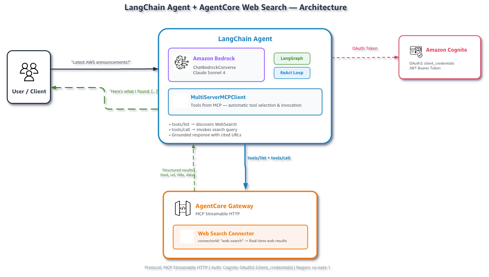

# Web Search with a LangChain Agent

## Overview

This demo shows the same Web Search Tool integration using LangChain and LangGraph instead of Strands. It uses `langchain-mcp-adapters` to connect to the AgentCore gateway and `create_react_agent` from LangGraph for the agent loop.



## Prerequisites

- Python 3.10+
- AWS account with Amazon Bedrock enabled in **us-east-1**
- AWS credentials with IAM, Cognito, and AgentCore gateway permissions
- Claude Sonnet 4 model access enabled in Bedrock

```bash
pip install -r ../requirements.txt
```

## Quick Start

```bash
# 1. Set up the Gateway (creates IAM role, Cognito, Gateway, Web Search target)
#python setup_gateway.py
python setup_gateway.py --gateway-name langchain-web-search-gw

# 2. Load credentials into your shell
source .env.web-search

# 3. (Optional) Override the default model
export BEDROCK_MODEL_ID="us.anthropic.claude-sonnet-4-20250514-v1:0"

# 4. Run the agent
python web_search_langchain.py

# Try a custom query
python web_search_langchain.py --query "Latest AWS announcements"
python web_search_langchain.py --query "Python 3.13 new features"
```

| Parameter | Required | Description |
|:----------|:---------|:------------|
| `--query` | No | Search query (default: built-in demo query) |

## How It Works

The script authenticates, discovers tools from the Gateway, and runs an agent loop:

### Step 1: Connect to the Gateway via MCP

An OAuth token is obtained from Cognito and passed to `MultiServerMCPClient`, which connects to the Gateway and converts MCP tools into LangChain-compatible objects:

```python
from langchain_mcp_adapters.client import MultiServerMCPClient

async with MultiServerMCPClient({
    "web-search": {
        "transport": "streamable_http",
        "url": gateway_url,
        "headers": {"Authorization": f"Bearer {token}"},
    }
}) as client:
    tools = client.get_tools()
```

### Step 2: Create the Agent

The agent uses LangGraph's `create_react_agent` with `ChatBedrockConverse` as the LLM:

```python
from langchain_aws import ChatBedrockConverse
from langgraph.prebuilt import create_react_agent

model = ChatBedrockConverse(
    model="us.anthropic.claude-sonnet-4-6",
    region_name="us-east-1",
)
agent = create_react_agent(model, tools=tools)
```

### Step 3: Run the Agent Loop

LangChain's MCP adapter uses async I/O. The agent invokes `WebSearch` automatically when it determines a search is needed, then synthesizes a cited response:

```python
result = await agent.ainvoke({"messages": [{"role": "user", "content": query}]})
```

## Files

| File | Description |
|:-----|:------------|
| `setup_gateway.py` | Creates Gateway + Web Search target infrastructure |
| `web_search_langchain.py` | Main demo script — LangChain agent with web search |
| `cleanup.py` | Deletes all provisioned AWS resources |
| `../utils/gateway_auth.py` | OAuth token retrieval (shared with other demos) |

## Cleanup (Optional)

When you're done remove all provisioned AWS resources:

**1. Retrieve resource IDs** from the setup output (printed when you ran `setup_gateway.py`):

```
Gateway ID:   <printed during setup>
IAM Role:     agentcore-web-search-gateway-role
Cognito Pool: <printed during setup>
```

> **Tip:** If you no longer have the terminal output, the gateway ID is the subdomain prefix in your `AGENTCORE_GATEWAY_URL` (e.g., `gw-abc123` from `https://gw-abc123.gateway.bedrock-agentcore...`). The IAM role follows the pattern `agentcore-<gateway-name>-role`.

**2. Run cleanup:**

```bash
python cleanup.py --gateway-id <id> --user-pool-id <id> --role-name <name>
```

| Parameter | Required | Description |
|:----------|:---------|:------------|
| `--gateway-id` | Yes | Gateway ID |
| `--user-pool-id` | Yes | Cognito User Pool ID |
| `--role-name` | Yes | IAM role name |
