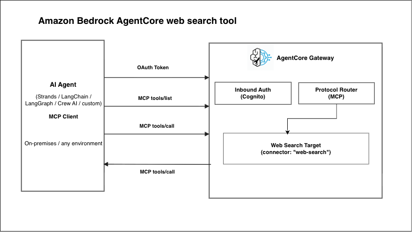
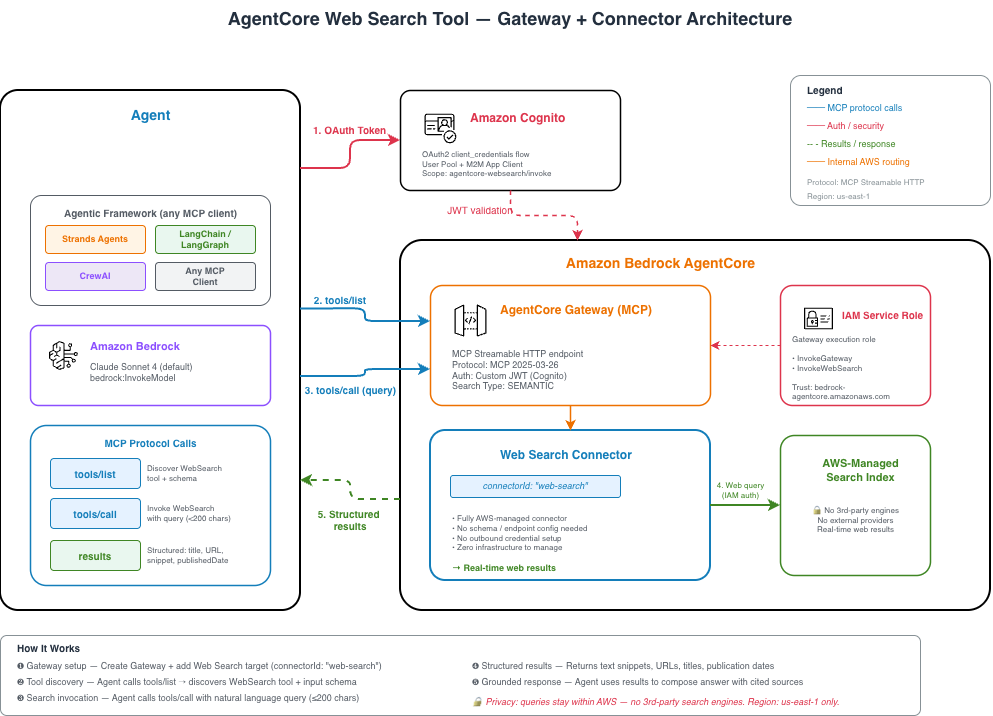

# AgentCore web search tool



[Amazon Bedrock AgentCore web search tool](https://docs.aws.amazon.com/bedrock-agentcore/latest/devguide/gateway-target-connector-web-search-tool.html) exposes web search as a fully managed, MCP-compliant tool through Amazon Bedrock AgentCore gateway. Your agents discover and invoke it using the standard Model Context Protocol — no custom integrations, no infrastructure to manage.

> 🔒 **Search Privacy**: The Web Search Tool queries an AWS-maintained search index. Queries do not route to any third-party search engines or external providers.

## Key Capabilities

- **Real-time information access** — Retrieve current web results with titles, URLs, snippets, and publication dates
- **Zero infrastructure management** — No search APIs to provision or scaling to configure
- **Framework agnostic** — Works with Strands Agents, LangChain, LangGraph, CrewAI, or any MCP-compatible client
- **Structured results** — Results returned in both MCP `content` (text) and `structuredContent` (typed JSON) formats
- **MCP-native** — Standard `tools/list` and `tools/call` protocol; no custom SDK required

## Tutorials

| Section | Description |
|:--------|:------------|
| [01-raw-mcp/](01-raw-mcp/) | Direct MCP tool discovery and invocation without an agent framework |
| [02-strands-agent/](02-strands-agent/) | Full agent loop with Strands Agents — automatic tool selection and cited responses |
| [03-langchain-agent/](03-langchain-agent/) | Full agent loop using LangChain + LangGraph with MCP adapter |

## Prerequisites

- AWS account with Amazon Bedrock enabled in **us-east-1**
- Python 3.10+
- AWS credentials with IAM, Cognito, and AgentCore gateway permissions
- Model access enabled for Claude Sonnet 4 (cross-region inference profile)

```bash
pip install -r requirements.txt
```

> **Note:** The Web Search Tool connector is available in [supported regions](https://docs.aws.amazon.com/bedrock-agentcore/latest/devguide/gateway-target-connector-web-search-tool.html#gateway-target-connector-web-search-tool-availability). Set your region accordingly when running the setup script.

## Core Concepts

### Gateway + Connector Architecture

The Web Search Tool uses the **connector** target type — a fully AWS-managed integration that requires no schema, no endpoint configuration, and no outbound credential setup. You specify `connectorId: "web-search"` and the Gateway handles everything else.



### How It Works

1. **Gateway setup** — Create an AgentCore gateway and add a Web Search Tool target using `connectorId: "web-search"`
2. **Tool discovery** — Your agent calls `tools/list` on the Gateway endpoint and discovers `WebSearch` with its input schema
3. **Search invocation** — Your agent calls `tools/call` with a natural language query (up to 200 characters)
4. **Structured results** — The tool returns results with text snippets, URLs, titles, and publication dates
5. **Grounded response** — Your agent uses the results to compose a response with cited sources

### Response Format

```json
{
  "results": [
    {
      "text": "Snippet from the web page...",
      "url": "https://example.com/article",
      "title": "Article Title",
      "publishedDate": "2026-05-28"
    }
  ]
}
```

| Field | Type | Required | Description |
|:------|:-----|:---------|:------------|
| `text` | string | Yes | Text content or snippet of the search result |
| `url` | string | No | URL of the source webpage |
| `title` | string | No | Title of the source webpage |
| `publishedDate` | string | No | Publication date of the result |

> **Note:** Queries longer than 200 characters may not return results. Keep queries concise.

### Authentication

- **Inbound**: Amazon Cognito with `client_credentials` OAuth flow (can use other OAuth providers)
- **Outbound**: Automatic — the Gateway uses its own IAM role to authenticate to the Web Search backend

## End-to-End Example

```bash
pip install -r requirements.txt

# Create Gateway and Web Search target (run from any sample folder)
python 01-raw-mcp/setup_gateway.py

# Load credentials
source .env.web-search

# Verify with raw MCP calls
python 01-raw-mcp/raw_mcp_call.py

# Run with Strands agent
python 02-strands-agent/web_search_strands.py

# Run with LangChain agent
python 03-langchain-agent/web_search_langchain.py

# Cleanup when done (run from any sample folder)
python 01-raw-mcp/cleanup.py --gateway-id <id> --user-pool-id <id> --role-name <name>
```

## Documentation

- [Web Search Tool connector](https://docs.aws.amazon.com/bedrock-agentcore/latest/devguide/gateway-target-connector-web-search-tool.html)
- [AgentCore gateway](https://docs.aws.amazon.com/bedrock-agentcore/latest/devguide/gateway.html)
- [Supported models for cross-region inference](https://docs.aws.amazon.com/bedrock/latest/userguide/inference-profiles-support.html)
