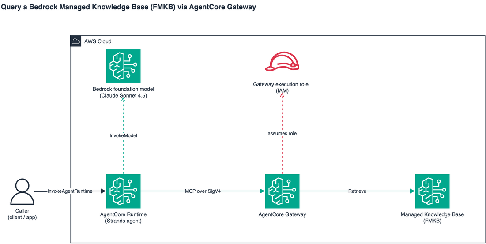

# Connect your agent to a Bedrock Managed Knowledge Base via AgentCore Gateway

This sample shows how to expose a Bedrock **Managed Knowledge Base (FMKB)** as an MCP tool through **AgentCore Gateway**, then have an agent — running on **AgentCore Runtime** — query that tool. Follows the same shape as the other folders under `01-features/03-connect-your-agent-to-anything`.



## What's in here

```
04-fmkb-managed-kb/
├── README.md
├── requirements.txt              # deps for 01-raw-mcp (02-strands-agent has its own copy)
├── utils/
│   ├── managed_kb.py             # helper: create/reuse a managed KB + S3 source
│   └── gateway.py                # helper: create gateway + KB target
├── 01-raw-mcp/                   # call the gateway directly via MCP+SigV4 (no agent)
│   ├── README.md
│   ├── setup_gateway.py
│   ├── raw_mcp_call.py
│   └── cleanup.py
├── 02-strands-agent/             # Strands agent on AgentCore Runtime, deployed via CLI
│   ├── README.md
│   ├── fmkb_gateway_strands.py   # the @app.entrypoint
│   └── iam/
│       ├── runtime-trust-policy.json
│       └── runtime-execution-policy.json
└── images/                       # (architecture diagrams)
```

## Prerequisites

1. **Python 3.10+** (`bedrock-agentcore` and `strands-agents` require it).
2. **AWS account in a region where AgentCore is available** (`us-west-2` recommended).
3. **Bedrock model access** to a Sonnet inference profile, e.g. `us.anthropic.claude-sonnet-4-5-20250929-v1:0`.
4. **An existing Managed Knowledge Base** with at least one ingested document. If you don't have one, create one with [`bedrock-samples / rag / managed-knowledge-bases / 01-getting-started/01-create-bmkb-s3.ipynb`](https://github.com/aws-samples/amazon-bedrock-samples/tree/main/rag/managed-knowledge-bases/01-getting-started). Note its `KB_ID`.
5. **AgentCore CLI** (used by `02-strands-agent`):
   ```bash
   pip install bedrock-agentcore-starter-toolkit
   ```
6. **Caller principal permissions** as documented in [Use the AgentCore CLI](https://docs.aws.amazon.com/bedrock-agentcore/latest/devguide/runtime-permissions.html#runtime-permissions-cli).

## Quick start

```bash
# from this folder
pip install -r requirements.txt

# 1. Create the gateway + KB target (writes .env.fmkb-gateway).
# `--name-prefix` controls the gateway-side resource names (gateway role,
# gateway, KB target); the runtime/agent name is set separately in step 3.
python 01-raw-mcp/setup_gateway.py --kb-id <YOUR_KB_ID> --name-prefix fmkb-sample
source .env.fmkb-gateway

# 2. Verify the gateway path with a raw MCP call (no agent)
python 01-raw-mcp/raw_mcp_call.py "What does the knowledge base say about X?"

# 3. Deploy the agent to Runtime and invoke it
cd 02-strands-agent
agentcore configure \
  --name fmkb_gateway_agent \
  --entrypoint fmkb_gateway_strands.py \
  --requirements-file requirements.txt \
  --region "$REGION" \
  --non-interactive
agentcore deploy --agent fmkb_gateway_agent --auto-update-on-conflict \
  -env "GATEWAY_URL=$GATEWAY_URL" \
  -env "AWS_REGION=$REGION" \
  -env "MODEL_ID=us.anthropic.claude-sonnet-4-5-20250929-v1:0"
agentcore invoke --agent fmkb_gateway_agent \
  '{"prompt":"What does the knowledge base say about X?"}'

# 4. Tear down
cd ..
python 01-raw-mcp/cleanup.py
agentcore destroy --agent fmkb_gateway_agent --force --delete-ecr-repo
```

The gateway uses `authorizerType=AWS_IAM`. The agent reaches it with SigV4-signed MCP via the `mcp-proxy-for-aws` library; the runtime execution role must allow `bedrock-agentcore:InvokeGateway` on the gateway ARN.

## Why pick what

- **`01-raw-mcp`** — confirms the gateway → KB plumbing works without any agent in the loop. Use this first when something breaks.
- **`02-strands-agent`** — production shape: agent deployed to Runtime, callable from anywhere via `bedrock-agentcore:InvokeAgentRuntime`.

## Tested against

Last validated with `bedrock-agentcore` 1.15.0, `strands-agents` 1.44.0, `mcp-proxy-for-aws` 1.6.2, `mcp` 1.28.0, and `boto3` / `botocore` 1.43.32. The `botocore` floor is non-trivial — earlier releases don't model `targetConfiguration.mcp.connector` for the bedrock-knowledge-bases connector and will reject `create_gateway_target` client-side.

If you hit a surprise after upgrading any of these, the most informative bisection point is `botocore` — service-model changes show up there first.

## Cleanup

`01-raw-mcp/cleanup.py` removes the gateway + KB target it created. `agentcore destroy` removes the runtime, ECR repo, CodeBuild project, log group, and execution role. The KB itself is *not* touched — you own its lifecycle.
