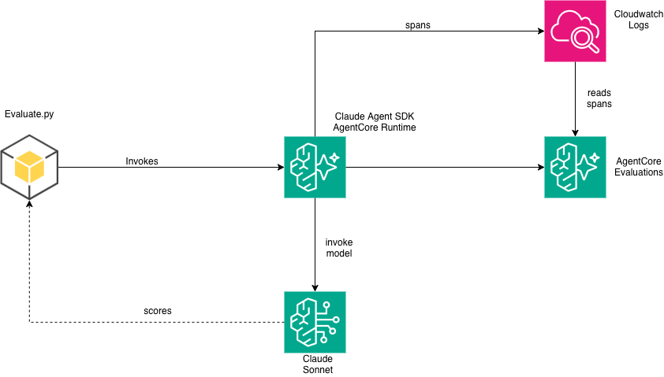

# Evaluate a Claude Agent SDK Agent with AgentCore Evaluations

This sample demonstrates how to evaluate an agent built with the
[Claude Agent SDK](https://docs.claude.com/en/api/agent-sdk/overview) using
Amazon Bedrock AgentCore Evaluations.

## How AgentCore Evaluations supports Claude Agent SDK

AgentCore Evaluations is framework-agnostic. It reads OpenTelemetry spans emitted by your agent and evaluates them regardless of which framework produced them. For Claude Agent SDK, the [`openinference-instrumentation-claude-agent-sdk`](https://pypi.org/project/openinference-instrumentation-claude-agent-sdk/) library auto-instruments the SDK client — just add it to your `requirements.txt` and ADOT discovers it at startup. No code changes to your agent.

The evaluation service reconstructs your agent session from `AGENT` and `TOOL` spans, extracts user prompts and agent responses, and runs evaluators (built-in or custom) against them.

For full documentation, see: [Supported frameworks — Claude Agent SDK](https://docs.aws.amazon.com/bedrock-agentcore/latest/devguide/supported-frameworks-claude-agent-sdk.html)

## What this sample does

1. **Deploys** an HR Assistant agent (Claude Agent SDK) to AgentCore Runtime
2. **Instruments** it automatically via `openinference-instrumentation-claude-agent-sdk`
3. **Invokes** a 3-turn conversation (PTO check → PTO request → policy lookup)
4. **Evaluates** using built-in + custom LLM-as-a-judge evaluators
5. **Sets up online evaluation** for continuous monitoring
6. **Cleans up** all resources when you're done

## Architecture



## Telemetry details

| Aspect | Value |
|--------|-------|
| Instrumentation library | `openinference-instrumentation-claude-agent-sdk >= 0.1.3` |
| Scope name | `openinference.instrumentation.claude_agent_sdk` |
| Invoke agent span | `openinference.span.kind` = `AGENT` |
| Tool span | `openinference.span.kind` = `TOOL` |
| Inference span | N/A (model metadata on AGENT span) |

## Example trace

When the agent runs on AgentCore Runtime with the instrumentation library installed, spans like these appear in CloudWatch:

**Invoke agent span (AGENT):**
```json
{
  "traceId": "6a292d74406894815807e2751e61dd49",
  "spanId": "a63aab3320ed8718",
  "name": "ClaudeAgentSDK.ClaudeSDKClient.receive_response",
  "scope": {
    "name": "openinference.instrumentation.claude_agent_sdk",
    "version": "0.1.5"
  },
  "attributes": {
    "openinference.span.kind": "AGENT",
    "llm.system": "anthropic",
    "llm.model_name": "us.anthropic.claude-sonnet-4-5-20250929-v1:0",
    "session.id": "hr-assistant-eval-session"
  }
}
```

**Tool span (TOOL):**
```json
{
  "traceId": "6a292deb7450b3155895da4f38cb579a",
  "spanId": "909dcb4eb5f851ae",
  "name": "get_pto_balance",
  "scope": {
    "name": "openinference.instrumentation.claude_agent_sdk"
  },
  "attributes": {
    "openinference.span.kind": "TOOL",
    "tool.name": "get_pto_balance",
    "tool.parameters": "{\"employee_id\": \"EMP-001\"}"
  }
}
```

The evaluation service reads these spans, extracts the user prompt and agent response from the correlated event records, and scores them against configured evaluators.

## Prerequisites

1. **AWS credentials** configured (`aws configure`)
2. **Bedrock model access** enabled for:
   - `us.anthropic.claude-sonnet-4-5-20250929-v1:0` (agent model)
   - `us.amazon.nova-lite-v1:0` (judge model for evaluation)
3. **AgentCore CLI** installed: `npm install -g @aws/agentcore`
4. **Python 3.12+** with pip

## Quick start (< 15 minutes)

```bash
# 1. Install dependencies
pip install -r requirements.txt

# 2. Deploy the agent to AgentCore
python deploy.py --region us-east-1

# 3. Run evaluation (invokes agent + evaluates spans)
python evaluate.py

# 4. Review results
cat results/on_demand_results.json

# 5. Cleanup when done
python cleanup.py
```

## Cost estimate

| Component | Cost per run |
|-----------|-------------|
| Bedrock (agent, 3 turns) | ~$0.10 |
| Bedrock (judge, 4 evaluations) | ~$0.01 |
| CloudWatch Logs | ~$0.01 |
| **Total** | **< $0.15** |

> ⚠️ Run `python cleanup.py` when finished to avoid ongoing charges.

## Files

| File | Purpose |
|------|---------|
| `agent.py` | HR Assistant agent using Claude Agent SDK |
| `deploy.py` | Deploy to AgentCore Runtime |
| `evaluate.py` | On-demand + online evaluation |
| `cleanup.py` | Delete all created resources |
| `requirements.txt` | Python dependencies |
| `Dockerfile` | Container image for AgentCore |

## Related

- [Supported frameworks documentation](https://docs.aws.amazon.com/bedrock-agentcore/latest/devguide/supported-frameworks-claude-agent-sdk.html)
- [AgentCore Evaluations overview](https://docs.aws.amazon.com/bedrock-agentcore/latest/devguide/evaluation.html)
- [Strands evaluation sample](../../llm-as-a-judge-evaluation/) (same HR Assistant, different framework)
