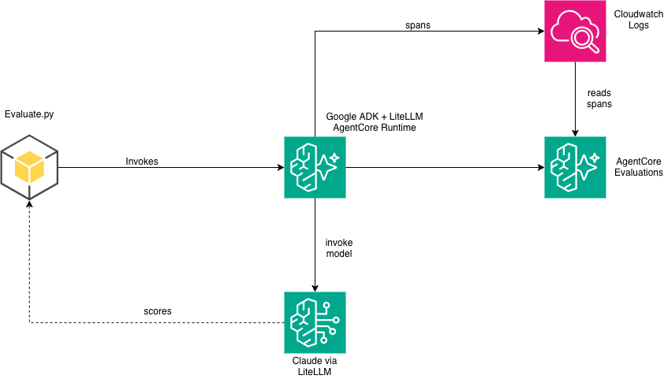

# Evaluate a Google ADK Agent with AgentCore Evaluations

This sample demonstrates how to evaluate an agent built with the
[Google Agent Development Kit (ADK)](https://google.github.io/adk-docs/) using
Amazon Bedrock AgentCore Evaluations.

## How AgentCore Evaluations supports Google ADK

AgentCore Evaluations is framework-agnostic. It reads OpenTelemetry spans emitted by your agent and evaluates them regardless of which framework produced them. For Google ADK, the [`openinference-instrumentation-google-adk`](https://pypi.org/project/openinference-instrumentation-google-adk/) library auto-instruments the ADK framework — just add it to your `requirements.txt` and ADOT discovers it at startup. No code changes to your agent.

Google ADK emits a nested span tree: an outer `invocation` span (`CHAIN`) wraps an `agent_run` span (`AGENT`), which wraps `call_llm` (`LLM`) and `execute_tool` (`TOOL`) spans. The evaluation service unwraps the Gemini content format (`new_message.parts[].text` for prompts, `content.parts[].text` for responses) automatically.

For full documentation, see: [Supported frameworks — Google ADK](https://docs.aws.amazon.com/bedrock-agentcore/latest/devguide/supported-frameworks-google-adk.html)

## What this sample does

1. **Deploys** an HR Assistant agent (Google ADK) to AgentCore Runtime
2. **Instruments** it automatically via `openinference-instrumentation-google-adk`
3. **Invokes** a 3-turn conversation (PTO check → PTO request → policy lookup)
4. **Evaluates** using built-in + custom LLM-as-a-judge evaluators
5. **Sets up online evaluation** for continuous monitoring
6. **Cleans up** all resources when you're done

## Architecture



## Model routing

By default, this sample uses **LiteLLM** to route model calls to **Claude on
Bedrock** — no external API key needed. To use Gemini natively instead:

```bash
export GOOGLE_API_KEY="your-key"
# Then in agent.py, change model to: "gemini-2.5-flash"
```

## Telemetry details

| Aspect | Value |
|--------|-------|
| Instrumentation library | `openinference-instrumentation-google-adk >= 0.1.13` |
| Scope name | `openinference.instrumentation.google_adk` |
| Invoke agent span | `openinference.span.kind` = `CHAIN` or `AGENT` |
| Tool span | `openinference.span.kind` = `TOOL` |
| Inference span | `openinference.span.kind` = `LLM` |

## Prerequisites

1. **AWS credentials** configured (`aws configure`)
2. **Bedrock model access** enabled for:
   - `us.anthropic.claude-sonnet-4-5-20250929-v1:0` (agent model via LiteLLM)
   - `us.amazon.nova-lite-v1:0` (judge model for evaluation)
3. **AgentCore CLI** installed: `npm install -g @aws/agentcore`
4. **Python 3.12+** with pip

## Example trace

When the agent runs on AgentCore Runtime with the instrumentation library installed, spans like these appear in CloudWatch:

**Invoke agent span (CHAIN):**
```json
{
  "traceId": "6a387ee61078243c1cc455ed45c6c313",
  "spanId": "70f2e87a30c34420",
  "name": "invocation",
  "scope": {
    "name": "openinference.instrumentation.google_adk",
    "version": "0.1.14"
  },
  "attributes": {
    "openinference.span.kind": "CHAIN",
    "input.mime_type": "application/json",
    "output.mime_type": "application/json",
    "session.id": "hr-assistant-eval-session"
  }
}
```

**Tool span (TOOL):**
```json
{
  "traceId": "6a387ef07b8f4f3732fab45d3c0b51ff",
  "spanId": "9028a8dd94943456",
  "name": "execute_tool get_pto_balance",
  "scope": {
    "name": "openinference.instrumentation.google_adk"
  },
  "attributes": {
    "openinference.span.kind": "TOOL",
    "tool.name": "get_pto_balance",
    "tool.parameters": "{\"employee_id\": \"EMP-001\"}"
  }
}
```

**Inference span (LLM):**
```json
{
  "traceId": "6a387ee61078243c1cc455ed45c6c313",
  "spanId": "1c4e5f8a2b9d0e73",
  "name": "call_llm",
  "scope": {
    "name": "openinference.instrumentation.google_adk"
  },
  "attributes": {
    "openinference.span.kind": "LLM",
    "gen_ai.request.model": "gemini-2.5-flash",
    "llm.model_name": "gemini-2.5-flash"
  }
}
```

The evaluation service reads these spans, unwraps the Gemini content format, and scores the agent's responses against configured evaluators.

## Quick start (< 15 minutes)

```bash
# 1. Install dependencies
pip install -r requirements.txt

# 2. Deploy the agent to AgentCore
python deploy.py --region us-east-1

# 3. Run evaluation (invokes agent + evaluates spans)
python evaluate.py

# 4. Review results
cat results/on_demand_results.json

# 5. Cleanup when done
python cleanup.py
```

## Cost estimate

| Component | Cost per run |
|-----------|-------------|
| Bedrock (agent, 3 turns) | ~$0.10 |
| Bedrock (judge, 4 evaluations) | ~$0.01 |
| CloudWatch Logs | ~$0.01 |
| **Total** | **< $0.15** |

> ⚠️ Run `python cleanup.py` when finished to avoid ongoing charges.

## Files

| File | Purpose |
|------|---------|
| `agent.py` | HR Assistant agent using Google ADK + LiteLLM |
| `deploy.py` | Deploy to AgentCore Runtime |
| `evaluate.py` | On-demand + online evaluation |
| `cleanup.py` | Delete all created resources |
| `requirements.txt` | Python dependencies |
| `Dockerfile` | Container image for AgentCore |

## Related

- [Supported frameworks documentation](https://docs.aws.amazon.com/bedrock-agentcore/latest/devguide/supported-frameworks-google-adk.html)
- [AgentCore Evaluations overview](https://docs.aws.amazon.com/bedrock-agentcore/latest/devguide/evaluation.html)
- [Claude Agent SDK sample](../claude-agent-sdk/) (same HR Assistant, different framework)
- [Strands evaluation sample](../../llm-as-a-judge-evaluation/) (same HR Assistant, different framework)
