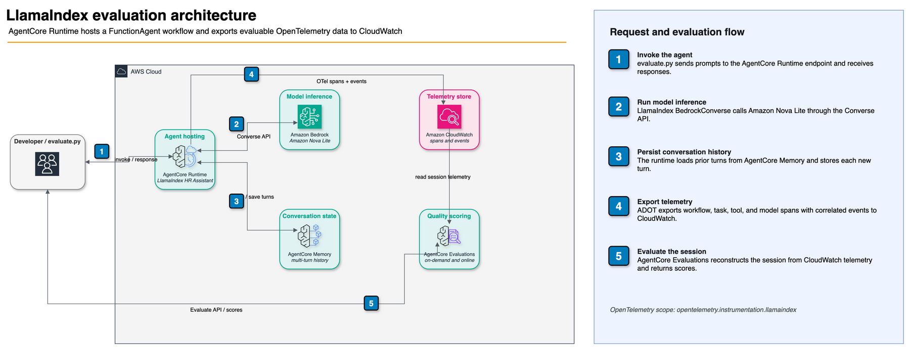
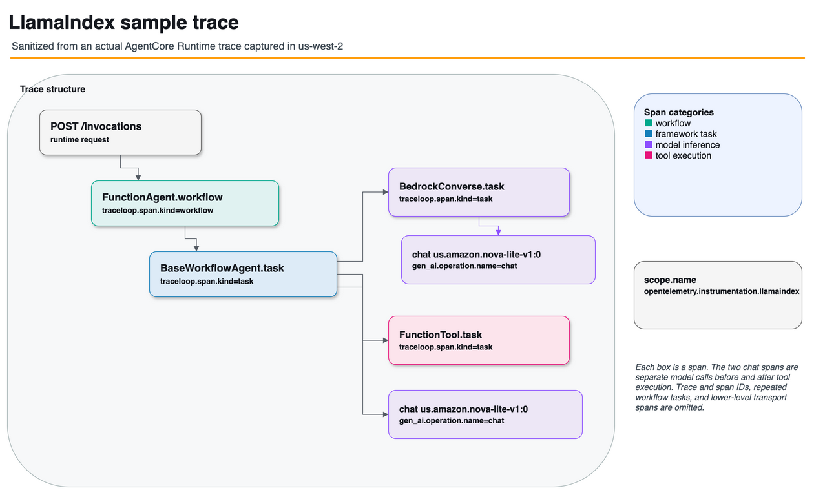

# Evaluate a LlamaIndex agent

Evaluate a [LlamaIndex](https://docs.llamaindex.ai/) agent with Amazon Bedrock AgentCore Evaluations. This sample deploys the shared HR Assistant, re-implemented as a LlamaIndex `FunctionAgent` workflow, to AgentCore Runtime. It then scores the agent with built-in and custom LLM-as-a-judge evaluators in on-demand and online modes. See [LlamaIndex support in AgentCore Evaluations](https://docs.aws.amazon.com/bedrock-agentcore/latest/devguide/supported-frameworks-llamaindex.html) for the supported instrumentation libraries, scope names, span extraction rules, and agent construction best practices.

The HR Assistant, its 5 tools, mock data, and system prompt are identical to the Strands version in [`../../utils/`](../../utils/), so ground-truth and expected responses stay consistent across the framework samples.

## What you'll learn

| Concept                       | Description                                                                                                 |
| ----------------------------- | ----------------------------------------------------------------------------------------------------------- |
| Framework instrumentation | Make a LlamaIndex agent evaluable by adding one OpenTelemetry package without instrumentation code          |
| Agent workflow structure  | Build with `FunctionAgent` so the workflow/inference/tool span tree the evaluation service needs is emitted |
| AgentCore Memory          | Persist multi-turn conversation history in the AgentCore Memory service, across microVM restarts            |
| On-demand evaluation      | Score a recorded session with built-in + custom LLM-as-a-judge evaluators via `EvaluationClient`            |
| Online evaluation         | Continuously score live traffic with an online evaluation config                                            |
| CLI evaluation            | Re-evaluate any session from the terminal with the AgentCore CLI                                            |

## Architecture



The PNG embeds its draw.io XML and can be opened directly in draw.io for editing.

## How it works

The agent is instrumented for evaluation with the OpenTelemetry LlamaIndex library (`opentelemetry-instrumentation-llamaindex`, scope `opentelemetry.instrumentation.llamaindex`). On AgentCore Runtime, AWS Distro for OpenTelemetry (ADOT) auto-discovers the library at startup, so no explicit instrumentation code is needed. The agent's spans and event records flow to CloudWatch, and AgentCore Evaluations reads them from there.

The agent is built as a LlamaIndex agent workflow using `FunctionAgent`, following the [AgentCore best practices for LlamaIndex agents](https://docs.aws.amazon.com/bedrock-agentcore/latest/devguide/supported-frameworks-llamaindex.html):

```python
from llama_index.core.agent.workflow import FunctionAgent
from llama_index.core.tools import FunctionTool
from bedrock_agentcore.memory import MemoryClient
from llama_index.core.base.llms.types import ChatMessage
from llama_index.llms.bedrock_converse import BedrockConverse

tools = [FunctionTool.from_defaults(fn=get_pto_balance), ...]
agent = FunctionAgent(
    tools=tools,
    llm=BedrockConverse(model="us.amazon.nova-lite-v1:0", region_name=REGION),
    system_prompt=SYSTEM_PROMPT,
    streaming=False,
)

# Conversation history persisted in AgentCore Memory, replayed as chat_history
memory_client = MemoryClient(region_name=REGION)
history = _load_chat_history(session_id)          # [ChatMessage] from list_events
response = await agent.run(prompt, chat_history=history)
memory_client.create_event(                        # persist the new turn
    memory_id=MEMORY_ID, actor_id=ACTOR_ID, session_id=session_id,
    messages=[(prompt, "USER"), (str(response), "ASSISTANT")],
)
```

- Agent workflow: `FunctionAgent` emits a top-level workflow span with inference and tool child spans, which is the structure AgentCore Evaluations reconstructs a session from.
- FunctionTool: each tool is registered as a `FunctionTool` so tool spans carry recoverable names, arguments, and results.
- Text-serializable results: the tools return JSON-serializable dicts, which LlamaIndex wraps in a text block for clean capture.
- `streaming=False`: one complete inference span per model call is what the evaluation service reads. It also avoids a `BedrockConverse` streaming parser issue (`TypeError` on split tool-call input deltas).
- AgentCore Memory for conversation history: each turn is stored in the [AgentCore Memory](https://docs.aws.amazon.com/bedrock-agentcore/latest/devguide/memory.html) service via `bedrock_agentcore.memory.MemoryClient` and replayed as `chat_history`, so multi-turn context survives microVM restarts. `deploy.py` creates the memory resource and injects `AGENTCORE_MEMORY_ID`. Only USER/ASSISTANT text turns are stored. Replaying stored tool-call messages, as the official `llama-index-memory-bedrock-agentcore` integration does, trips the Bedrock Converse API's toolUse/toolResult pairing validation on the next turn.

`FunctionAgent` is used (not `ReActAgent`) because Nova Lite supports native tool calling. If you swap in a model without tool calling, `ReActAgent` is the alternative; AgentCore then extracts the final answer from the standard `Answer:` section of its output.

The LLM is a Bedrock model (Nova Lite via `BedrockConverse`), matching the shared Strands agent so expected responses stay identical.

## Sample trace



This trace was captured from the deployed sample and sanitized for publication. AgentCore Evaluations identifies `FunctionAgent.workflow` as the agent invocation from `traceloop.span.kind=workflow`. It identifies LlamaIndex inference tasks from `traceloop.span.kind=task`, and recognizes `FunctionTool.task` as a tool span because its `traceloop.entity.name` ends in `Tool.task`. The two chat spans are separate model calls before and after tool execution. The shared scope is `opentelemetry.instrumentation.llamaindex`. Repeated workflow tasks and lower-level transport spans are omitted from the figure for readability. The PNG embeds its draw.io XML and can be opened directly in draw.io for editing.

## Prerequisites

- Python 3.10+
- AWS CLI configured with credentials
- Access to `us.amazon.nova-lite-v1:0` on Amazon Bedrock in your region
- Permissions for: `bedrock-agentcore:*`, `bedrock-agentcore-control:*`, `logs:*`, `iam:CreateRole`, `iam:PutRolePolicy`, `s3:PutObject`, `bedrock:InvokeModel`

## Deploy the agent

```bash
uv run --frozen --with-requirements requirements.txt python deploy.py --region us-west-2
```

This builds an ARM64 deployment package, creates an AgentCore Memory resource (conversation history store, injected as `AGENTCORE_MEMORY_ID`), creates the AgentCore Runtime, and writes `agent_config.json` in this directory (read by `evaluate.py`).

## Run the evaluation

```bash
uv run --frozen --with-requirements requirements.txt python evaluate.py --region us-west-2
```

The script:

1. Creates two custom LLM-as-a-judge evaluators (`HRResponseQuality` TRACE, `HRSessionCompleteness` SESSION).
2. Invokes the deployed agent for a 3-turn session and waits ~90s for CloudWatch span ingestion.
3. Runs on-demand evaluation with `EvaluationClient` (built-in + custom evaluators, with `ReferenceInputs` ground truth). Scores are saved to `results/on_demand_results.json`.
4. Creates an online evaluation config that continuously scores live traffic with built-in evaluators. Details are saved to `results/online_eval_config.json`.

## Expected output

```
[1/4] Creating custom LLM-as-a-judge evaluators ...
  Creating HRResponseQuality (TRACE) ...
  Creating HRSessionCompleteness (SESSION) ...

[2/4] Invoking HR Assistant to generate a session ...
  Turn 1: What is the PTO balance for employee EMP-001?
         -> The PTO balance for employee EMP-001 is as follows: Total days: 15 ...
  Turn 2: Please submit a PTO request for EMP-001 from 2026-07-14 to 2026-07-18.
         -> The PTO request for employee EMP-001 has been submitted and approved ...
  Turn 3: What is the company remote work policy?
         -> Employees may work remotely up to 3 days per week ...

[3/4] Running on-demand evaluation (EvaluationClient) ...
  Evaluator                                     Value    Label
  --------------------------------------------------------------------------------
  Builtin.GoalSuccessRate                       1.0      Yes
  Builtin.Correctness                           1.0      Perfectly Correct
  Builtin.Helpfulness                           0.83     Very Helpful
  HRResponseQuality                             1.0      excellent
  HRSessionCompleteness                         1.0      complete

[4/4] Creating online evaluation configuration ...
  Online evaluation config created: hr_llamaindex_eval_<suffix>-XXXXXXXXXX
```

TRACE-level evaluators (`Correctness`, `Helpfulness`, `HRResponseQuality`) return one score per turn, so the full run prints 11 results. Online evaluation results appear a few minutes later in CloudWatch at `/aws/bedrock-agentcore/evaluations/results/<config-id>`, one record per evaluator per sampled turn with `gen_ai.evaluation.score.value` and `gen_ai.evaluation.explanation` attributes.

## Evaluate from the CLI

Once sessions exist in CloudWatch, you can re-evaluate them from the terminal with the [AgentCore CLI](https://www.npmjs.com/package/@aws/agentcore). No Python is needed. Because this sample deploys with a plain `deploy.py` (not an `agentcore` project), use the standalone flags:

```bash
npm install -g @aws/agentcore

AGENT_ARN=$(jq -r .agent_arn agent_config.json)
agentcore run eval \
  --runtime-arn "$AGENT_ARN" \
  --evaluator-arn Builtin.Helpfulness Builtin.Correctness \
  --region us-west-2 \
  --session-id <session-id-from-evaluate-py-output> \
  --days 1
```

Ground truth can be supplied inline with `--assertion`, `--expected-trajectory`, and `--expected-response`. Omit `--session-id` to evaluate every session in the lookback window.

## Troubleshooting ARM64 wheels

`deploy.py` cross-compiles dependencies with `--platform manylinux2014_aarch64 --only-binary=:all:`. LlamaIndex pulls a broad dependency tree; if a transitive dependency lacks an aarch64 wheel and the install fails, either:

- add `--no-binary=<package>` for the offending pure-Python package, or
- build the zip on an ARM64 machine or in a `public.ecr.aws/lambda/python:3.13-arm64` container / AWS CodeBuild ARM instead of cross-compiling.

The sample installs the full `llama-index` meta-package (not just `llama-index-core`). This is required: ADOT's auto-instrumentation checks the OpenTelemetry LlamaIndex instrumentation's declared dependency (`llama-index`) at startup and silently skips the instrumentor if only `llama-index-core` is present. The agent then emits no evaluable spans.

## Clean up

Run the cleanup script from this directory:

```bash
uv run --frozen --with-requirements requirements.txt python cleanup.py
```

The script uses the `default` AWS profile and the region in `agent_config.json`. It deletes the online evaluation configurations and custom evaluators recorded under `results/`, then removes the AgentCore Runtime, Memory, sample-specific CloudWatch log groups, deployment package, and IAM roles. Asynchronous AgentCore deletions are checked for completion before dependent resources are removed, and the script can be run again if cleanup is interrupted.

The shared `aws/spans` log group is retained. The regional deployment bucket is also retained when it contains objects from other samples. Use `--profile` or `--region` to override the defaults.

## Additional resources

- [Supported agent frameworks: LlamaIndex](https://docs.aws.amazon.com/bedrock-agentcore/latest/devguide/supported-frameworks-llamaindex.html)
- [LlamaIndex documentation](https://docs.llamaindex.ai/)
- [Amazon Bedrock AgentCore Developer Guide](https://docs.aws.amazon.com/bedrock-agentcore/latest/devguide/)
