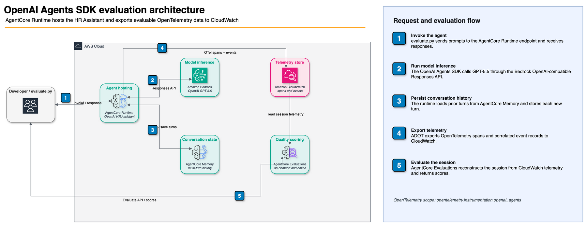
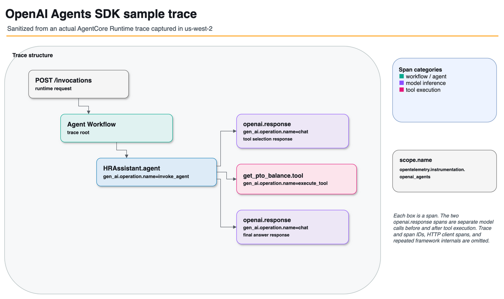

# Evaluate an OpenAI Agents SDK agent

Evaluate an [OpenAI Agents SDK](https://openai.github.io/openai-agents-python/) agent with Amazon Bedrock AgentCore Evaluations. This sample deploys the shared HR Assistant, re-implemented with the OpenAI Agents SDK, to AgentCore Runtime. It then scores the agent with built-in and custom LLM-as-a-judge evaluators in on-demand and online modes. See [OpenAI Agents support in AgentCore Evaluations](https://docs.aws.amazon.com/bedrock-agentcore/latest/devguide/supported-frameworks-openai-agents.html) for the supported instrumentation libraries, scope names, and span extraction rules.

The HR Assistant, its 5 tools, mock data, and system prompt are identical to the Strands version in [`../../utils/`](../../utils/), so ground-truth and expected responses stay consistent across the framework samples.

## What you'll learn

| Concept                       | Description                                                                                             |
| ----------------------------- | ------------------------------------------------------------------------------------------------------- |
| Framework instrumentation | Make an OpenAI Agents SDK agent evaluable by adding one OpenTelemetry package without instrumentation code |
| OpenAI GPT-5.5 on Bedrock | Call `openai.gpt-5.5` through Bedrock's OpenAI-compatible Responses API with a Bedrock API key          |
| AgentCore Memory          | Persist multi-turn conversation history in the AgentCore Memory service, across microVM restarts        |
| On-demand evaluation      | Score a recorded session with built-in + custom LLM-as-a-judge evaluators via `EvaluationClient`        |
| Online evaluation         | Continuously score live traffic with an online evaluation config                                        |
| CLI evaluation            | Re-evaluate any session from the terminal with the AgentCore CLI                                        |

## Architecture



The PNG embeds its draw.io XML and can be opened directly in draw.io for editing.

## How it works

The agent is instrumented for evaluation with the OpenTelemetry OpenAI Agents library (`opentelemetry-instrumentation-openai-agents`, scope `opentelemetry.instrumentation.openai_agents`). On AgentCore Runtime, AWS Distro for OpenTelemetry (ADOT) auto-discovers the library at startup, so no explicit instrumentation code is needed. The agent's spans and event records flow to CloudWatch, and AgentCore Evaluations reads them from there.

The LLM is OpenAI GPT-5.5 on Amazon Bedrock (`openai.gpt-5.5`), reached through the Bedrock mantle endpoint's OpenAI-compatible Responses API and authenticated with a [Bedrock API key](https://docs.aws.amazon.com/bedrock/latest/userguide/api-keys.html). The OpenAI Agents SDK talks to it via an `AsyncOpenAI` client:

```python
from agents import Agent, OpenAIResponsesModel
from openai import AsyncOpenAI
from aws_bedrock_token_generator import provide_token

# Short-term Bedrock API key minted from the runtime's IAM role by a local
# SigV4 presign, no network call, nothing stored in code or config
api_key = provide_token(region=MODEL_REGION)
client = AsyncOpenAI(base_url=f"https://bedrock-mantle.{MODEL_REGION}.api.aws/openai/v1", api_key=api_key)
model = OpenAIResponsesModel(model="openai.gpt-5.5", openai_client=client)

agent = Agent(name="HRAssistant", instructions=SYSTEM_PROMPT, model=model, tools=[...])
```

`provide_token()` returns a [short-term Bedrock API key](https://docs.aws.amazon.com/bedrock/latest/userguide/api-keys-how.html) (a `bedrock-api-key-...` string) with the same permissions as the runtime's IAM role, valid up to 12 hours. This is the secure kind AWS recommends for production. The agent is rebuilt on every invocation so a long-lived runtime never reuses an expired key. For exploration, you can instead generate a long-term key (Bedrock console → API keys, or `aws iam create-service-specific-credential --service-name bedrock.amazonaws.com`) and pass it as the `api_key`. Store it in AWS Secrets Manager rather than in code.

Three implementation details matter for evaluation:

- Responses API, not Chat Completions. The OpenTelemetry instrumentation extracts the agent's response text from Responses API spans (`ResponseSpanData`); with `OpenAIChatCompletionsModel` the response text is not captured on the spans and evaluators score empty responses. GPT-5.5 is served on the mantle endpoint's `openai/v1` path (`https://bedrock-mantle.<region>.api.aws/openai/v1`). This differs from the `/v1` path used by gpt-oss models.
- Keep SDK tracing enabled. The instrumentation hooks into the SDK's tracing pipeline, so do not call `set_tracing_disabled(True)`. Doing so would silence the evaluation spans. The SDK's default platform.openai.com exporter is inert without an `OPENAI_API_KEY` and only logs a skip message.
- AgentCore Memory for conversation history, not `SQLiteSession`. The SDK's session classes are local to one microVM (history is lost across restarts) and replay full Responses API output items (including model `reasoning` items) as the next turn's input, which the mantle endpoint rejects with an empty output. Instead, `deploy.py` creates an [AgentCore Memory](https://docs.aws.amazon.com/bedrock-agentcore/latest/devguide/memory.html) resource and the agent persists each turn as a memory event (via `bedrock_agentcore.memory.MemoryClient`), reloading the plain `{"role", "content"}` history at the start of every invocation.

The agent is rebuilt on every invocation so a long-lived runtime never reuses an expired short-term key.

## Sample trace



This trace was captured from the deployed sample and sanitized for publication. AgentCore Evaluations identifies `HRAssistant.agent` as the agent invocation from `gen_ai.operation.name=invoke_agent`, the two `openai.response` spans as model calls from `gen_ai.operation.name=chat`, and `get_pto_balance.tool` as the tool call from `gen_ai.operation.name=execute_tool`. The two chat spans are separate model calls before and after tool execution. The shared scope is `opentelemetry.instrumentation.openai_agents`. The PNG embeds its draw.io XML and can be opened directly in draw.io for editing.

## Prerequisites

- Python 3.10+
- AWS CLI configured with credentials
- Access to `openai.gpt-5.5` on Amazon Bedrock. GPT-5.5 is served from `us-east-1` / `us-east-2` (see [the model card](https://docs.aws.amazon.com/bedrock/latest/userguide/model-card-openai-gpt-55.html)); the runtime can be deployed in any region and calls the model cross-region via `BEDROCK_OPENAI_MODEL_REGION` (default `us-east-1`).
- Permissions for: `bedrock-agentcore:*`, `bedrock-agentcore-control:*`, `logs:*`, `iam:CreateRole`, `iam:PutRolePolicy`, `s3:PutObject`, `bedrock:InvokeModel`

## Deploy the agent

```bash
uv run --frozen --with-requirements requirements.txt python deploy.py --region us-west-2
```

This builds an ARM64 deployment package, creates an AgentCore Memory resource (conversation history store, injected as `AGENTCORE_MEMORY_ID`), creates the AgentCore Runtime, and writes `agent_config.json` in this directory (read by `evaluate.py`).

The runtime's IAM role is granted `bedrock-mantle:CreateInference` and `bedrock-mantle:CallWithBearerToken` for the mantle Responses API, plus `bedrock:InvokeModel*` and `bedrock:CallWithBearerToken` (the latter pair covers the `bedrock-runtime/openai/v1` Chat Completions endpoint, should you switch `BEDROCK_OPENAI_BASE_URL` to it). The bearer-token actions are required because `provide_token()`'s short-term API key authenticates against these endpoints with `bedrock:CallWithBearerToken` rather than SigV4.

## Run the evaluation

```bash
uv run --frozen --with-requirements requirements.txt python evaluate.py --region us-west-2
```

The script:

1. Creates two custom LLM-as-a-judge evaluators (`HRResponseQuality` TRACE, `HRSessionCompleteness` SESSION).
2. Invokes the deployed agent for a 3-turn session and waits ~90s for CloudWatch span ingestion.
3. Runs on-demand evaluation with `EvaluationClient` (built-in + custom evaluators, with `ReferenceInputs` ground truth). Scores are saved to `results/on_demand_results.json`.
4. Creates an online evaluation config that continuously scores live traffic with built-in evaluators. Details are saved to `results/online_eval_config.json`.

## Expected output

```
[1/4] Creating custom LLM-as-a-judge evaluators ...
  Creating HRResponseQuality (TRACE) ...
  Creating HRSessionCompleteness (SESSION) ...

[2/4] Invoking HR Assistant to generate a session ...
  Turn 1: What is the PTO balance for employee EMP-001?
         -> Employee EMP-001 has 10 PTO days remaining (15 total, 5 used) ...
  Turn 2: Please submit a PTO request for EMP-001 from 2026-07-14 to 2026-07-18.
         -> Your PTO request has been submitted and approved. Request ID: PTO-2026-001 ...
  Turn 3: What is the company remote work policy?
         -> Employees may work remotely up to 3 days per week ...

[3/4] Running on-demand evaluation (EvaluationClient) ...
  Evaluator                                     Value    Label
  --------------------------------------------------------------------------------
  Builtin.GoalSuccessRate                       1.0      Yes
  Builtin.Correctness                           1.0      Perfectly Correct
  Builtin.Helpfulness                           1.0      Above And Beyond
  HRResponseQuality                             1.0      excellent
  HRSessionCompleteness                         1.0      complete

[4/4] Creating online evaluation configuration ...
  Online evaluation config created: hr_openai_eval_<suffix>-XXXXXXXXXX
```

TRACE-level evaluators (`Correctness`, `Helpfulness`, `HRResponseQuality`) return one score per turn, so the full run prints 11 results. Online evaluation results appear a few minutes later in CloudWatch at `/aws/bedrock-agentcore/evaluations/results/<config-id>`, one record per evaluator per sampled turn with `gen_ai.evaluation.score.value` and `gen_ai.evaluation.explanation` attributes.

## Evaluate from the CLI

Once sessions exist in CloudWatch, you can re-evaluate them from the terminal with the [AgentCore CLI](https://www.npmjs.com/package/@aws/agentcore). No Python is needed. Because this sample deploys with a plain `deploy.py` (not an `agentcore` project), use the standalone flags:

```bash
npm install -g @aws/agentcore

AGENT_ARN=$(jq -r .agent_arn agent_config.json)
agentcore run eval \
  --runtime-arn "$AGENT_ARN" \
  --evaluator-arn Builtin.Helpfulness Builtin.Correctness \
  --region us-west-2 \
  --session-id <session-id-from-evaluate-py-output> \
  --days 1
```

```
Agent: hr_openai_xxxxxxxx-XXXXXXXXXX | Sessions: 1 | Lookback: 1d

  Builtin.Helpfulness: 0.94

Results saved to: eval_2026-07-10_13-03-07.json
```

Ground truth can be supplied inline with `--assertion`, `--expected-trajectory`, and `--expected-response`. Omit `--session-id` to evaluate every session in the lookback window.

## Troubleshooting ARM64 wheels

`deploy.py` cross-compiles dependencies with `--platform manylinux2014_aarch64 --only-binary=:all:`. If a dependency lacks an aarch64 wheel and the install fails, either:

- add `--no-binary=<package>` for the offending pure-Python package, or
- build the zip on an ARM64 machine or in a `public.ecr.aws/lambda/python:3.13-arm64` container / AWS CodeBuild ARM instead of cross-compiling.

## Clean up

Run the cleanup script from this directory:

```bash
uv run --frozen --with-requirements requirements.txt python cleanup.py
```

The script uses the `default` AWS profile and the region in `agent_config.json`. It deletes the online evaluation configurations and custom evaluators recorded under `results/`, then removes the AgentCore Runtime, Memory, sample-specific CloudWatch log groups, deployment package, and IAM roles. Asynchronous AgentCore deletions are checked for completion before dependent resources are removed, and the script can be run again if cleanup is interrupted.

The shared `aws/spans` log group is retained. The regional deployment bucket is also retained when it contains objects from other samples. Use `--profile` or `--region` to override the defaults.

## Additional resources

- [Supported agent frameworks: OpenAI Agents](https://docs.aws.amazon.com/bedrock-agentcore/latest/devguide/supported-frameworks-openai-agents.html)
- [OpenAI Agents SDK](https://openai.github.io/openai-agents-python/)
- [GPT-5.5 model card](https://docs.aws.amazon.com/bedrock/latest/userguide/model-card-openai-gpt-55.html)
- [Amazon Bedrock API keys](https://docs.aws.amazon.com/bedrock/latest/userguide/api-keys.html)
- [Amazon Bedrock AgentCore Developer Guide](https://docs.aws.amazon.com/bedrock-agentcore/latest/devguide/)
