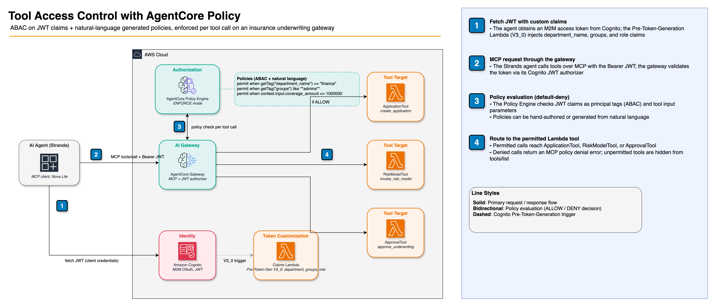

# Policy in Amazon Bedrock AgentCore — Fine-Grained Access Control

Enforce Cedar policies on AI agent-to-tool interactions through an AgentCore MCP gateway.
Covers NL2Cedar (natural language → Cedar) and hand-authored attribute-based access control
(ABAC) using JWT claims from Cognito.

## Architecture



**Demo scenario:** Insurance underwriting system with three Lambda-backed tools:
- `ApplicationTool` — create insurance applications (`applicant_region`, `coverage_amount`)
- `RiskModelTool` — invoke risk scoring model (`API_classification`, `data_governance_approval`)
- `ApprovalTool` — approve underwriting decisions (`claim_amount`, `risk_level`)

## Prerequisites

- Python 3.12+
- AWS CLI configured with credentials
- Amazon Bedrock model access (Nova Lite) in your region
- Node.js (for Lambda function packaging during deploy)

## Quick Start

```bash
pip install -r requirements.txt

# Deploy gateway, Lambda tools, Cognito OAuth, and policy Engine
python deploy.py

# Run the full policy demo (NL2Cedar + ABAC + agent)
python policy_demo.py

# Clean up all AWS resources
python cleanup.py
```

## AgentCore CLI

Add a policy engine and Cedar policies to an existing project with the AgentCore CLI:

```bash
npm install -g @aws/agentcore

# Add a policy engine (interactive)
agentcore add policy-engine

# Or non-interactive
agentcore add policy-engine \
  --name InsurancePolicyEngine \
  --attach-to-gateways mygateway \
  --attach-mode ENFORCE

# Add a Cedar policy from a file
agentcore add policy \
  --name coverage-limit \
  --engine InsurancePolicyEngine \
  --source policies/coverage_limit.cedar

# Or generate a Cedar policy from natural language (NL2Cedar)
agentcore add policy \
  --name coverage-limit \
  --engine InsurancePolicyEngine \
  --generate "Allow users to invoke the application tool when coverage is less than 1000000 and region is US or CA" \
  --gateway mygateway

# Deploy all resources
agentcore deploy
```

For the full policy demo in this folder, `deploy.py` (boto3) provisions all resources end-to-end including the gateway, Lambda tools, Cognito, and policy engine. See [`../01-gateway/README.md`](../01-gateway/README.md) for the full gateway CLI reference.

### Testing gateway access after deploy

After running `python deploy.py`, test the gateway directly:

```bash
# Read values from policy_config.json
CLIENT_ID=$(python -c "import json; c=json.load(open('policy_config.json')); print(c['gateway']['client_info']['client_id'])")
CLIENT_SECRET=$(python -c "import json; c=json.load(open('policy_config.json')); print(c['gateway']['client_info']['client_secret'])")
TOKEN_URL=$(python -c "import json; c=json.load(open('policy_config.json')); print(c['gateway']['client_info']['token_endpoint'])")

TOKEN=$(curl -s -X POST "$TOKEN_URL" \
  -d "grant_type=client_credentials&client_id=$CLIENT_ID&client_secret=$CLIENT_SECRET" \
  | python -c "import json,sys; print(json.load(sys.stdin)['access_token'])")

GATEWAY_URL=$(python -c "import json; c=json.load(open('policy_config.json')); print(c['gateway']['gateway_url'])")
```

List tools visible through the gateway (respects active policies):

```bash
curl -X POST "$GATEWAY_URL" \
  -H "Authorization: Bearer $TOKEN" \
  -H "Content-Type: application/json" \
  -d '{"jsonrpc":"2.0","id":1,"method":"tools/list","params":{}}'
```

Call a gateway tool directly via JSON-RPC:

```bash
curl -X POST "$GATEWAY_URL" \
  -H "Authorization: Bearer $TOKEN" \
  -H "Content-Type: application/json" \
  -d '{"jsonrpc":"2.0","id":1,"method":"tools/call","params":{"name":"ApplicationToolTarget___create_application","arguments":{"applicant_region":"US","coverage_amount":500000}}}'
```

Run individual demo sections:

```bash
python policy_demo.py --section A   # NL2Cedar only
python policy_demo.py --section B   # Fine-grained ABAC only
python policy_demo.py --section C   # Agent end-to-end only
```

## How It Works

### Step 1: Deploy Lambda Tools (`deploy.py`)

Three Node.js 20.x Lambda functions serve as the backend tools. Each is zipped from `utils/*.js`
and deployed via the Lambda API:

```python
import boto3, zipfile, io

lambda_client = boto3.client("lambda")

# Zip the JS source in memory
buf = io.BytesIO()
with zipfile.ZipFile(buf, "w") as zf:
    zf.write("utils/application_tool.js", "index.js")
buf.seek(0)

lambda_client.create_function(
    FunctionName="ApplicationTool",
    runtime="nodejs20.x",
    Role=role_arn,
    Handler="index.handler",
    Code={"ZipFile": buf.read()},
)
```

Each Lambda handler returns a JSON-serializable result that the gateway forwards back to the caller.

### Step 2: Create gateway with Cognito JWT Authorizer (`deploy.py`)

The gateway is an MCP server that sits in front of your Lambda tools. It validates the `Authorization: Bearer <token>` header on every request using Cognito as the identity provider.

```python
from bedrock_agentcore_starter_toolkit import GatewayClient

gateway_client = GatewayClient(region=region)

# Creates Cognito User Pool, domain, and M2M app client in one call
oauth_config = gateway_client.create_oauth_authorizer_with_cognito(
    gateway_name="PolicyDemo-InsuranceUnderwriting",
    client_name="policy-demo-client",
)

# Creates the gateway with JWT authorizer pointing at Cognito
gateway = gateway_client.create_mcp_gateway(
    name="PolicyDemo-InsuranceUnderwriting",
    authorizer_config=oauth_config,
)
```

After the gateway is created, attach each Lambda as a **target** — this tells the gateway how
to route MCP `tools/call` requests to the Lambda:

```python
gateway_client.create_lambda_target(
    gateway_id=gateway_id,
    target_name="ApplicationToolTarget",
    lambda_arn=application_lambda_arn,
    tool_schema={
        "name": "create_application",
        "description": "Create an insurance application",
        "inputSchema": {
            "json": {
                "type": "object",
                "properties": {
                    "applicant_region": {"type": "string"},
                    "coverage_amount": {"type": "number"},
                },
                "required": ["applicant_region", "coverage_amount"],
            }
        },
    },
)
```

> **Important**: gateway names must match `([0-9a-zA-Z][-]?){1,48}` — **underscores are not allowed**.
> Use hyphens instead. A name like `PolicyDemo_Gateway` will raise a `ValidationException` immediately.

> **Important**: Cognito **access tokens** do not include an `aud` claim. If you set `allowedAudience`
> on the gateway's JWT authorizer, every token will fail validation with a 401. Leave `allowedAudience`
> unset when using Cognito client-credentials tokens.

Finally, add a Lambda resource-based policy so the gateway service can invoke each function:

```python
lambda_client.add_permission(
    FunctionName=lambda_arn,
    StatementId="allow-agentcore-gateway",
    Action="lambda:InvokeFunction",
    Principal="bedrock-agentcore.amazonaws.com",
)
```

### Step 3: Create and Attach a Cedar policy Engine (`deploy.py`)

The policy Engine is the component that evaluates Cedar policies before every tool call.
Create it on the control plane, then attach it to the gateway in `ENFORCE` mode:

```python
control = boto3.client("bedrock-agentcore-control")

# Create the policy Engine
pe_response = control.create_policy_engine(
    name="InsurancePolicyEngine",
    type="CEDAR",
)
policy_engine_arn = pe_response["policyEngineArn"]

# Wait for ACTIVE status
while True:
    resp = control.get_policy_engine(policyEngineId=pe_id)
    if resp["status"] == "ACTIVE":
        break
    time.sleep(10)
```

Attach the policy Engine to the gateway:

```python
control.update_gateway(
    gatewayId=gateway_id,
    policyEngineConfiguration={
        "arn": policy_engine_arn,
        "mode": "ENFORCE",   # ENFORCE = deny by default; MONITOR = log only
    },
)
```

> **Important**: In `ENFORCE` mode the policy Engine is **default-deny** — every tool call is
> blocked unless an explicit `permit` policy allows it. `MONITOR` mode lets all calls through
> but logs policy decisions for auditing. Start in `MONITOR` mode during development to avoid
> accidental lock-outs.

### `create_policy_engine` Parameters

| Parameter | Required | Description |
|:----------|:---------|:------------|
| `name` | Yes | Unique name for the policy engine |
| `type` | Yes | `CEDAR` (currently the only supported type) |
| `description` | No | Human-readable description |

### Step 4: Inject Custom Claims via Cognito V3_0 Trigger (`deploy.py`)

Cedar policies check JWT claims surfaced as **principal tags**. Cognito injects these via a
Pre-Token-Generation Lambda trigger. The V3_0 trigger is required for M2M `client_credentials`
flow — V1_0 and V2_0 do not fire for machine clients.

```python
# Lambda that injects custom claims into every issued JWT
CLAIMS_LAMBDA_CODE = '''
exports.handler = async (event) => {
  event.response = {
    claimsAndScopeOverrideDetails: {
      accessTokenGeneration: {
        claimsToAddOrOverride: {
          department_name: "finance",
          groups: JSON.stringify(["admins", "team-finance"]),
          role: "underwriter"
        }
      }
    }
  };
  return event;
};
'''

# Attach the trigger to the User Pool
cognito.update_user_pool(
    UserPoolId=user_pool_id,
    LambdaTriggerConfig={
        "PreTokenGenerationConfig": {
            "LambdaVersion": "V3_0",       # Required for client_credentials flow
            "LambdaArn": claims_lambda_arn,
        }
    },
)
```

> **Important**: V3_0 requires Cognito **Essentials** or **Plus** tier. The default Developer
> tier only supports V1_0 triggers, which do not fire for machine-to-machine token issuance.
> The `GatewayClient.create_oauth_authorizer_with_cognito()` call in `deploy.py` creates the
> User Pool at the Essentials tier automatically.

### Step 5: Generate Policies with NL2Cedar (`policy_demo.py`, Part A)

`PolicyClient.generate_policy()` converts plain English to Cedar using the gateway's tool
schemas as context. The model produces accurate `action` and `resource` references automatically.

```python
from bedrock_agentcore_starter_toolkit import PolicyClient

policy_client = PolicyClient(region=region)

# Single constraint
result = policy_client.generate_policy(
    natural_language="Allow users to invoke the application tool when coverage < 1000000 and region is US or CA",
    gateway_id=gateway_id,
)
# → permit(principal, action == AgentCore::Action::"ApplicationToolTarget___create_application",
#          resource == AgentCore::gateway::"<gateway-arn>")
#   when { context.input.coverage_amount < 1000000 &&
#          (context.input.applicant_region == "US" || context.input.applicant_region == "CA") };

# Multi-line → generates multiple policies from one call
result = policy_client.generate_policy(
    natural_language="Allow risk model when governance approved.\nBlock application tool unless coverage present.",
    gateway_id=gateway_id,
)

# Principal-scoped — use <idp_claims> hint to target JWT attributes
result = policy_client.generate_policy(
    natural_language='Forbid access unless principal has scope group:Controller <idp_claims>["scope"]</idp_claims>',
    gateway_id=gateway_id,
)
```

Each generated policy is then created on the policy Engine:

```python
for cedar_statement in result["policies"]:
    control.create_policy(
        policyEngineId=pe_id,
        statement=cedar_statement,
        # findings: list of validation warnings — pass IGNORE_ALL_FINDINGS
        # if the service flags style issues in otherwise valid Cedar
        findings=[{"resolution": "IGNORE_ALL_FINDINGS"}],
    )
```

> **Note**: `generate_policy()` may return `findings` (validation warnings). Pass
> `findings=[{"resolution": "IGNORE_ALL_FINDINGS"}]` to `create_policy()` to proceed anyway.
> Some patterns like double-negation (`!(!(x))`) may still fail service validation even with
> this flag — handle those with a try/except and log the specific Cedar statement.

### `generate_policy` Parameters

| Parameter | Required | Description |
|:----------|:---------|:------------|
| `natural_language` | Yes | Plain English description of the desired policy |
| `gateway_id` | Yes | gateway ID — provides tool schemas to the generation model |
| `policy_engine_id` | No | If provided, generated policies are validated against this engine |

### Step 6: Create Direct Cedar Policies (ABAC) (`policy_demo.py`, Part B)

For precise control, author Cedar policies directly. JWT claims are surfaced as Cedar
**principal tags** — always check existence with `hasTag` before reading with `getTag`:

```python
control.create_policy(
    policyEngineId=pe_id,
    statement="""
    permit(
      principal,
      action == AgentCore::Action::"ApplicationToolTarget___create_application",
      resource == AgentCore::gateway::"<gateway-arn>"
    )
    when {
      principal.hasTag("department_name") &&
      principal.getTag("department_name") == "finance"
    };
    """,
)
```

#### ABAC Patterns Reference

| Pattern | Cedar Snippet | Claim Type |
|:--------|:-------------|:-----------|
| Department check | `getTag("department_name") == "finance"` | String scalar |
| Group membership | `getTag("groups") like "*admins*"` | Serialized JSON array |
| Principal identity | `getTag("sub") == "<client-id>"` | M2M: `sub` equals the Cognito client ID |
| Combined conditions | `getTag("department_name") == "finance" && context.input.coverage_amount <= 1000000` | Principal tag + input param |
| Wildcard matching | `getTag("groups") like "*team-finance*"` | Substring wildcard |

> **Important**: Cognito serializes array claims (like `groups`) as JSON strings:
> `'["admins","team-finance"]'`. Use `like "*admins*"` (wildcard substring) rather than
> equality — direct equality comparison against a JSON array string will always fail.

> **Important**: For M2M client-credentials tokens, the `sub` claim equals the **Cognito app
> client ID** (not a user ID). Use `principal.getTag("sub") == "<your-client-id>"` to scope
> a policy to a specific machine client.

The `policy_demo.py` dynamically updates the claims Lambda and fetches a fresh token for each
scenario so the JWT reflects the current test claims:

```python
# Update claims injected into every new JWT
def update_jwt_claims(config, new_claims):
    # Writes new Lambda code with the embedded claims dict
    lambda_client.update_function_code(FunctionName=claims_lambda_name, ZipFile=zipped_code)
    waiter.wait(FunctionName=claims_lambda_name)  # wait for update to propagate
    time.sleep(5)  # allow Cognito trigger to pick up the new version

# Fetch a fresh JWT (new claims take effect immediately)
access_token = fetch_access_token(client_id, client_secret, token_endpoint)
```

### Step 7: Test Agent with policy Enforcement (`policy_demo.py`, Part C)

A Strands agent connects to the gateway via MCP using an active coverage-limit policy.
Policy enforcement is transparent to the agent — the gateway either allows or denies the
underlying Lambda invocation without the agent needing special handling:

```python
from utils.agent_with_tools import AgentSession

# Active policy: permit ApplicationToolTarget when coverage_amount <= 1000000
with AgentSession() as session:
    # ALLOW — $750K is within the $1M limit
    session.invoke("Create application for US region with $750,000 coverage")

    # DENY — $2M exceeds the limit; agent receives a policy denial error
    session.invoke("Create application for US region with $2 million coverage")
```

The `AgentSession` context manager fetches a fresh Cognito token, opens an MCP connection
to the gateway, and wires the available tools directly into the Strands agent:

```python
class AgentSession:
    def __enter__(self):
        access_token = fetch_access_token(client_id, client_secret, token_endpoint)
        self.mcp_client = MCPClient(
            lambda: streamablehttp_client(
                gateway_url,
                headers={"Authorization": f"Bearer {access_token}"},
            )
        )
        self.mcp_client.__enter__()
        tools = self.mcp_client.list_tools_sync()  # only policy-permitted tools appear here
        self.agent = Agent(model=BedrockModel("us.amazon.nova-lite-v1:0"), tools=tools)
        return self
```

> **Note**: When the policy Engine denies a tool call, the gateway returns an MCP error
> (`McpError: Tool Execution Denied`). The Strands agent catches this and surfaces it as a
> natural-language denial explanation in its response — your agent code does not need any
> special error handling for policy denials.

## Cedar policy Syntax Reference

```cedar
// Permit by department (scalar string claim)
permit(principal, action == AgentCore::Action::"ApplicationToolTarget___create_application",
       resource == AgentCore::gateway::"<gateway-arn>")
when {
  principal.hasTag("department_name") &&
  principal.getTag("department_name") == "finance"
};

// Permit by group membership (serialized array — use wildcard)
permit(principal, action == AgentCore::Action::"RiskModelToolTarget___invoke_risk_model",
       resource == AgentCore::gateway::"<gateway-arn>")
when {
  principal.hasTag("groups") &&
  principal.getTag("groups") like "*admins*"
};

// Permit by principal identity (M2M: sub == client_id)
permit(principal, action == AgentCore::Action::"ApprovalToolTarget___approve_underwriting",
       resource == AgentCore::gateway::"<gateway-arn>")
when {
  principal.hasTag("sub") &&
  principal.getTag("sub") == "<cognito-client-id>"
};

// Combined: principal tag + input parameter constraint
permit(principal, action == AgentCore::Action::"ApplicationToolTarget___create_application",
       resource == AgentCore::gateway::"<gateway-arn>")
when {
  principal.hasTag("department_name") &&
  principal.getTag("department_name") == "finance" &&
  context.input.coverage_amount <= 1000000
};

// Forbid (block) a specific action for everyone
forbid(principal, action == AgentCore::Action::"ApprovalToolTarget___approve_underwriting",
       resource == AgentCore::gateway::"<gateway-arn>");
```

Action names follow the pattern `<TargetName>___<function_name>` — the target name you specified
when attaching the Lambda, followed by triple-underscore and the tool function name.

## ABAC Test Scenarios

The `policy_demo.py` Part B exercises three ABAC patterns against the insurance tools:

### Scenario 1: Department-Based Access Control

Configure the claims Lambda to inject `department_name: "finance"` and create:

```cedar
permit(principal, action, resource)
when {
  principal.hasTag("department_name") &&
  principal.getTag("department_name") == "finance"
};
```

| Claims | Expected | Reason |
|:-------|:---------|:-------|
| `department_name: "finance"` | ALLOWED | Claim matches |
| `department_name: "engineering"` | DENIED | Claim does not match |

### Scenario 2: Groups-Based Access Control

Groups are serialized as a JSON string (`'["admins","team-finance"]'`) — use `like` for substring matching:

```cedar
permit(principal, action, resource)
when {
  principal.hasTag("groups") &&
  principal.getTag("groups") like "*admins*"
};
```

| Claims | Expected | Reason |
|:-------|:---------|:-------|
| `groups: ["admins", "team-finance"]` | ALLOWED | Substring match |
| `groups: ["team-finance"]` | DENIED | No "admins" substring |

### Scenario 3: Principal ID-Based Access Control

In Cognito M2M client-credentials flow, the `sub` claim equals the app client ID:

```cedar
permit(principal, action, resource)
when {
  principal.hasTag("sub") &&
  principal.getTag("sub") == "<your-client-id>"
};
```

| Claims | Expected | Reason |
|:-------|:---------|:-------|
| `sub: "<matching-client-id>"` | ALLOWED | Exact match |
| `sub: "<other-client-id>"` | DENIED | Different client |

### policy Effect of `ENFORCE` Mode (Default-Deny)

| State | Tool list | Tool invocation |
|:------|:----------|:----------------|
| No policy engine attached | All 3 tools visible | All invocations succeed |
| policy engine attached, no policies | No tools visible | All invocations blocked |
| One permit policy active | 1 tool visible | Only permitted conditions allowed |

## Pattern Matching with `like` Operator

The `like` operator supports wildcards for flexible substring matching:

| Pattern | Matches | Use Case |
|:--------|:--------|:---------|
| `"*admin*"` | Contains "admin" anywhere | Group membership check |
| `"admin*"` | Starts with "admin" | Prefix check |
| `"*admin"` | Ends with "admin" | Suffix check |
| `"team-*"` | Starts with "team-" | Group prefix check |

> **Important**: Cognito serializes array claims as JSON strings. `groups: ["admins","team-finance"]`
> becomes the string `'["admins","team-finance"]'`. Use `like "*admins*"` — not `==` — to check membership.

## Best Practices

### policy Design

1. **Use specific actions** — Target `ToolTarget___function_name` rather than wildcards
2. **Always check `hasTag()` before `getTag()`** — avoids runtime errors when the claim is absent
3. **Use `like` for arrays** — Cognito serializes JSON arrays as strings; `==` will never match
4. **Test both ALLOW and DENY** — verify policies in both directions before deploying to production
5. **Start in MONITOR mode** — log policy decisions without blocking traffic; switch to ENFORCE once validated

### Cognito Configuration

1. **Use V3_0 trigger** — V1_0 and V2_0 triggers do not fire for M2M `client_credentials` flow
2. **Upgrade to Essentials tier** — V3_0 requires Cognito Essentials or Plus (not Developer tier)
3. **Verify token claims** — decode the JWT and confirm claims appear before creating policies
4. **Wait after Lambda update** — allow 5–10 seconds for Cognito to pick up the new trigger version

### Common Pitfalls

- Using V1_0/V2_0 trigger with M2M flow — claims silently absent from token
- Setting `allowedAudience` on the JWT authorizer — Cognito access tokens have no `aud` claim; all requests return 401
- Exact match (`==`) on serialized array claims — use wildcard `like "*value*"` instead
- Not waiting for policy `ACTIVE` status before testing — policy engine may still be in `CREATING`

## Required IAM Permissions

```json
{
  "Version": "2012-10-17",
  "Statement": [
    {
      "Effect": "Allow",
      "Action": [
        "bedrock-agentcore:CreatePolicyEngine",
        "bedrock-agentcore:GetPolicyEngine",
        "bedrock-agentcore:ListPolicyEngines",
        "bedrock-agentcore:CreatePolicy",
        "bedrock-agentcore:DeletePolicy",
        "bedrock-agentcore:ListPolicies"
      ],
      "Resource": "*"
    },
    {
      "Effect": "Allow",
      "Action": [
        "cognito-idp:UpdateUserPool",
        "lambda:CreateFunction",
        "lambda:UpdateFunctionCode",
        "lambda:AddPermission",
        "iam:CreateRole",
        "iam:AttachRolePolicy",
        "iam:PassRole"
      ],
      "Resource": "*"
    }
  ]
}
```

## Additional Resources

- [Cedar policy Language](https://docs.cedarpolicy.com/)
- [Policy in Amazon Bedrock AgentCore — Developer Guide](https://docs.aws.amazon.com/bedrock-agentcore/latest/devguide/policy.html)
- [AgentCore gateway — Developer Guide](https://docs.aws.amazon.com/bedrock-agentcore/latest/devguide/gateway.html)
- [Supported Cedar policy Examples](https://docs.aws.amazon.com/bedrock-agentcore/latest/devguide/example-policies.html)
- [Amazon Cognito Pre-Token-Generation Trigger](https://docs.aws.amazon.com/cognito/latest/developerguide/user-pool-lambda-pre-token-generation.html)

## Files

| File | Description |
|:-----|:------------|
| `deploy.py` | Deploys all AWS resources end-to-end (Steps 1–4 above) |
| `policy_demo.py` | NL2Cedar + direct Cedar ABAC + agent demo (Steps 5–7) |
| `cleanup.py` | Deletes all resources created by `deploy.py` |
| `requirements.txt` | Python dependencies |
| `utils/agent_with_tools.py` | Strands `AgentSession` connecting via MCP gateway |
| `utils/application_tool.js` | Lambda: create insurance application |
| `utils/risk_model_tool.js` | Lambda: invoke risk scoring model |
| `utils/approval_tool.js` | Lambda: approve underwriting decision |
