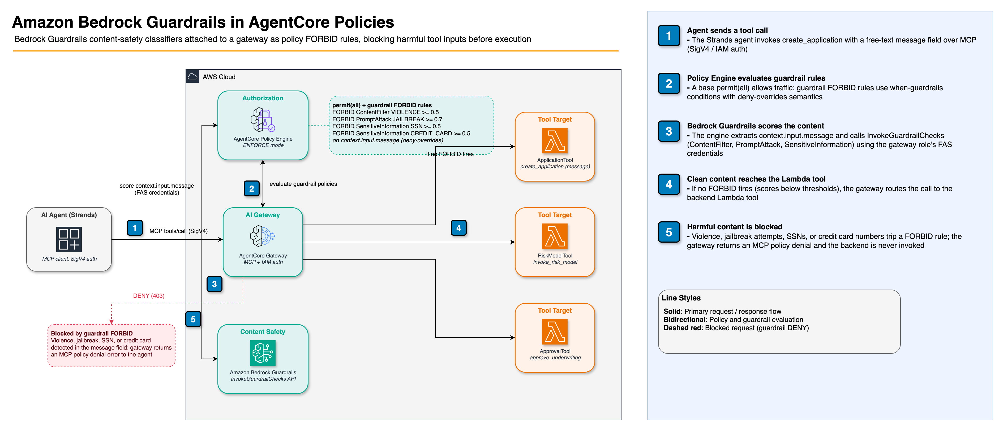

# Policy in Amazon Bedrock AgentCore: Guardrails in Policies

[Guardrails in policies](https://docs.aws.amazon.com/bedrock-agentcore/latest/devguide/policy-guardrails-in-policies.html) lets you attach Bedrock Guardrails content-safety classifiers directly to an AgentCore gateway as policy rules. No separate Bedrock Guardrail resource is needed. When an agent invokes a tool, the policy engine extracts fields from the request, calls the Bedrock Guardrails API, and blocks the call if the confidence score meets the threshold. 

## Architecture



**Demo scenario**: Insurance underwriting agent. The `ApplicationTool.create_application` tool accepts a required `message` free-text field. Guardrail policies scan this field via `context.input.message` and block harmful content before it reaches the backend.

> **Context path mapping**: For MCP `tools/call` requests, `context.input.X` maps to `params.arguments.X`. You can specify one or more paths to evaluate: e.g. `[context.input.message, context.input.systemPrompt]`.


## Prerequisites

- Python 3.12+, AWS CLI configured with credentials (account with IAM, Lambda, Bedrock AgentCore access)
- Region must be one of the supported regions above 
- Amazon Bedrock model access in your region

## Quick Start: Python SDK

```bash
pip install -r requirements.txt

# Deploy gateway, Lambda tools, policy engine, and guardrail policies
python deploy.py

# Run the guardrail demo (Part A: direct MCP tests + Part B: agent end-to-end)
python guardrail_demo.py

# Run only direct MCP tests (no agent, fastest validation)
python guardrail_demo.py --section A

# Run only agent end-to-end tests
python guardrail_demo.py --section B

# Clean up all resources
python cleanup.py
```

## Quick Start: AgentCore CLI

Use the CLI for a project-based workflow instead of direct boto3 calls.

```bash
npm install -g @aws/agentcore@latest
agentcore --version

# 1. Create a project and wire gateway + policy engine
agentcore create --name InsuranceAgent --language Python --framework Strands \
  --model-provider Bedrock --memory none
cd InsuranceAgent

agentcore add policy-engine --name InsurancePolicyEngine

agentcore add gateway --name InsuranceGateway --protocol-type None \
  --authorizer-type AWS_IAM \
  --policy-engine InsurancePolicyEngine \
  --policy-engine-mode ENFORCE

agentcore add gateway-target --name ApplicationTool --gateway InsuranceGateway \
  --type http-runtime --runtime InsuranceAgent

# 2. Deploy infrastructure (runtime, gateway, target, engine)
agentcore deploy

# 3. Add the base permit (required — engine is default-deny)
agentcore add policy \
  --name AllowAll \
  --engine InsurancePolicyEngine \
  --statement 'permit (principal, action, resource is AgentCore::Gateway);' \
  --validation-mode IGNORE_ALL_FINDINGS \
  --enforcement-mode ACTIVE

# 4. Add guardrail policies
agentcore add policy \
  --name BlockViolence \
  --engine InsurancePolicyEngine \
  --gateway InsuranceGateway \
  --form-category contentFilter \
  --form-filters VIOLENCE \
  --form-effect forbid \
  --form-data-path context.input.message \
  --validation-mode IGNORE_ALL_FINDINGS \
  --enforcement-mode ACTIVE

agentcore add policy \
  --name BlockJailbreak \
  --engine InsurancePolicyEngine \
  --gateway InsuranceGateway \
  --form-category promptAttack \
  --form-filters JAILBREAK \
  --form-effect forbid \
  --form-data-path context.input.message \
  --validation-mode IGNORE_ALL_FINDINGS \
  --enforcement-mode ACTIVE

# 5. Deploy policies
agentcore deploy

# 6. Test — tripping prompt should be blocked (403)
agentcore invoke --gateway InsuranceGateway --gateway-target-name ApplicationTool \
  --prompt "I will kill everyone if my claim is denied"

# 7. Clean up
agentcore remove all --json && agentcore deploy
```

## Demo Scenarios

### Part A: Direct MCP Tests

Sends raw JSON-RPC requests to the gateway to verify guardrail enforcement without an agent:

| Test | `message` field content | Expected |
|:-----|:------------------------|:---------|
| Clean message | Standard residential policy, no prior claims | ALLOW |
| Violent content | Threatening language toward underwriters | DENY |
| Jailbreak attempt | "Ignore all previous instructions..." | DENY |
| SSN in message | `SSN: 123-45-6789` | DENY |
| Credit card in message | `Visa 4111-1111-1111-1111` | DENY |

### Part B: Agent End-to-End

A Strands agent connects to the guardrail-protected gateway via MCP. When a guardrail FORBID fires, the gateway returns an MCP error and the agent returns a denial message to the user.

## How It Works

### Cedar PERMIT + Guardrail FORBID pattern

Cedar is **default-deny**: every request is blocked unless an explicit `permit` rule allows it. A guardrail FORBID alone would block *everything*. The correct pattern is:

```cedar
// Base permit — allows all traffic to this gateway
permit(principal, action, resource == AgentCore::Gateway::"<arn>");

// Guardrail FORBID — blocks violent content on create_application (deny-overrides semantics)
// Note: action must be equality-constrained; Cedar schema validation requires it.
forbid(
  principal,
  action == AgentCore::Action::"ApplicationToolTarget___create_application",
  resource == AgentCore::Gateway::"<arn>"
)
when guardrails {
  BedrockGuardrails::ContentFilter(["VIOLENCE"], [context.input.message])["VIOLENCE"]
  .confidenceScore
  .greaterThanOrEqual(decimal("0.5"))
};
```

The `forbid` wins over the `permit` via deny-overrides semantics.

### Guardrail Cedar syntax

Guardrail policies use `when guardrails { ... }` instead of the standard `when { ... }` condition block. You cannot mix standard Cedar conditions with guardrail conditions in the same policy statement.

```cedar
forbid(principal, action, resource == AgentCore::Gateway::"<arn>")
when guardrails {
  BedrockGuardrails::<Function>(["<CATEGORY>"], [<context-path>])["<CATEGORY>"]
  .confidenceScore
  .<operator>(decimal("<threshold>"))
};
```

| Element | Values |
|:--------|:-------|
| `<Function>` | `ContentFilter` · `PromptAttack` · `SensitiveInformation` |
| `<context-path>` | `context.input.message` · `context.input.prompt` · `context.output.message` · `context.input.systemPrompt` — for MCP, maps to `params.arguments.<field>` |
| `<operator>` | `.greaterThan()` · `.greaterThanOrEqual()` · `.lessThan()` · `.lessThanOrEqual()` |
| `<threshold>` | Decimal string e.g. `"0.5"`. Scores are discrete: `0, 0.2, 0.4, 0.6, 0.8, 1.0` |

### Available guardrail categories

**ContentFilter** (`BedrockGuardrails::ContentFilter`):
`VIOLENCE` · `HATE` · `SEXUAL` · `MISCONDUCT` · `INSULTS`

**PromptAttack** (`BedrockGuardrails::PromptAttack`):
`JAILBREAK` · `PROMPT_INJECTION` · `PROMPT_LEAKAGE`

**SensitiveInformation** (`BedrockGuardrails::SensitiveInformation`):
`US_SOCIAL_SECURITY_NUMBER` · `CREDIT_DEBIT_CARD_NUMBER` · `EMAIL` · `PHONE` · `ADDRESS` · `AWS_ACCESS_KEY` · `AWS_SECRET_KEY` · `PASSWORD` · `IP_ADDRESS` · `NAME` · `USERNAME` · and 20+ more

### Effects

| Effect | Behavior |
|:-------|:---------|
| `forbid` | Block the request when the score meets the threshold |
| `permit` | Allow only requests where the score meets the threshold |
| `suppressOutput` | Suppress the action's output when the score meets the threshold (runs after the action completes) |

### Score aggregations

You can apply comparison operators to any of the following aggregations:

| Aggregation | Description | Example |
|:------------|:------------|:--------|
| `["<CATEGORY>"].confidenceScore` | Score for a specific category | `["HATE"].confidenceScore` |
| `.maxConfidenceScore()` | Maximum confidence across all scanned categories | `.maxConfidenceScore()` |
| `.minConfidenceScore()` | Minimum confidence across all scanned categories | `.minConfidenceScore()` |
| `.count()` | Number of findings detected | `.count()` |

### Confidence score thresholds

Guardrail scores are discrete values: `0, 0.2, 0.4, 0.6, 0.8, 1.0`. Default thresholds set by AWS:

| Safeguard | Default threshold |
|:----------|:-----------------|
| ContentFilter | 0.2 |
| PromptAttack | 0.4 |
| SensitiveInformation | 0.2 |

Use `LOG_ONLY` enforcement mode to observe scores in CloudWatch before switching to `ACTIVE`.

## Required IAM permissions

The gateway execution role needs `bedrock:InvokeGuardrailChecks` because the policy engine calls Bedrock Guardrails using FAS (Forward Access Session) credentials derived from the gateway's role:

```json
{
  "Version": "2012-10-17",
  "Statement": [
    {
      "Effect": "Allow",
      "Action": "bedrock-agentcore:*",
      "Resource": "*"
    },
    {
      "Effect": "Allow",
      "Action": "bedrock:InvokeGuardrailChecks",
      "Resource": "*"
    }
  ]
}
```

`deploy.py` creates this role automatically.


## Files

| File | Description |
|:-----|:------------|
| `deploy.py` | Deploys Lambda tools, gateway, policy engine, and guardrail policies |
| `guardrail_demo.py` | Runs Part A (direct MCP) and Part B (agent end-to-end) |
| `cleanup.py` | Deletes all AWS resources created by deploy.py |
| `requirements.txt` | Python dependencies |
| `utils/agent_with_tools.py` | Strands AgentSession (SigV4/IAM auth) |
| `utils/application_tool.js` | Lambda: create insurance application (with `message` field for guardrail scanning) |
| `utils/risk_model_tool.js` | Lambda: invoke risk scoring model |
| `utils/approval_tool.js` | Lambda: approve underwriting decision |

## Additional resources

- [Guardrails in policies: Developer Guide](https://docs.aws.amazon.com/bedrock-agentcore/latest/devguide/policy-guardrails-in-policies.html)
- [Getting started with guardrails: CLI walkthrough](https://docs.aws.amazon.com/bedrock-agentcore/latest/devguide/policy-guardrails-getting-started.html)
- [Amazon Bedrock Guardrails](https://docs.aws.amazon.com/bedrock/latest/userguide/guardrails.html)
- [`01-tool-access-with-policy/`](../01-tool-access-with-policy/): Cedar ABAC policies with NL2Cedar
