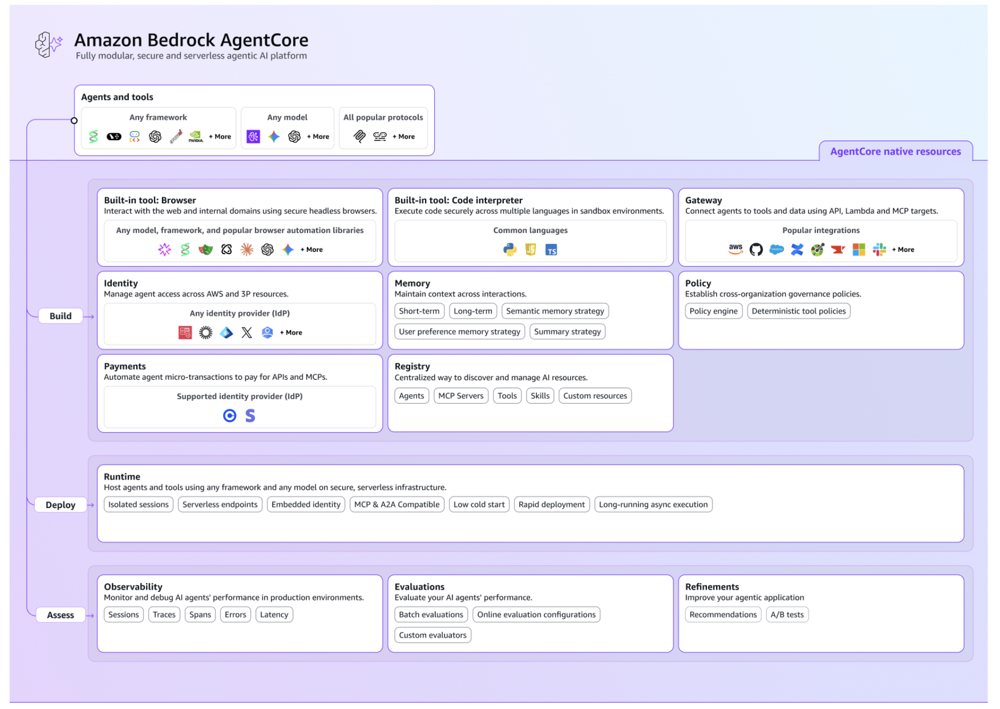

# Amazon Bedrock AgentCore — Feature Tutorials

## What is Amazon Bedrock AgentCore?

Amazon Bedrock AgentCore is an agentic platform for building, deploying, and operating highly effective agents securely at scale using any framework and foundation model. With AgentCore, you can enable agents to take actions across tools and data with the right permissions and governance, run agents securely at scale, and monitor agent performance and quality in production — all without any infrastructure management.

AgentCore services work together or independently with any open-source framework such as CrewAI, LangGraph, LlamaIndex, and Strands Agents and with any foundation model, so you don't have to choose between open-source flexibility and enterprise-grade security and reliability.

### Core Services

| Service | Description |
|:--------|:------------|
| **runtime** | Secure, serverless environment for deploying and scaling AI agents and tools. Fast cold starts, session isolation, multi-protocol support (HTTP, MCP, A2A, AG-UI), and extended runtime for async agents. |
| **memory** | Short-term conversation memory and long-term persistent memory that survives across sessions. Shareable across agents; learns from past interactions. |
| **gateway** | Converts APIs, Lambda functions, and existing services into MCP-compatible tools. Connects to pre-existing MCP servers and popular integrations (Salesforce, Zoom, Jira, Slack). |
| **identity** | Agent identity, access, and authentication management compatible with existing IdPs — Cognito, Okta, Microsoft Entra ID, Auth0, and others. Supports inbound JWT validation and outbound OAuth2/API-key credential management. |
| **observability** | Unified tracing, debugging, and monitoring for agents in production using OpenTelemetry. Integrates with CloudWatch and third-party platforms. |
| **evaluations** | Automated, data-driven agent assessment with on-demand and online evaluation using built-in and custom evaluators. |
| **policy** | Deterministic control over agent behavior using natural language or Cedar policies. Intercepts every tool call before execution via the gateway. |
| **registry** | Centralized catalog for discovering and managing agents, MCP servers, tools, and skills across your organization. Governed publishing and approval workflow with semantic search. |
| **payments** | Microtransaction payments for agents via the x402 protocol — wallet integration, configurable spending limits, and end-to-end observability. |
| **code interpreter** | Isolated sandbox for agents to execute Python, JavaScript, and TypeScript code. |
| **browser** | Managed cloud browser for agents to interact with web applications, navigate sites, fill forms, and extract information. |
| **harness** | Serverless agent orchestration layer — model, tools, system prompt, and context management in a single API call, without managing a runtime. |



### What Can You Build?

- **Agents** — Autonomous AI apps that reason, use tools, and maintain context across sessions. Deploy agents for customer support, workflow automation, data analysis, or coding assistance — serverless with isolated sessions, persistent memory, and built-in observability.
- **Tools and MCP Servers** — Transform existing APIs, databases, or services into tools any MCP-compatible agent can use. Wrap Lambda functions or OpenAPI specs through a gateway without rewriting code.
- **Agent Platforms** — Give internal developers or customers a paved path to build agents using approved tools, shared memory stores, and governed access to enterprise services. Centralize observability, authentication, and compliance while enabling teams to ship faster.

---

This section provides hands-on tutorials for each Amazon Bedrock AgentCore capability. Each folder focuses on a specific service, with working code you can deploy and test.

## Approach: APIs via AWS SDK (boto3)

There are [several interfaces](https://docs.aws.amazon.com/bedrock-agentcore/latest/devguide/develop-agents.html) for interacting with AgentCore:

| Interface | Description |
|:----------|:------------|
| **AgentCore CLI** | Node.js CLI for creating, deploying, and managing agents (`agentcore create`, `agentcore deploy`) |
| **AgentCore Python SDK** | Python primitives for agent development (`bedrock-agentcore` package) |
| **AgentCore MCP Server** | MCP server for conversational agent development from IDEs (Kiro, Cursor, Claude Code) |
| **AWS SDK** | Full API access via boto3 (Python), AWS SDK for Java, JavaScript, etc. |
| **AWS CLI** | Command-line access to all AgentCore operations |
| **Console** | Web-based UI for creating and managing services |

For these tutorials, we focus on **capabilities and implementation details**, so we use:

- **AWS SDK (boto3)** for infrastructure — creating runtimes, endpoints, memory stores, gateways, and other AWS resources via the `bedrock-agentcore-control` (control plane) and `bedrock-agentcore` (data plane) clients
- **AgentCore Python SDK** for agent code — the `bedrock-agentcore` package provides `BedrockAgentCoreApp` for wrapping your agent as an HTTP service

This gives you full visibility into every API call and parameter, which is the point of educational content. In production, you might prefer the AgentCore CLI or console for faster iteration.

### Two boto3 Clients

| Client | Service Name | Purpose |
|:-------|:-------------|:--------|
| **Control plane** | `bedrock-agentcore-control` | Create, update, delete, and manage resources (runtimes, memory, gateways, etc.) |
| **Data plane** | `bedrock-agentcore` | Invoke agents, execute commands, create memory events, etc. |

```python
import boto3

# Manage infrastructure
control = boto3.client('bedrock-agentcore-control', region_name='us-west-2')

# Interact with running agents and services
data = boto3.client('bedrock-agentcore', region_name='us-west-2')
```

## Feature Tutorials

| # | Folder | What's inside |
|:--|:-------|:--------------|
| 01 | [harness](01-harness/) | Serverless agent orchestration environment — model, tools, sandbox, and session management in a single API call |
| 02 | [host your agent](02-host-your-agent/) | Deploy agents and MCP tool servers on AgentCore runtime; multi-protocol (HTTP, MCP, A2A, AG-UI), streaming, sessions, async, VPC, and coding agents |
| 03 | [connect your agent to anything](03-connect-your-agent-to-anything/) | Built-in managed tools: sandboxed Python code execution (Code Interpreter) and headless browser automation (Browser Tool) |
| 04 | [manage context of your agent](04-manage-context-of-your-agent/) | Short-term session memory and long-term persistent memory for context-aware agents |
| 05 | [authenticate and authorize](05-authenticate-and-authorize/) | Inbound auth (Cognito, Entra ID, Okta, PingFederate) and outbound auth (OAuth2, API keys, 3LO, M2M, OBO) |
| 06 | [observe, evaluate, and optimize](06-observe-evaluate-optimize-your-agent/) | Trace and debug with OpenTelemetry, evaluate with LLM-as-a-judge and ground-truth evaluators, optimize prompts and tool descriptions |
| 07 | [centralize and govern](07-centralize-and-govern-your-ai-infrastructure/) | AgentCore gateway (MCP proxy for APIs and Lambda), Cedar policy engine, agent/tool registry |
| 08 | [agents that transact](08-agents-that-transact/) | Microtransaction payments for agents via x402 protocol — wallet setup, spending limits, multi-agent orchestration |

## AgentCore CLI

The AgentCore CLI is an alternative to boto3 for creating, deploying, and managing AgentCore resources. Install it:

```bash
npm install -g @aws/agentcore
```

### Scaffold and deploy an agent

```bash
# Create a new project interactively
agentcore create

# Deploy to AWS
agentcore deploy

# Check status of all deployed resources
agentcore status

# Invoke the deployed agent
agentcore invoke --prompt "Hello, what can you help me with?"
```

### Add features to an existing project

```bash
# Memory
agentcore add memory --name mymemory --strategies SEMANTIC

# Gateway + target
agentcore add gateway --name mygateway
agentcore add gateway-target --type mcp-server --endpoint https://mcp.example.com/mcp --gateway mygateway

# Policy engine
agentcore add policy-engine --name MyPolicyEngine --attach-to-gateways mygateway --attach-mode ENFORCE
agentcore add policy --name my-policy --engine MyPolicyEngine \
  --generate "Allow users to invoke tools only when their subscription is active"

# Outbound credentials (API key or OAuth M2M)
agentcore add credential --name OpenAIKey --type api-key --api-key $OPENAI_API_KEY
agentcore add credential --name GitHubM2M --type oauth \
  --discovery-url $GITHUB_DISCOVERY_URL \
  --client-id $GITHUB_CLIENT_ID --client-secret $GITHUB_CLIENT_SECRET \
  --scopes repo,read:user

# Inbound auth (protect runtime with JWT)
agentcore add agent --name MyAgent --type byo --code-location app/ --entrypoint main.py \
  --language Python --authorizer-type CUSTOM_JWT \
  --discovery-url $COGNITO_DISCOVERY_URL --allowed-clients $COGNITO_CLIENT_ID

# Evaluation
agentcore add evaluator --name MyEval --level SESSION --type llm-as-a-judge \
  --instructions "Score whether the agent fully resolved the user's request."
agentcore add online-eval --name MyOnlineEval --runtime MyAgent \
  --evaluator Builtin.GoalSuccessRate --sampling-rate 100 --enable-on-create

# Run evaluations and optimization
agentcore run batch-evaluation --runtime MyAgent --evaluator Builtin.GoalSuccessRate Builtin.Helpfulness
agentcore run recommendation --runtime MyAgent --type system-prompt --evaluator Builtin.GoalSuccessRate

agentcore deploy
```

Each feature section's README has a dedicated **AgentCore CLI** section with more detailed examples for that specific feature.

## Prerequisites

- Python 3.12+
- [`uv`](https://docs.astral.sh/uv/getting-started/installation/) installed (for building arm64 deployment packages)
- AWS account with Amazon Bedrock AgentCore access
- AWS CLI configured with credentials
- `boto3` installed (`pip install boto3`)

## Documentation

- [What is Amazon Bedrock AgentCore?](https://docs.aws.amazon.com/bedrock-agentcore/latest/devguide/what-is-bedrock-agentcore.html)
- [Available interfaces for using AgentCore](https://docs.aws.amazon.com/bedrock-agentcore/latest/devguide/develop-agents.html)
- [boto3 Control Plane Reference](https://docs.aws.amazon.com/boto3/latest/reference/services/bedrock-agentcore-control.html)
- [boto3 Data Plane Reference](https://docs.aws.amazon.com/boto3/latest/reference/services/bedrock-agentcore.html)
- [AgentCore Python SDK (GitHub)](https://github.com/aws/bedrock-agentcore-sdk-python)
