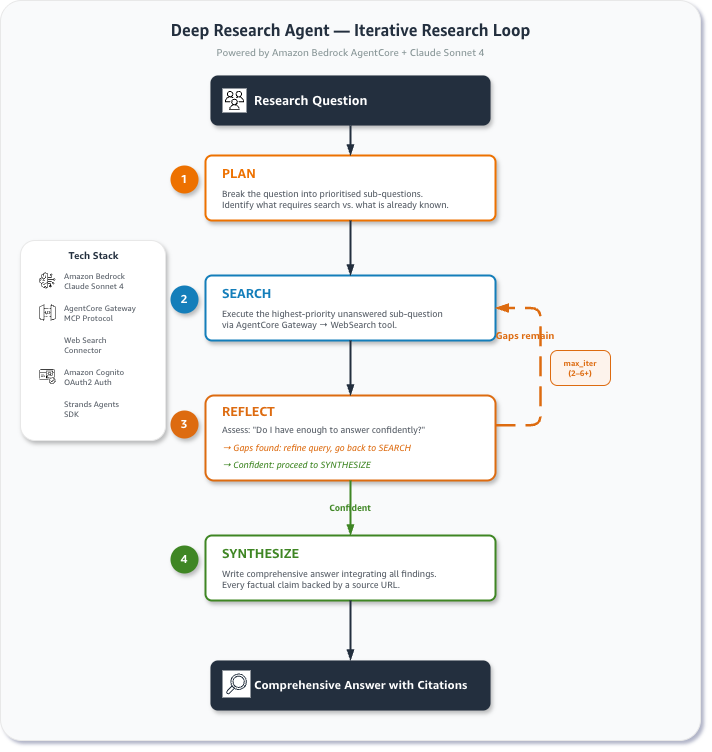
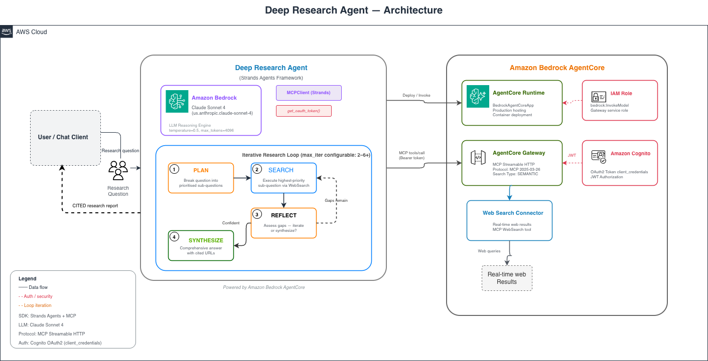

# Deep Research Agent

An intelligent research agent powered by Amazon Bedrock AgentCore and Claude Sonnet 4 that answers complex, multi-faceted questions through an iterative Plan → Search → Reflect → Synthesize loop.

## Overview

Single-shot web search works for simple factual queries. For questions that require comparing multiple sources, reconciling conflicting information, or drilling into details revealed by earlier results, you need a reflect-and-refine loop. The Deep Research Agent makes that loop explicit and configurable.



| Information | Details |
|:------------|:--------|
| Use case type | Research / Question answering |
| Agent type | Single agent |
| AgentCore components | AgentCore gateway, AgentCore runtime |
| Agentic framework | Strands Agents |
| LLM model | Anthropic Claude Sonnet 4 |
| Use case vertical | Cross-vertical |
| Example complexity | Intermediate |
| SDK used | bedrock-agentcore, strands-agents, mcp |

## When to Use This Pattern

| Scenario | Single-shot search | Deep Research Agent |
|:---------|:-------------------|:--------------------|
| Simple factual lookup | ✅ Sufficient | Overkill |
| Multi-source comparison | ❌ Incomplete | ✅ Ideal |
| Conflicting information | ❌ Misses nuance | ✅ Reconciles |
| Follow-up questions emerge | ❌ Single pass | ✅ Iterates |
| Complex regulatory / technical topics | ❌ Shallow | ✅ Deep |

## Example Questions

- "What are the key differences between Claude Sonnet 4 and GPT-4.5 for enterprise code generation, and which has stronger developer community adoption?"
- "What regulatory changes in the EU in 2026 affect AI startup compliance, and what are the key deadlines?"
- "How has the adoption of Model Context Protocol changed agent development practices in 2025–2026?"
- "What are the current best practices for deploying LLM agents in production, based on recent industry reports?"
- "What are the trade-offs between RAG and fine-tuning for enterprise LLM applications?"

## Use Case Architecture



## Features

- **Configurable depth** — set `--max-iter` (or `DEEP_RESEARCH_MAX_ITER`) to tune depth vs. cost
- **Transparent reasoning** — plan, search queries, and reflections are visible in the output
- **Cited answers** — every factual claim is backed by a source URL
- **AgentCore runtime** — production-ready hosting via `BedrockAgentCoreApp`
- **CLI + runtime modes** — run locally with `--query` or deploy to AgentCore runtime

## Tuning the Loop

| `--max-iter` | Effect | Use when |
|:-------------|:-------|:---------|
| 2 | Fast, shallow | Simple factual questions |
| 4 (default) | Balanced | Most research tasks |
| 6+ | Deep, thorough | Complex comparative analysis |

Each additional iteration costs one WebSearch call and one LLM call.

## Prerequisites

- AWS account with Amazon Bedrock enabled in **us-east-1**
- **Claude Sonnet 4** model access enabled in Bedrock (Bedrock Console → Model Access)
- AWS credentials with `bedrock:InvokeModel` permission
- **No Gateway pre-setup required** — the agent auto-detects or provisions one for you

### IAM permissions for auto-provisioning (first run only)

If no existing Gateway is found, the agent will offer to create one. This requires:

```
iam:CreateRole, iam:PutRolePolicy, iam:GetRole
cognito-idp:CreateUserPool, cognito-idp:CreateUserPoolDomain
cognito-idp:CreateResourceServer, cognito-idp:CreateUserPoolClient
cognito-idp:ListUserPools, cognito-idp:ListUserPoolClients
cognito-idp:DescribeUserPoolClient, cognito-idp:DescribeResourceServer
bedrock-agentcore:CreateGateway, bedrock-agentcore:GetGateway
bedrock-agentcore:CreateGatewayTarget, bedrock-agentcore:ListGatewayTargets
bedrock-agentcore:ListGateways
```

On subsequent runs, if you export the printed variables, only `bedrock:InvokeModel` is needed.

## Quick Start

### 1. Install dependencies

```bash
cd 02-use-cases/01-conversational-agents/deep-research-agent
pip install -r requirements.txt
```

### 2. Run locally

```bash
# Interactive mode — auto-detects or provisions Gateway, then prompts for a question
python deep_research_agent.py

# Direct question
python deep_research_agent.py --query "What are the trade-offs between RAG and fine-tuning for enterprise LLMs?"

# Deep mode — 6 iterations for complex comparative questions
python deep_research_agent.py --query "Compare Claude Sonnet 4 and GPT-4.5 for code generation" --max-iter 6
```

On first run without environment variables, the agent will:
1. Scan your account for an existing Gateway with a Web Search target
2. If found, reuse it automatically
3. If not found, prompt you to create one (~60 seconds)
4. Write credentials to `.env.web-search` for future runs

### 3. (Optional) Pre-configure environment variables

If you already have a Gateway from a previous setup, source the credentials file:

```bash
source .env.web-search
```

Or set them manually:

```bash
export AGENTCORE_GATEWAY_URL="https://..."
export COGNITO_DOMAIN="us-east-1xxxxxxxx"
export COGNITO_CLIENT_ID="..."
export COGNITO_CLIENT_SECRET="..."
export COGNITO_SCOPE="agentcore-websearch/invoke"
export AWS_DEFAULT_REGION="us-east-1"
```

### 4. (Optional) Deploy to AgentCore runtime

For runtime deployments, environment variables **must** be pre-configured in the
container environment (no interactive provisioning in runtime mode):

```bash
# The BedrockAgentCoreApp entrypoint makes this deployment-ready
python deep_research_agent.py  # starts the runtime server when deployed
```

When deployed, invoke via the AgentCore runtime API:

```json
{
  "prompt": "What are the current best practices for deploying LLM agents in production?",
  "max_iter": 4
}
```

## Cleanup

When you're done, remove all provisioned resources:

```bash
python cleanup.py --gateway-id <gateway-id> --user-pool-id <user-pool-id> --role-name <role-name>
```

| Parameter | Required | Description |
|:----------|:---------|:------------|
| `--gateway-id` | Yes | Gateway ID (printed during provisioning) |
| `--user-pool-id` | Yes | Cognito User Pool ID (printed during provisioning) |
| `--role-name` | Yes | IAM role name (printed during provisioning) |

The cleanup script will:
- Delete the Gateway and all its targets
- Delete the Cognito User Pool and domain
- Delete the IAM service role and inline policies
- Remove the local `.env.web-search` credentials file

After cleanup, unset environment variables:

```bash
unset AGENTCORE_GATEWAY_URL COGNITO_DOMAIN COGNITO_CLIENT_ID COGNITO_CLIENT_SECRET COGNITO_SCOPE
```

## IAM Permissions

### Caller (agent runtime)

```json
{
  "Effect": "Allow",
  "Action": "bedrock:InvokeModel",
  "Resource": "arn:aws:bedrock:us-east-1::foundation-model/us.anthropic.claude-sonnet-4-20250514-v1:0"
}
```

### Gateway authentication

Gateway invocation is authorised via the Cognito OAuth token — no additional IAM permissions needed for the caller beyond `bedrock:InvokeModel`.

### Auto-provisioning (first run only)

See the Prerequisites section above for the full list of permissions needed to create Gateway infrastructure. These are only required once — after provisioning, the agent only needs `bedrock:InvokeModel`.

## Files

| File | Description |
|:-----|:------------|
| `deep_research_agent.py` | Main agent — Plan/Search/Reflect loop, AgentCore runtime entrypoint, and CLI |
| `gateway_setup.py` | Auto-detection and provisioning of Gateway + Web Search infrastructure |
| `cleanup.py` | Deletes all provisioned AWS resources and local credentials |
| `requirements.txt` | Python dependencies |
| `README.md` | This file |

## How It Works

### The Research Loop

The system prompt encodes the loop directly. Claude:

1. **Plans** — decomposes the question into ordered sub-questions and identifies what needs searching
2. **Searches** — calls the `WebSearch` tool with the highest-priority unanswered sub-question (queries kept under 200 characters for best results)
3. **Reflects** — after each result, explicitly notes what was learned and what gaps remain; decides whether to search again or synthesize
4. **Synthesizes** — once confident (or when `max_iter` is reached), writes a comprehensive answer with cited URLs and noted uncertainties

### Gateway Integration

The agent connects to AgentCore gateway via MCP Streamable HTTP. The Gateway exposes the Web Search connector as a standard MCP `WebSearch` tool. Tool discovery (`tools/list`) and invocation (`tools/call`) happen automatically through the Strands `MCPClient`.

### Auth Flow

```
deep_research_agent.py
  └── get_oauth_token()
        └── POST /oauth2/token → Cognito (client_credentials)
              └── Bearer token attached to every MCP request → Gateway
```

## Related Resources

- [`01-features/03-connect-your-agent-to-anything/03-web-search/`](../../../01-features/03-connect-your-agent-to-anything/03-web-search/) — Gateway setup, raw MCP, and basic agent demos
- [AgentCore gateway documentation](https://docs.aws.amazon.com/bedrock-agentcore/latest/devguide/gateway.html)
