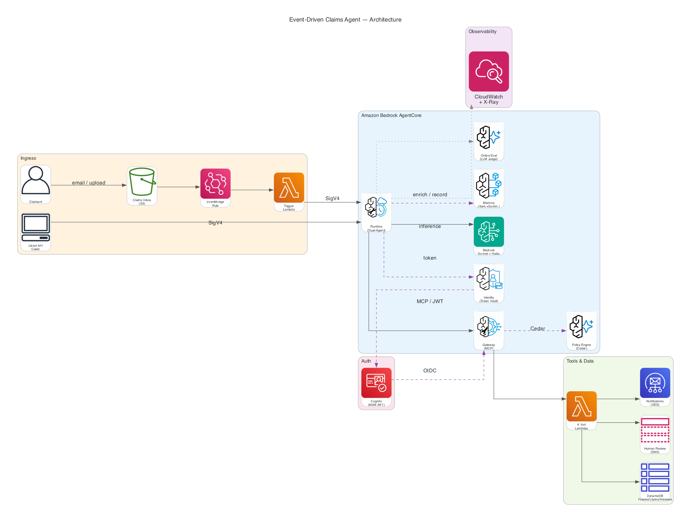

# Event-Driven Claims Processing Agent

> [!IMPORTANT]
> The examples provided in this repository are for experimental and educational purposes only. They demonstrate concepts and techniques but are not intended for direct use in production environments.

An event-driven insurance claims processing system built on **Amazon Bedrock AgentCore**. Claims arrive via email, are processed by a dual-agent architecture (Claims Processor + Validation Agent), and are automatically routed based on confidence scoring — all deployed with a single command.

| | |
|---|---|
| ⏱️ **Time to deploy** | ~20-30 minutes (first time, with prerequisites met) |
| 💰 **Running cost** | ~$3-5/day (Fargate + DynamoDB on-demand + Lambda). Tear down when not testing. |
| 🏗️ **Resources created** | ~76 (via single CloudFormation stack) |
| 🧹 **Teardown** | `./scripts/destroy.sh us-west-2` removes everything (stack + Cognito + state) |

## What You'll Learn

This sample teaches you how to build a production-realistic agent system on AgentCore. By the time you've deployed and explored it, you'll understand:

| Concept | What it demonstrates |
|---------|---------------------|
| **Dual-agent orchestration** | Two Strands agents in sequence — a Claims Processor makes a decision, then a Validation Agent independently reviews it to reduce bias |
| **Event-driven triggers** | S3 → EventBridge → Lambda → AgentCore Runtime pipeline for asynchronous processing |
| **MCP Gateway + Lambda tools** | Tools deployed as Lambda functions behind the Model Context Protocol Gateway, discoverable via semantic search |
| **Cedar policy enforcement** | A Policy Engine that blocks tool calls at runtime (e.g., claims ≥$100k are denied before execution) |
| **AgentCore Identity for auth** | `@requires_access_token` decorator manages OAuth tokens via Identity vault — no secrets in env vars |
| **Agent memory** | SEMANTIC + SUMMARIZATION strategies for cross-session recall of repeat claimants |
| **Online evaluation** | Built-in quality metrics (Helpfulness, Correctness, Tool Selection Accuracy) running on every invocation |
| **Full observability automation** | CloudWatch Transaction Search + TRACES/LOGS delivery for Gateway/Memory enabled via scripts |

## Architecture



<details>
<summary>Text description (for accessibility)</summary>

The system has three layers:

1. **Ingress:** Email → Amazon SES → S3 bucket (claims-inbox/) → EventBridge rule → Trigger Lambda (SigV4 auth to Runtime)
2. **Processing:** AgentCore Runtime runs Phase 1 (Claims Processor), Phase 2 (Validation Agent), Phase 3 (Execution based on confidence score)
3. **Tools:** MCP Gateway (Cognito CUSTOM_JWT auth) + Cedar Policy Engine routes tool calls to 6 Lambda functions → DynamoDB, SNS, and SES

</details>

See [docs/ARCHITECTURE.md](./docs/ARCHITECTURE.md) for full component diagrams, data flows, and details.

## Quick Start

### Prerequisites

- AWS Account with [Bedrock model access](https://docs.aws.amazon.com/bedrock/latest/userguide/model-access.html) (Claude Sonnet 4)
- [AgentCore CLI](https://docs.aws.amazon.com/bedrock/latest/userguide/agentcore.html) (`npm install -g @aws/bedrock-agentcore-cli`, ≥ 1.0.0-preview.13)
- [AWS CDK CLI](https://docs.aws.amazon.com/cdk/v2/guide/getting-started.html) (`npm install -g aws-cdk`)
- [Docker](https://www.docker.com/products/docker-desktop/) or [Finch](https://github.com/runfinch/finch) (container runtime)
- Python 3.12+ with [uv](https://docs.astral.sh/uv/getting-started/installation/) (`pip install uv` or `brew install uv`)
- [AWS CLI v2](https://docs.aws.amazon.com/cli/latest/userguide/getting-started-install.html) configured (`aws configure`)
- Node.js 18+

### Deploy

```bash
cd event-driven-claims-agent
./deploy.sh us-west-2
```

This single command: configures your target account/region → installs dependencies → validates `agentcore.json` → bootstraps CDK → deploys all 76 resources → seeds test data → prints test commands.

### Test

```bash
python3 scripts/test_invoke.py --region us-west-2
```

Expected output:

```
🔑 Authenticating...
✅ Connected to claimsagent
📝 I need to file a claim. My policy is POL-12345. Fender bender yesterday, $2000 damage.

━━━ Agent Response ━━━

## Phase 1: Claims Processing
[Agent looks up policy POL-12345, verifies coverage, makes ACCEPT decision]

---
## Phase 2: Validation & Routing
CONFIDENCE: 92
ROUTING: AUTO_APPROVE
[Validator confirms decision is sound — clear-cut case]

---
## Phase 3: Execution
**Auto-approved** (confidence: 92/100)
✅ Claim created: CLM-XXXXXXXX
📧 Approval notification sent to claimant@example.com

✅ Processing complete.

━━━━━━━━━━━━━━━━━━━━━
```

Try different scenarios:

```bash
# Cedar blocks this (≥$100k threshold)
python3 scripts/test_invoke.py --region us-west-2 \
  --prompt 'File a claim for POL-12345. Car totaled. $150000 damage.'

# Routes to human review (vague description → low confidence)
python3 scripts/test_invoke.py --region us-west-2 \
  --prompt 'Policy POL-12345. Something happened to my car.'

# Run all 5 E2E scenarios
python3 scripts/test_e2e.py --region us-west-2

# Validate the authentication patterns (SigV4 inbound, JWT rejection, Gateway M2M, negative cases)
python3 scripts/test_auth.py --region us-west-2
```

### Teardown

```bash
./scripts/destroy.sh us-west-2
```

## Demo

<p align="center">
  
</p>

The demo shows: (1) auto-approved claim with email notification, (2) Cedar policy blocking a $150k claim, (3) event-driven S3 → EventBridge → Agent flow.

## Documentation

| Document | What it covers |
|----------|----------------|
| [Architecture](./docs/ARCHITECTURE.md) | System components, data flows, dual-agent pipeline, Mermaid diagrams |
| [Deployment Guide](./docs/deployment.md) | Prerequisites, step-by-step deploy, verify, local dev, troubleshooting, teardown |
| [Configuration Reference](./docs/CONFIGURATION.md) | All env vars, Cedar policies, Cognito, SES, model, memory settings |
| [Tutorial: Make It Your Own](./docs/tutorial.md) | Guided walkthrough to modify the sample for your own use case |

## AgentCore Services Demonstrated

| Service | What it does here |
|---------|-------------------|
| **Runtime** | Hosts the dual-agent container (Strands SDK, SigV4 inbound auth, streaming responses) |
| **Gateway** | MCP protocol for tool discovery + invocation, 6 Lambda targets, semantic search |
| **Identity** | Manages OAuth credentials for Runtime → Gateway auth (no secrets in env vars) |
| **Policy Engine** | Cedar policies enforced before every tool call (`AllowAll` + `BlockExcessiveClaims`) |
| **Memory** | SEMANTIC retrieval + SUMMARIZATION for repeat claimant recall across sessions |
| **Observability** | X-Ray tracing + CloudWatch APPLICATION_LOGS + Transaction Search with TRACES/LOGS delivery |
| **Evaluation** | 3 built-in metrics at 100% sampling + custom LLM-as-judge evaluator |

## Project Structure

```
event-driven-claims-agent/
├── app/claimsagent/           # Agent runtime (Strands SDK, dual-agent logic)
│   ├── main.py                # Entrypoint: prompts, agents, routing, Identity-managed Gateway OAuth
│   ├── config.py              # Centralized env var reads
│   ├── Dockerfile             # Container image (Python 3.12, multi-stage)
│   ├── memory/session.py      # AgentCore Memory (graceful degradation)
│   └── tools/                 # Co-located tools (structured output)
├── agentcore/
│   ├── agentcore.json         # AgentCore resources (Runtime, Gateway, Memory, PolicyEngine, Eval)
│   └── cdk/lib/               # CDK: supplementary infra (DynamoDB, S3, Lambda, EventBridge — NO Cognito)
├── lambdas/                   # One Lambda per Gateway tool
│   ├── schemas/               # MCP tool schemas (JSON)
│   ├── trigger/               # EventBridge → Runtime invocation (SigV4 auth)
│   ├── create_claim/          # DynamoDB write
│   ├── policy_lookup/         # DynamoDB read
│   ├── human_review/          # SNS + DynamoDB
│   ├── notification/          # SES email
│   ├── list_pending_claims/   # DynamoDB scan
│   └── resolve_claim/         # DynamoDB update
├── scripts/                   # Deploy + test + Cognito + observability utilities
│   ├── setup_cognito.sh       # Create Cognito User Pool (AWS CLI, not CDK)
│   ├── teardown_cognito.sh    # Delete Cognito if script-created
│   ├── enable_observability.py  # Enable Transaction Search + deliveries
│   ├── disable_observability.py # Clean up observability deliveries
│   ├── destroy.sh             # Unified teardown: observability → stack → Cognito → state
│   ├── test_invoke.py         # Interactive agent invocation (SigV4 auth, streaming)
│   ├── test_auth.py           # Authentication pattern tests (SigV4, JWT rejection, Gateway M2M)
│   ├── test_cedar.py          # Cedar policy enforcement tests
│   ├── test_e2e.py            # 5-scenario E2E test suite
│   └── seed_dynamodb.py       # Populate test policies
├── docs/                      # Full documentation set
├── deploy.sh                  # One-command deploy (interactive Cognito setup)
└── README.md                  # This file
```

## Customization

### Change the AI model

Edit `agentcore/agentcore.json` → `runtimes[0].envVars`, change `AGENT_MODEL_ID`:
```json
{ "name": "AGENT_MODEL_ID", "value": "us.anthropic.claude-haiku-4-5-20251001-v1:0" }
```
Then: `agentcore deploy --target dev --yes`

### Adjust the Cedar policy threshold

The $100k blocking threshold is in `agentcore/agentcore.json` → `policyEngines[0].policies[1].statement`. Change `100000` to your value, then redeploy.

### Adjust the auto-approve confidence threshold

In `app/claimsagent/main.py`, search for `confidence >= 80`. Change `80` to your desired threshold.

### Add a new tool

See the step-by-step guide in [docs/tutorial.md](./docs/tutorial.md#experiment-5-add-a-new-tool).

### Adapt to a different domain

See the domain adaptation walkthrough in [docs/tutorial.md](./docs/tutorial.md#adapt-to-a-different-domain).

## 🤝 Contributing

We welcome contributions! Please see our [Contributing Guidelines](../../../CONTRIBUTING.md) for details.

## 📄 License

This project is licensed under the MIT License - see the [LICENSE](../../../LICENSE) file for details.

## 🆘 Support

- **Issues**: [GitHub Issues](https://github.com/awslabs/amazon-bedrock-agentcore-samples/issues)
- **AgentCore Docs**: [Amazon Bedrock AgentCore Documentation](https://docs.aws.amazon.com/bedrock/latest/userguide/agentcore.html)
- **Architecture & Decisions**: [docs/ARCHITECTURE.md](./docs/ARCHITECTURE.md) and [docs/decisions/](./docs/decisions/README.md)
