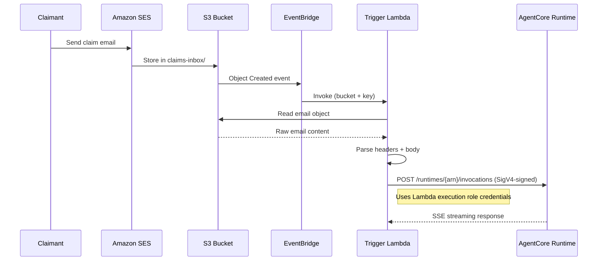
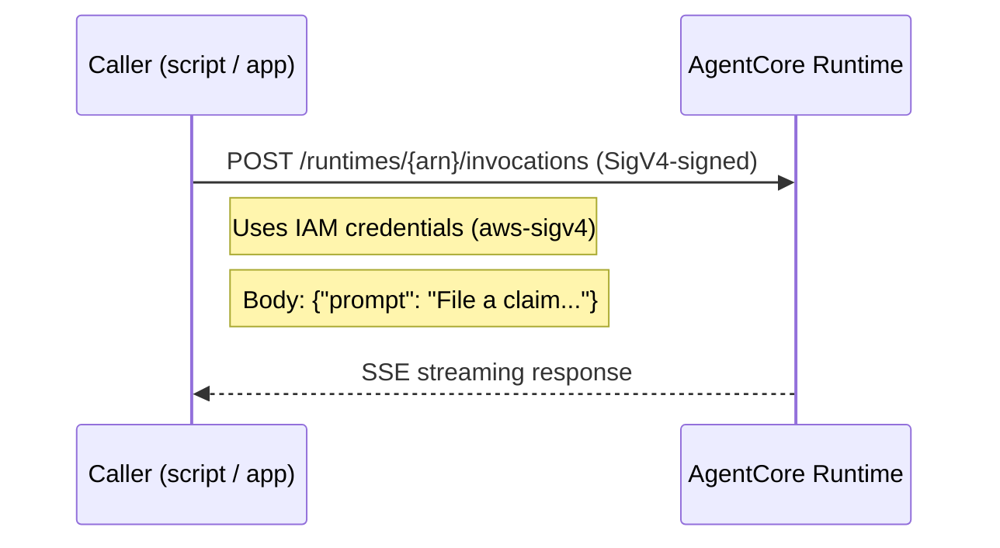
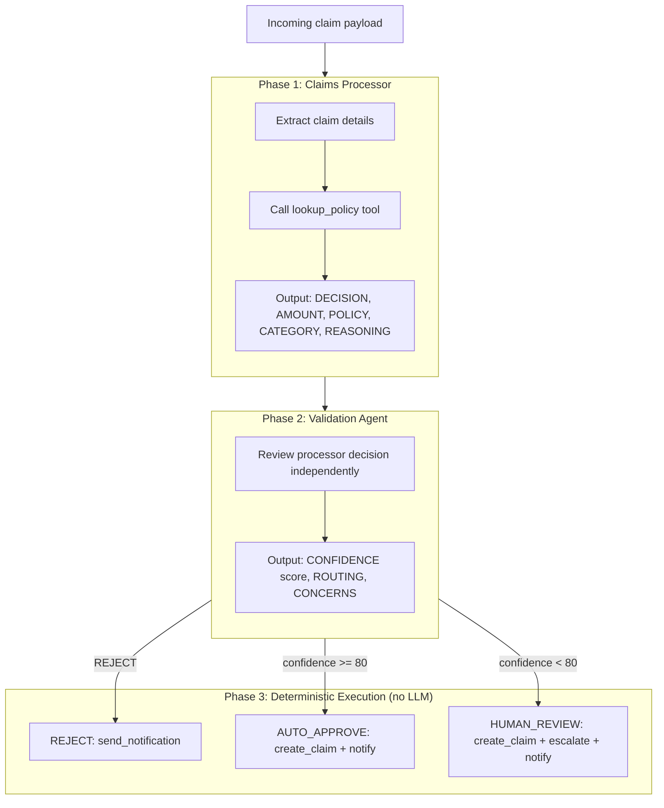
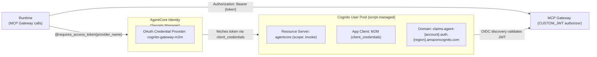

# Architecture: Event-Driven Claims Agent

## System Overview

The Event-Driven Claims Agent is an insurance claims processor built on Amazon Bedrock AgentCore. It accepts claim submissions via email (through S3/EventBridge) or direct API invocation, processes them through a dual-agent pipeline, and routes outcomes to auto-approval or human review.

This document explains:
- **Components** — what each piece does and how they connect
- **Data flows** — how a claim moves from submission to resolution
- **Authentication** — how services authenticate to each other (Cognito M2M, JWT)
- **Tool architecture** — how the agent calls Lambda tools via the MCP Gateway
- **Memory and evaluation** — how the system remembers and monitors quality

## Architecture Diagrams

### High-Level Architecture


### Event-Driven Ingress Flow


### Dual-Agent Processing Pipeline


---

## Component Descriptions

### AgentCore Runtime

- **Build type:** Container (ARM64/Graviton, Python 3.12)
- **Framework:** Strands Agents SDK
- **Auth (inbound):** AWS_IAM (SigV4) — callers sign requests with AWS credentials (Lambda execution role or IAM user)
- **Auth (outbound to Gateway):** Cognito M2M JWT via `@requires_access_token` decorator — secrets managed by AgentCore Identity vault (no env vars)
- **Entrypoint:** `app/claimsagent/main.py`
- **Agents:** Two `Agent` instances (Claims Processor, Validation Agent), lazily initialized as module-level singletons
- **Model (cost routing):** Claims Processor and Executor use `global.anthropic.claude-sonnet-4-6` (complex reasoning + tool use); Validation Agent uses `FAST_MODEL_ID` (`us.anthropic.claude-haiku-4-5-20251001-v1:0`) — classification task with no external tools, ~5x cheaper and 3–8s faster
- **Co-located tools:** `submit_decision`, `submit_validation` (Strands `@tool` decorators for structured output)

### AgentCore Gateway

- **Protocol:** MCP (Model Context Protocol) over streamable HTTP
- **Auth:** Cognito CUSTOM_JWT (validates JWT tokens via OIDC discovery URL from Cognito User Pool)
- **Search type:** SEMANTIC (tool discovery by description)
- **Targets:** 6 Lambda functions (see tool table below)
- **Policy enforcement:** Cedar Policy Engine runs before every tool call (ENFORCE mode)

### Cedar Policy Engine

Two policies are enforced at the Gateway level:

| Policy | Effect | Condition |
|--------|--------|-----------|
| `AllowAllTools` | permit | Any authenticated principal, any tool, on this gateway |
| `BlockExcessiveClaims` | forbid | `create-claim` when `context.input.estimated_amount >= 100000` |

Policy Engine operates in `ENFORCE` mode — blocked tool calls return an authorization error to the agent.

### Lambda Tool Functions

| Tool | Lambda | DynamoDB | Notes |
|------|--------|----------|-------|
| `lookup_policy` | `ClaimsAgent-PolicyLookup` | PoliciesTable (read) | Returns policy details or "not found" |
| `create_claim` | `ClaimsAgent-CreateClaim` | ClaimsTable (write) | Agent passes `status` + `decision` |
| `request_human_review` | `ClaimsAgent-HumanReview` | ReviewsTable (write) | Also publishes to SNS |
| `send_notification` | `ClaimsAgent-Notification` | — | SES send email |
| `list_pending_claims` | `ClaimsAgent-ListPending` | ClaimsTable (scan) | Filters `status=pending_review` |
| `resolve_claim` | `ClaimsAgent-ResolveClaim` | ClaimsTable + ReviewsTable (update) | Human operator resolves |

All handlers return `json.dumps({...})` directly — no HTTP envelope.

### Trigger Lambda

Handles the event-driven path from S3 → Runtime (fire-and-forget):
1. Receives EventBridge event with S3 object details
2. Reads the file from S3 (email format or raw JSON)
3. Parses email headers to extract `claimant_email` and `subject`
4. Signs the request with SigV4 using the Lambda's execution role credentials (IAM auth)
5. Invokes the Runtime via HTTPS POST to `/runtimes/{arn}/invocations`
6. Confirms HTTP 200 and reads first few lines to verify the agent started streaming
7. Closes the connection immediately — does NOT wait for the full response

The agent processes the claim asynchronously after the Lambda returns. Results are written to DynamoDB by the agent's tool calls (`create_claim`, `request_human_review`, `send_notification`), not returned to this Lambda.

**Auth:** The Trigger Lambda uses AWS_IAM (SigV4) authentication. CDK grants `bedrock-agentcore:InvokeAgentRuntime` permission via `runtime.grantInvoke(triggerFn)`. No Cognito credentials needed for this path.

---

## Data Flows

### Event-Driven Path (Email → S3 → EventBridge → Agent)



### Direct Invocation Path (API → Agent)



---

## Dual-Agent Processing Pipeline



### Routing Logic

The routing logic lives in `app/claimsagent/routing.py` (extracted from `main.py` for testability). The confidence threshold is configurable via the `AUTO_APPROVE_THRESHOLD` environment variable (default: 80).

Both agents MUST call their respective structured-output tools (`submit_decision`, `submit_validation`). If they fail to do so, routing defaults to safe outcomes:
- Missing `submit_decision` → defaults to REJECT (no unintended approvals)
- Missing `submit_validation` → defaults to HUMAN_REVIEW (ensures human oversight)

### Phase 3: Deterministic Execution

Phase 3 does **not** use an LLM call. Once routing is resolved (REJECT / AUTO_APPROVE / HUMAN_REVIEW), the execution is deterministic — we have all required data from the structured output tools and call Gateway tools directly via `MCPClient.call_tool_async()`. This eliminates one Sonnet invocation (~6–16s and ~$0.01 per request).

All Phase 3 tool calls are non-fatal: if any fails, the agent logs a warning and continues. The primary response stream is never interrupted by secondary action failures.

---

## Memory Strategy

- **SEMANTIC** — stores and retrieves facts about claims and policies across sessions
- **SUMMARIZATION** — compresses session history for repeat claimants
- Expiration: 90 days
- Graceful degradation: if Memory is not deployed or throws `ResourceNotFoundException`, the agent continues without memory (no crash)

---

## Observability

- **X-Ray tracing:** enabled on the Runtime via `instrumentation.enableOtel: true`
- **CloudWatch logs:** `APPLICATION_LOGS` → `/aws/bedrock-agentcore/claims-agent` (1-week retention)
- **Transaction Search + Trace/Log Delivery:** Automatically enabled by `scripts/enable_observability.py` for Gateway and Memory
- **Online Evaluation:** 3 built-in metrics (Helpfulness, Correctness, Tool Selection Accuracy) at 100% sampling, bound to the Runtime endpoint
- **Automatic OTEL configuration:** Runtime auto-configures exporters, propagators, and instrumentation when `enableOtel: true` is set

---

## Cognito Authentication Architecture



### Auth Summary

| Path | Method | Mechanism |
|------|--------|-----------|
| Trigger Lambda → Runtime | AWS_IAM (SigV4) | Lambda execution role signs request with `bedrock-agentcore` service |
| Test scripts → Runtime | AWS_IAM (SigV4) | User/role credentials sign request with `bedrock-agentcore` service |
| Runtime → MCP Gateway | Cognito M2M JWT | `@requires_access_token` decorator → Identity vault → `client_credentials` flow → `Authorization: Bearer {token}` |
| Gateway → Lambda tools | IAM invoke | Gateway role has `lambda:InvokeFunction` on each tool function |

The Cognito User Pool is managed by `scripts/setup_cognito.sh` (creates) and `scripts/teardown_cognito.sh` (destroys). The client secret is registered with AgentCore Identity during deploy via `agentcore add credential`. All callers of the Runtime (Trigger Lambda, test scripts) use IAM auth (SigV4). CDK grants invoke permissions via `runtime.grantInvoke()`.

### Validating Authentication

`scripts/test_auth.py` exercises all four paths plus negative cases against a deployed stack:

```bash
python3 scripts/test_auth.py --region us-west-2
```

| # | Test | Expected |
|---|------|----------|
| 1 | SigV4 → Runtime | ✅ Accepted (correct inbound path) |
| 2 | JWT → Runtime | ❌ Rejected (Runtime is AWS_IAM inbound, not CUSTOM_JWT) |
| 3 | Runtime → Gateway (M2M) | ✅ Tool call succeeds (Identity-managed token) |
| 4 | No auth → Runtime | ❌ Rejected |
| 5 | Invalid JWT → Runtime | ❌ Rejected |
| 6 | Wrong scope → Cognito | ❌ Rejected at token endpoint |
