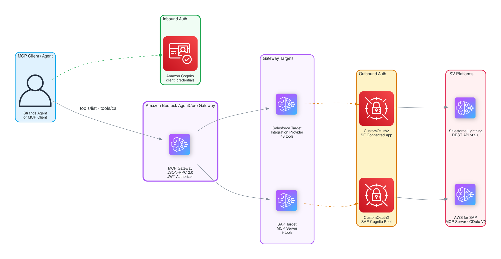

<!-- Copyright Amazon.com, Inc. or its affiliates. All Rights Reserved. -->
<!-- SPDX-License-Identifier: Apache-2.0 -->

# Amazon Bedrock AgentCore Gateway — Multi-ISV Orchestration (Salesforce + SAP)

This tutorial series demonstrates how to connect multiple ISV SaaS platforms (Salesforce Lightning Platform and AWS for SAP MCP Server) to a single [Amazon Bedrock AgentCore Gateway](https://docs.aws.amazon.com/bedrock-agentcore/latest/devguide/gateway.html), enabling cross-system AI agent workflows through one unified endpoint.

## Tutorial Details

| Information | Details |
|:---|:---|
| Tutorial type | Interactive |
| AgentCore components | AgentCore Gateway, AgentCore Identity |
| Agentic Framework | [Strands Agents](https://github.com/strands-agents/sdk-python) |
| Gateway Target types | Integration Provider Template (Salesforce), MCP Server (SAP) |
| Inbound Auth IdP | Amazon Cognito |
| Outbound Auth | CustomOauth2 (Salesforce Connected App), CustomOauth2 (SAP Cognito) |
| LLM model | Anthropic Claude Sonnet 4.6 (`us.anthropic.claude-sonnet-4-6` — replace `us.` with your region prefix or use `global.`) |
| Tutorial vertical | Enterprise CRM + ERP |
| Example complexity | Medium |
| SDK used | boto3, requests |

## Tutorials

| # | Notebook | Description |
|---|---|---|
| 1 | [01-salesforce-gateway-target.ipynb](01-salesforce-gateway-target.ipynb) | Add Salesforce Lightning Platform via the built-in Integration Provider Template with CustomOauth2 |
| 2 | [02-sap-mcp-server-target.ipynb](02-sap-mcp-server-target.ipynb) | Add AWS for SAP MCP Server as a Gateway MCP target |
| 3 | [03-cross-isv-queries.ipynb](03-cross-isv-queries.ipynb) | Cross-system queries combining Salesforce + SAP through one gateway |

## Architecture



## Prerequisites

- An AWS account with access to Amazon Bedrock AgentCore
- Model access enabled for `anthropic.claude-sonnet-4-6` in your region (see [Manage model access](https://docs.aws.amazon.com/bedrock/latest/userguide/model-access.html))
- Python 3.11–3.13 (Python 3.14 is not yet supported — the AWS CRT library lacks a 3.14 wheel)
- A Salesforce Developer Edition org with a Connected App configured for OAuth2 `client_credentials` flow
- Access to an AWS for SAP MCP Server deployment (see [documentation](https://docs.aws.amazon.com/mcp-sap/latest/awsforsapmcp/introduction.html))
- AWS CLI configured with appropriate credentials

## Getting Started

1. Install dependencies:
   ```bash
   pip install -r requirements.txt
   ```

2. Open the first notebook and follow the steps sequentially:
   ```bash
   jupyter notebook 01-salesforce-gateway-target.ipynb
   ```

3. Each notebook will prompt you for credentials and guide you through the full setup, invocation, and cleanup process.

## Important Notes

- **Salesforce Developer Edition orgs** hibernate after ~24 hours of inactivity. Log into the Salesforce web UI to wake the org before running the notebooks.
- **CustomOauth2** is required for Salesforce Developer Edition orgs. The built-in `SalesforceOauth2` vendor hardcodes the `login.salesforce.com` OAuth endpoint. Developer Edition orgs only allow `client_credentials` on their org-specific domain (`*.develop.my.salesforce.com`), so we use `CustomOauth2` with the org's OAuth2 metadata.
- **SAP MCP Server** runs in read-only mode by default. Write operations must be explicitly enabled in the SAP MCP Server configuration.

## Disclaimer

This is sample code for demonstration purposes only. Not intended for production use without additional security review. In particular:

- **IAM permissions** — the Gateway execution role scopes most actions to specific ARNs (`bedrock:InvokeModel` to the Claude models, `secretsmanager:GetSecretValue` to the `bedrock-agentcore-*` secret prefix, `iam:PassRole` to the role itself with a `PassedToService` condition). The `bedrock-agentcore:*`/`agent-credential-provider:*` actions remain at service-action level (scoped to the account/region) because the gateway, target, and credential-provider IDs are created later in the flow. Production deployments should tighten these further to the specific resource IDs once known.
- **Salesforce target** uses the built-in Integration Provider Template, which must be created via the AWS Console (not API). See the [supported integrations](https://docs.aws.amazon.com/bedrock-agentcore/latest/devguide/gateway-target-integrations.html).
- **Content-Type parameter** — The Salesforce schema exposes `Content-Type` as a tool parameter. Because the gateway [manages Content-Type as a restricted header](https://docs.aws.amazon.com/bedrock-agentcore/latest/devguide/gateway-headers.html), pass `""` (empty string) for this parameter on create/update operations to prevent header duplication.

## License

This project is licensed under the Apache License 2.0. See the [LICENSE](../../../LICENSE) file for details.
