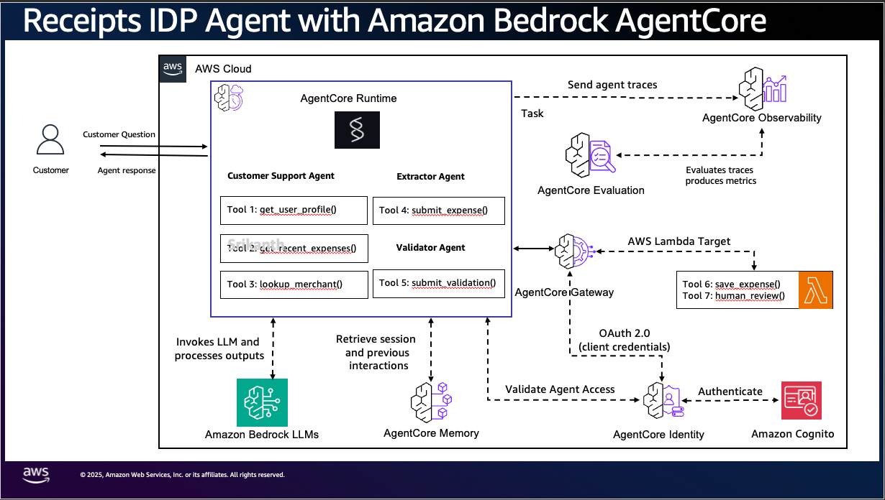
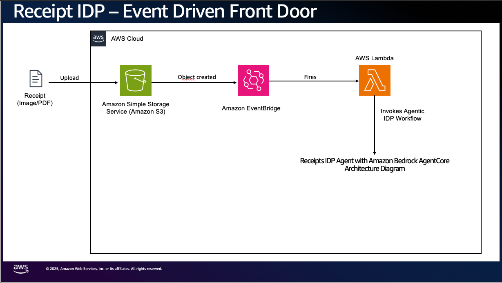

# Architecture

A receipt lands in S3; a dual-agent pipeline on AgentCore Runtime extracts a structured expense, an independent validator decides whether to auto-persist or route to human review, and the whole run is traced and evaluated in CloudWatch. A **model degradation ladder** keeps the pipeline serving through a Bedrock capacity event. This document is the map; the *why* behind each choice lives in [decisions/](decisions/).





## The three planes

```mermaid
flowchart TB
    subgraph FD["Front door"]
        S3[("S3 inbox<br/>receipts/&lt;user&gt;/&lt;file&gt;")]
        EB["EventBridge rule<br/>(Object Created)"]
        TRIG["Trigger Lambda<br/>invoke_agent_runtime"]
        S3 -->|object created| EB --> TRIG
    end

    subgraph CP["Control plane — resilience (the degradation ladder)"]
        AC["AWS AppConfig<br/>activeRung + rung defs"]
        ALARM["CloudWatch alarm<br/>on ModelStepDowns"]
        CTRL["Controller Lambda<br/>1 rung/step, cooldown"]
        ALARM -->|EventBridge| CTRL -->|StartDeployment| AC
    end

    subgraph DP["Data plane — one receipt run (Runtime microVM)"]
        AGENT["Dual agent:<br/>0. read rung (cached)<br/>1. OCR (Textract)<br/>2. EXTRACTOR → structured<br/>3. VALIDATOR → route<br/>4. persist or review"]
        GW["AgentCore Gateway<br/>(1 MCP endpoint)<br/>Cedar on every tool call"]
        DDB[("DynamoDB<br/>Users / Expenses")]
        BR["Bedrock<br/>(global inference profile,<br/>per the active rung)"]
        AGENT -->|tool calls MCP| GW -->|Lambda targets| DDB
        AGENT -->|model call| BR
    end

    OBS["CloudWatch GenAI Observability<br/>+ Evaluations (aws/spans, online eval)"]
    SQS[("SQS defer queue<br/>(L4)")]
    DRAIN["Drain Lambda<br/>bounded, jittered"]

    TRIG -->|M2M, {s3_uri, user_id}| AGENT
    AC -.->|cached read at invoke start| AGENT
    AGENT -.->|503 persists past L4| SQS --> DRAIN -->|replay| AGENT
    AGENT -->|ModelStepDowns metric| ALARM
    AGENT -->|spans per step, tagged with rung| OBS
```

**Front door** (event-driven, [ADR-0006](decisions/0006-s3-eventbridge-over-direct-invoke.md)) — upload → S3 → EventBridge → trigger Lambda → Runtime. No logged-in user; the agent authenticates as itself ([ADR-0004](decisions/0004-agent-as-principal-m2m-over-per-user-jwt.md)).

**Data plane** — one receipt = one Runtime session = a tree of spans. The agent reads the active rung from AppConfig (cached), OCRs the receipt with Textract, runs the extractor then the independent validator ([ADR-0002](decisions/0002-dual-agent-over-single-agent.md)), and persists or routes to review through the Gateway. It never touches DynamoDB directly — the Gateway is the one place auth, Cedar authorization, and observability are enforced ([ADR-0003](decisions/0003-gateway-lambda-targets-over-co-located-tools.md)).

**Control plane** — the degradation ladder ([ADR-0007](decisions/0007-degradation-ladder-on-503.md)). The rung lives in AppConfig; the agent reads it; on a sustained `503` an alarm-driven controller steps it down for everyone. See [the ladder](#the-degradation-ladder) below.

## The pipeline, step by step

1. **Read the rung.** `get_active_rung()` reads `activeRung` from AppConfig via the `appconfigdata` data API ([ADR-0009](decisions/0009-appconfigdata-not-lambda-extension.md)), cached in-process. The rung sets the model and which features run. Falls back to L0 if AppConfig is unreachable — the agent never hard-fails on the ladder.
2. **OCR.** Textract `analyze_expense` reads the receipt straight from S3 (`S3Object`) and returns summary fields + line-item groups with per-field confidence.
3. **Table parse.** A deterministic Markdown-table parser turns the line-item block into structured rows; the agent only re-derives rows the parser couldn't (hybrid extraction).
4. **Extractor agent.** A Strands agent on the rung's model produces a structured expense via a forced `submit_expense` tool call — machine-checkable, not free text.
5. **Validator agent.** An independent agent (sheddable from L2 down) sees only the OCR + the extractor's output and decides `AUTO_PERSIST` vs `NEEDS_REVIEW`.
6. **Persist or review.** `save_expense` (Cedar-gated) on auto-persist, else `human_review` — both through the Gateway. A Cedar denial on `save_expense` falls back to `human_review`.
7. **Return + observe.** A structured result with `confidence`, `needs_review`, and the `rung`; the trace span is tagged with the rung so a degraded run is visible.

## The degradation ladder

The distinct contribution of this sample. Bedrock `503` (capacity, **not** quota — that's `429`) steps the model to one with independent capacity; `429`/`500` back off and retry the same model.

| Rung | Model (global inference profile) | Behavior |
|------|----------------------------------|----------|
| **L0** | `global.anthropic.claude-opus-4-8` | Full pipeline. Default. |
| **L1** | `global.anthropic.claude-opus-4-7` | Drop memory writes + merchant lookup; keep validator. |
| **L2** | `global.anthropic.claude-opus-4-6-v1` | Extractor + persist only; everything routes to review. |
| **L3** | `global.anthropic.claude-sonnet-4-6` | Same, cheaper, independently provisioned. |
| **L4** | none | Defer: queue to SQS, return `deferred`. |

Two ways the rung is set ([ADR-0010](decisions/0010-two-rung-setting-paths.md)):
- **Reactive (in-agent):** a persistent `503` during a run steps to the next rung's model *for that run*. The agent emits a `ModelStepDowns` metric.
- **Proactive (control loop):** an alarm on sustained `ModelStepDowns` → EventBridge → controller Lambda steps `activeRung` down for *every new run* (cooldown, one rung at a time); recovery steps it back up.

At the floor, L4 buffers receipts in SQS and a jittered drain replays them so a recovered tier isn't stampeded ([ADR-0011](decisions/0011-l4-sqs-jittered-drain.md)). Three resilience layers, kept distinct: per-call backoff (`429`/`500`), the SQS buffer (volume), the ladder (capacity/`503`).

## AgentCore services used

| Service | Role here |
|---------|-----------|
| **Runtime** | Hosts the dual-agent orchestrator in a session-isolated microVM (code-based, not the managed Harness — IDP needs a custom OCR step + forced structured output + the ladder). |
| **Gateway** | Turns the DynamoDB read/write Lambdas into governed MCP tools through one endpoint. The single enforcement point. |
| **Policy (Cedar)** | Gates `save_expense` on the tool input (amount ≥ $2,000 → review), deterministically, independent of the agents ([ADR-0012](decisions/0012-cedar-on-tool-input.md)). |
| **Observability** | OTel traces/logs/metrics → CloudWatch GenAI Observability; each span tagged with the rung. Auto-instrumented (the Runtime is CLI/CDK-deployed). |
| **Evaluations** | A SESSION LLM-as-judge evaluator (extraction quality + routing) + online eval with built-in metrics, scored from spans. |
| **Memory** | Per-user facts + session summaries in custom `receipts/...` namespaces (sheddable on lower rungs). The agent degrades gracefully if Memory isn't deployed. |

## Component inventory

- **`app/receiptsagent/`** — the agent. `main.py` (dual-agent entrypoint + the 503 step-down loop), `config.py` (the single env-read seam), `model/ladder.py` (rung resolution + the appconfigdata reader), `tools/` (OCR, structured output, the table parser), `gateway_auth.py` (M2M token), `memory/`, `mcp_client/`.
- **`lambdas/`** — the Gateway tools (`get_user_profile`, `get_recent_expenses`, `lookup_merchant`, `save_expense`, `human_review`) + the front-door `trigger` + the ladder `controller` + the L4 `drain`, each with its schema under `lambdas/schemas/`.
- **`agentcore/agentcore.json`** — the AgentCore resources (Runtime, Gateway + targets, PolicyEngine + Cedar policies, Evaluator, OnlineEvaluationConfig).
- **`agentcore/cdk/`** — the supplementary infra (DynamoDB, S3, Cognito, SQS, AppConfig, alarms, EventBridge, the Lambdas) + the glue stack ([ADR-0001](decisions/0001-agentcore-cli-plus-cdk.md)).

See [CONFIGURATION.md](CONFIGURATION.md) for the knobs and [tutorial.md](tutorial.md) for a guided run.
