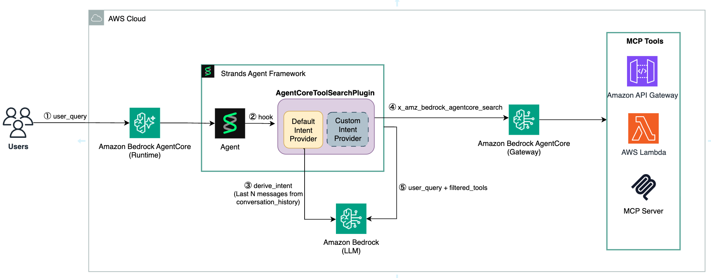

# Semantic Tool Discovery with AgentCore Gateway Tool Search Plugin

This sample demonstrates how to build a **Strands agent** that uses **Amazon Bedrock AgentCore Gateway's semantic tool search** to dynamically discover and invoke only the relevant tools for each user request — without loading all tools upfront.

## What This Sample Does

When agents have access to many tools (tens or hundreds), loading all of them for every request is inefficient and can degrade model performance. This sample shows how the `AgentCoreToolSearchPlugin` solves this problem by:

1. **Deploying a Lambda function** with 34 travel-domain tools across 9 domains (flights, hotels, car rentals, restaurants, currency, loyalty, weather, activities, trip planning)
2. **Registering the function** with AgentCore Gateway as a tool target with semantic search enabled
3. **Creating a Strands agent** that uses the plugin to dynamically discover only the relevant tools per request based on user intent

The key value: instead of loading all 34 tools for every query, the agent dynamically loads only the relevant tools per request via semantic search — improving response quality and reducing token usage.

## Architecture



On each agent invocation:

1. **User query** — The user sends a query to the Strands agent
2. **Hook** — The agent triggers the `AgentCoreToolSearchPlugin` before model invocation
3. **Derive intent** — The `IntentProvider` sends the last N messages from conversation history to the configured LLM to produce a concise intent string
4. **Search gateway** — The intent is passed to AgentCore Gateway's `x_amz_bedrock_agentcore_search` tool to obtain the most relevant tools
5. **Invoke LLM** — The agent invokes the LLM with the user query along with the matched tools from registered MCP targets (Lambda, API Gateway, MCP Server)

Previously loaded tools are cleared before each search, so the agent always has the most relevant tools available.

## Key Concepts

| Concept | Description |
|---------|-------------|
| **AgentCore Gateway** | Managed MCP-compatible endpoint that hosts tool targets and provides semantic search |
| **Tool Target** | A Lambda function (or other compute) registered with the gateway, wrapped automatically with MCP protocol |
| **Semantic Tool Search** | Gateway capability that matches user intent to relevant tools using embeddings |
| **AgentCoreToolSearchPlugin** | Strands plugin that hooks into the agent lifecycle to search and load tools dynamically |
| **Intent Provider** | Component that derives a concise intent string from conversation history (defaults to the agent's own model) |

## Prerequisites

| Requirement | Details |
|---|---|
| Python | 3.12+ |
| AWS CLI | 2.x, configured with valid credentials |
| AWS Account | With Bedrock model access enabled |

### Required IAM Permissions

Your calling identity needs:

- `lambda:CreateFunction`, `lambda:InvokeFunction`, `lambda:DeleteFunction`, `lambda:UpdateFunctionCode`, `lambda:GetFunction`
- `iam:CreateRole`, `iam:AttachRolePolicy`, `iam:DetachRolePolicy`, `iam:DeleteRole`
- `bedrock:InvokeModel` (for agent reasoning)
- `bedrock-agentcore:*` (for gateway management and MCP connections)

## Getting Started

### 1. Install dependencies

```bash
pip install -r requirements.txt
```

### 2. Configure AWS credentials

```bash
export AWS_REGION=us-east-1  # optional, defaults to us-east-1
aws sts get-caller-identity  # verify credentials
```

### 3. Deploy infrastructure

This creates the Lambda function, AgentCore Gateway, and registers the tools:

```bash
python deploy.py
```

### 4. Run the agent

This creates a Strands agent with the `AgentCoreToolSearchPlugin` and runs example queries across multiple travel domains:

```bash
python invoke.py
```

You'll see the agent dynamically select different tool subsets for each domain:

```
  Domain: Flight Search
  Query:  Find flights from San Francisco to New York next Friday
  Tools loaded by semantic search: ['check_availability', 'get_flight_details', 'search_flights']

  Domain: Hotel Search
  Query:  Search for hotels in Manhattan with a pool
  Tools loaded by semantic search: ['get_hotel_amenities', 'get_hotel_details', 'search_hotels']
```

### 5. Clean up resources

```bash
python cleanup.py
```

## Project Structure

```
agentcore-tool-search-plugin/
├── deploy.py                   # Deploy Lambda + Gateway + register tools
├── invoke.py                   # Create agent and run example queries
├── cleanup.py                  # Delete all created AWS resources
├── config.py                   # Shared configuration
├── requirements.txt            # Python dependencies
├── README.md                   # This file
└── lambda/
    ├── travel_tools.py         # Lambda function with 34 travel tools
    └── tool_schemas.json       # MCP tool schemas for gateway registration
```

## Configuration

Environment variables:

| Variable | Default | Description |
|----------|---------|-------------|
| `AWS_REGION` | `us-east-1` | AWS region for all resources |
| `MODEL_ID` | `us.anthropic.claude-sonnet-4-20250514-v1:0` | Bedrock model for agent reasoning |

## Customization

The `AgentCoreToolSearchPlugin` supports custom models for intent classification, custom system prompts, and fully custom intent providers. For details and code examples, see the [AgentCoreToolSearchPlugin documentation](https://strandsagents.com/docs/community/plugins/agentcore-tool-search/).

## Cost Considerations

Running this sample creates AWS resources that incur charges:

- **AWS Lambda** — Function invocations during verification and agent tool calls
- **Amazon Bedrock** — Model inference for agent reasoning and intent classification
- **AgentCore Gateway** — Gateway usage for tool registration and MCP-based invocations

Always run `python cleanup.py` when finished to delete all resources.

## Related Resources

- [AgentCoreToolSearchPlugin documentation (Strands)](https://strandsagents.com/docs/community/plugins/agentcore-tool-search/)
- [AgentCoreToolSearchPlugin source code](https://github.com/aws/bedrock-agentcore-sdk-python/tree/main/src/bedrock_agentcore/gateway/integrations/strands/plugins/agentcore_tool_search)
- [AgentCore Gateway — Semantic Tool Search](https://docs.aws.amazon.com/bedrock-agentcore/latest/devguide/gateway-using-mcp-semantic-search.html)
- [Strands Agents SDK](https://strandsagents.com/)