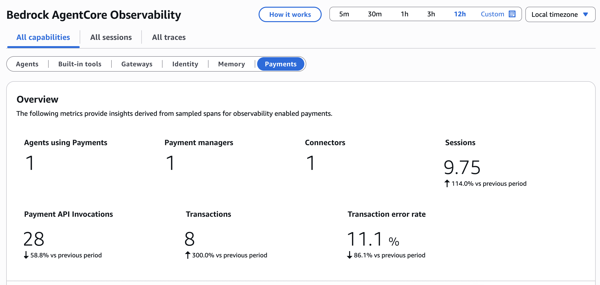

# Pay for Data — Heurist Finance Agent

## Overview

A finance research agent that pays for real-time market data using **Amazon Bedrock AgentCore payments**. The agent calls paid [Heurist](https://heurist.xyz) endpoints for live prices, SEC filings, and macro indicators, analyzes the data with AgentCore Code Interpreter, and returns charts and reports as S3 presigned URLs — all without any manual payment code in the tools.

The agent is deployed to **AgentCore Runtime**: a managed container endpoint with HTTPS invocation, SigV4 auth, and automatic observability via CloudWatch.

> **Mainnet sample.** This walkthrough targets Base mainnet and calls the live [Heurist mesh x402 registry](https://mesh.heurist.xyz/x402/agents?details=true). Every invocation settles real USDC on-chain. Typical per-call prices are $0.002–$0.005, so $1 USDC covers ~200 calls. A Base Sepolia variant of the catalog exists at `/x402/base-sepolia/agents?details=true`, but the EIP-712 signing path on AgentCore's Coinbase connector follows the connector's network selection, so this sample uses Base mainnet.

Heurist endpoints use the [x402 protocol](https://x402.org) — they return HTTP 402 until a valid payment proof is attached. The `AgentCorePaymentsPlugin` handles payment end-to-end: it intercepts 402 responses, generates a USDC proof via the AgentCore payment manager, attaches it, and retries. Your tool code stays a plain `http_request` call.



## Architecture

```
App Backend (ManagementRole)              AgentCore Runtime
  |                                        +------------------------------+
  | create_session(budget=$X)              |  agent/main.py               |
  |                                        |  BedrockAgentCoreApp         |
  |-- invoke(manager_arn, session_id, -->  |  + AgentCorePaymentsPlugin   |
  |         instrument_id, prompt)         |                              |
  |                                        |  http_request -> 402         |
  |<-- {response, artifacts: [{url}]} ---  |  -> ProcessPayment -> retry  |
  |                                        |  -> Code Interpreter         |
  | get_session(check spend)               |  -> export to S3             |
                                           +------------------------------+
                                                      |
                                                      v
                                          CloudWatch GenAI Observability
                                          (automatic via OpenTelemetry)
```

## How It Works

`AgentCorePaymentsPlugin` handles the entire x402 payment lifecycle:

```python
from bedrock_agentcore.payments.integrations.strands import (
    AgentCorePaymentsPlugin,
    AgentCorePaymentsPluginConfig,
)

payment_plugin = AgentCorePaymentsPlugin(
    config=AgentCorePaymentsPluginConfig(
        payment_manager_arn=PAYMENT_MANAGER_ARN,
        user_id=USER_ID,
        payment_instrument_id=PAYMENT_INSTRUMENT_ID,
        payment_session_id=PAYMENT_SESSION_ID,
        region="us-west-2",
    )
)

agent = Agent(
    model=BedrockModel(model_id=MODEL_ID),
    tools=[http_request, code_interpreter, export_artifact_to_s3, ...],
    plugins=[payment_plugin],
)
```

See [`agent/main.py`](agent/main.py) for the full implementation.

## Sample Details

| | |
|---|---|
| AgentCore components | AgentCore payments, AgentCore Code Interpreter, AgentCore Runtime |
| Agent framework | [Strands Agents](https://strandsagents.com/) |
| Model | Claude Sonnet 4.6 on Amazon Bedrock (configurable) |
| Payment protocol | [x402](https://x402.org) |
| Payment network | Base (USDC) |

## Data Sources

Fetched at runtime from the [Heurist mesh registry](https://mesh.heurist.xyz/x402/agents?details=true). By default the sample loads tools from four agents:

| Agent | Representative tools | Typical price |
|-------|----------------------|---------------|
| `YahooFinanceAgent` | `price_history`, `quote_snapshot`, `futures_snapshot` | $0.002 |
| `FredMacroAgent` | `macro_series_snapshot`, `macro_regime_context` | $0.003 |
| `SecEdgarAgent` | `filing_timeline`, `filing_diff`, `xbrl_fact_trends` | $0.002 |
| `ExaSearchDigestAgent` | `exa_web_search`, `exa_scrape_url` | $0.005 |

Override with the `HEURIST_AGENT_IDS` environment variable.

## Prerequisites

- An **AgentCore payment manager** created in your AWS account
- A **payment instrument** created and funded — embedded crypto wallet with USDC on **Base mainnet** (default; the notebook walks through this in Step 4)
- Coinbase CDP project with **Delegated signing** enabled, and a per-wallet delegation grant approved via the WalletHub URL returned at instrument creation
- Python 3.11+
- AWS credentials with Bedrock and AgentCore access in `us-west-2`
- Node.js 20+ (for the `@aws/agentcore` CLI)
- Docker (running, for `agentcore deploy` container build)
- [AWS CDK](https://docs.aws.amazon.com/cdk/v2/guide/getting_started.html) installed globally

## Layout

```
pay-for-data/
├── README.md
├── .env.example
├── pay-for-data.ipynb                    # notebook: deploy and invoke via AgentCore Runtime
└── agent/                                # everything below ships in the Runtime container
    ├── main.py                           # AgentCore Runtime entry point (BedrockAgentCoreApp)
    ├── catalog.py                        # fetches Heurist registry, formats for system prompt
    ├── catalog_live_cache.json           # synced catalog (bundled in Runtime image)
    ├── config.py                         # loads .env / payment context
    ├── sync_registry.py                  # CLI: refreshes the catalog cache (run before deploy)
    ├── requirements.txt                  # container Python deps
    └── Dockerfile                        # opentelemetry-instrument python -m main
```

## Quick Start

Open [`pay-for-data.ipynb`](pay-for-data.ipynb) and run the cells in order:

| Step | What happens |
|------|-------------|
| 1 | Configure credentials and confirm AWS identity |
| 2 | Sync the Heurist tool catalog (bundled in the container image) |
| 3 | Create the S3 artifacts bucket |
| 4 | Provision embedded wallet resources (credential provider, manager, connector, instrument) |
| 5 | Fund the wallet and grant signing delegation via WalletHub |
| 6 | Enable Payment Manager observability (CW Logs + X-Ray vended-log delivery) |
| 7 | Scaffold and deploy to AgentCore Runtime via the `agentcore` CLI |
| 8 | Grant execution-role permissions (payment, Code Interpreter, S3, Bedrock + inference profile) |
| 9 | Invoke the deployed agent and inspect results |
| 10 | View observability traces in CloudWatch |
| 11 | Cleanup |

## Payment Flow

When the agent calls a paid Heurist endpoint:

1. `http_request` sends a POST to the endpoint URL.
2. Heurist returns HTTP 402 with x402 payment terms (network, asset, amount, recipient).
3. `AgentCorePaymentsPlugin` intercepts the response.
4. The plugin asks the AgentCore payment manager to generate a payment proof.
5. The payment manager uses the payment instrument to sign a USDC transfer and returns a proof.
6. The plugin attaches the proof as `X-PAYMENT` and retries — Heurist validates and returns the data.

The plugin retries up to 3 times per tool call. Payment limits are enforced at the session scope — the agent cannot exceed `maxSpendAmount`.

## How the Runtime Agent Works

`agent/main.py` implements the AgentCore Runtime service contract with full feature parity:

**Stateless, payload-driven**
All payment config (manager ARN, session ID, instrument ID) comes from the invocation payload. The container holds no credentials. The app backend (ManagementRole) creates payment sessions with spending limits before each invocation. The Runtime execution role (ProcessPaymentRole) can only spend within those limits.

**AgentCore Code Interpreter**
Code Interpreter is a remote AWS API — it works identically from a Runtime container as from any other environment. The agent uses it for pandas/matplotlib analysis and chart generation.

**S3 artifact storage**
Artifacts produced by Code Interpreter are uploaded to S3 and returned as presigned download URLs. The response shape is:

```json
{
  "response": "<markdown research summary>",
  "artifacts": [
    {"name": "chart.png", "url": "https://...", "expires_in": 3600}
  ]
}
```

If `CI_ARTIFACTS_BUCKET` is not configured, the agent degrades gracefully: charts become markdown tables, text returns inline.

**Observability**
The `agentcore deploy` CLI configures the container to run under `opentelemetry-instrument`. Combined with `aws-opentelemetry-distro` (included in `agent/requirements.txt`), this provides:
- Strands agent spans (LLM calls, tool calls, agent turns) → CloudWatch GenAI Observability
- Code Interpreter calls stitched as child spans via W3C `traceparent` botocore instrumentation
- Payment calls (`ProcessPayment`, `GetPaymentInstrument`) as boto3 child spans

No instrumentation code required in `agent/main.py`.

**Execution role permissions** (attached by the notebook, Step 8):

| Permission set | Actions | Resource scope |
|---|---|---|
| Payment data-plane | `ProcessPayment`, `GetPaymentInstrument`, `GetPaymentInstrumentBalance`, `GetPaymentSession`, `GetResourcePaymentToken` | `payment-manager/*`, `payment-manager/*/instrument/*`, `payment-manager/*/session/*` |
| Code Interpreter | `StartCodeInterpreterSession`, `InvokeCodeInterpreter`, `StopCodeInterpreterSession` | `code-interpreter/*` |
| S3 artifacts | `PutObject`, `GetObject` | `<bucket>/heurist-finance-artifacts/*` |
| Bedrock model | `InvokeModel`, `InvokeModelWithResponseStream` | `foundation-model/*`, `inference-profile/*`, `application-inference-profile/*` (the latter two are required for CRIS-fronted models like Claude Sonnet 4.6 in us-west-2) |

## Environment Variables

See [`.env.example`](.env.example). Required on the host (notebook):

| Variable | Description |
|----------|-------------|
| `PAYMENT_MANAGER_ARN` | ARN of the AgentCore payment manager |
| `PAYMENT_SESSION_ID` | ID of an active payment session |
| `PAYMENT_INSTRUMENT_ID` | ID of a funded payment instrument (embedded crypto wallet) |
| `USER_ID` | User identifier for payment tracking |
| `BEDROCK_MODEL_ID` | Bedrock model (default: Claude Sonnet 4.6) |
| `HEURIST_AGENT_IDS` | Comma-separated Heurist agents to load |
| `HEURIST_CATALOG_URL` | Catalog endpoint — `https://mesh.heurist.xyz/x402/agents?details=true` (mainnet) or the `/x402/base-sepolia/...` variant for testnet |

Bundled in the container `.env` (set by Step 7):

| Variable | Description |
|----------|-------------|
| `CI_ARTIFACTS_BUCKET` | S3 bucket used for artifact upload |
| `CI_ARTIFACTS_PREFIX` | S3 key prefix (default: `heurist-finance-artifacts`) |
| `CI_ARTIFACTS_TTL` | Presigned URL TTL in seconds (default: 3600) |
| `AWS_REGION` | Region for boto3 clients |
| `AGENT_NAME` | Reported in payment observability |
| `BYPASS_TOOL_CONSENT` | Set to `true` so `strands_tools.http_request` skips its TTY confirm prompt — required because the Runtime container has no TTY |
| `AGENT_MAX_TOKENS` | Max Bedrock output tokens per agent turn (default: `32000`). Lower this if you only need short Q&A — Bedrock charges per output token, so a 32k cap is a worst-case ~$0.48 per turn for Claude Sonnet 4.6. Most turns use far less. The SDK default (4k) is too low for workflows that fetch data, run Code Interpreter, and write a markdown report in one turn — it raises `MaxTokensReachedException` mid-run. |

Payment context (`PAYMENT_MANAGER_ARN`, `PAYMENT_SESSION_ID`, `PAYMENT_INSTRUMENT_ID`, `USER_ID`) is passed in the **invocation payload** at runtime, not via env vars in the container.

## Costs

A single agent invocation incurs charges across four categories. Approximate worst-case figures for the default config:

| Category | Driver | Approx. cost per turn | Notes |
|---|---|---|---|
| **Heurist x402 (USDC on Base mainnet)** | Each paid tool call | $0.002–$0.005 per call | Settles real USDC on-chain. A typical research run uses 3–10 paid calls. The wallet must be funded. |
| **Bedrock model output** | `AGENT_MAX_TOKENS` × Claude Sonnet 4.6 output rate | up to ~$0.90 per turn at the 32k cap | Bedrock charges $0.015 per 1k output tokens for Claude Sonnet 4.6 in us-west-2 (input is cheaper at $0.003 per 1k). Most turns use far less than the cap; lower `AGENT_MAX_TOKENS` for short Q&A. |
| **Bedrock AgentCore Runtime** | Container vCPU × seconds + memory × seconds while invoked | a few cents per minute of active invocation | Idle minutes between invocations are not billed (`idleRuntimeSessionTimeout=600s`). |
| **Bedrock AgentCore Code Interpreter** | Sessions started + minutes active | a few cents per turn | Only billed when the agent actually invokes the Code Interpreter tool. |
| **S3 + CloudWatch** | Artifact storage + log/trace ingestion | rounding error | A small chart + report is well under 1 MB. Vended-log delivery to CW Logs and X-Ray is metered the same as your other CW usage. |

Tune `AGENT_MAX_TOKENS` and `SESSION_MAX_SPEND` in `.env` to match the workflow you actually run. The notebook uses a $0.25 per-session spend cap by default, which is plenty for a multi-call research workflow.

## Notes

- Payment sessions expire. Create a fresh session before each invocation in automated workflows.
- Each paid call settles USDC on Base. Ensure your payment instrument is funded.
- Sync the catalog cache before building the container image (`python agent/sync_registry.py`). The cache is bundled in the image — the container does not call the Heurist registry at startup.
- Presigned artifact URLs expire after `CI_ARTIFACTS_TTL` seconds (default: 1 hour). Download or forward the URL to the end user promptly.
